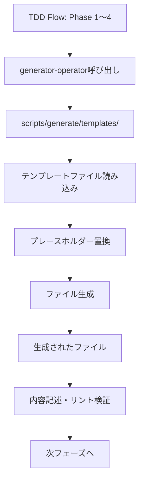

# generator-operatorとの連携方法

このドキュメントは、TDD開発フロー内で `generator-operator` スキルとどのように連携するかを定義します。

## 📋 概要

TDD開発フローのPhase 1〜4では、各設計書のテンプレート生成時に `generator-operator` スキルを呼び出します。

`generator-operator`は、`scripts/generate/templates/`配下のテンプレートファイルを使用して、サービス・セクション固有のファイルを生成します。

## 🔗 連携するフェーズ

| Phase | 生成するドキュメント | テンプレート | generator-operator呼び出し |
| :--- | :--- | :--- | :--- |
| **Phase 1** | GUIDING_PRINCIPLES.md | `workflow/GUIDING_PRINCIPLES.md` | ✅ |
| **Phase 2** | func-spec.md | `docs/func-spec.template.md` | ✅ |
| **Phase 2** | uiux-spec.md | `docs/uiux-spec.template.md` | ✅ |
| **Phase 3** | {section}-spec.yaml | `docs/spec.yaml` | ✅ |
| **Phase 3** | file-list.md | `workflow/file-list.template.md` | ✅ |
| **Phase 4** | MOCK_POLICY.md | `workflow/MOCK_POLICY.md` | ✅ |
| **Phase 4** | TDD_WORK_FLOW.md | `workflow/TDD_WORK_FLOW.md` | ✅ |
| **Phase 5** | E2E tests, CSS, Route, Components, Logic, Data-IO | 各種テンプレート | ✅（必要に応じて） |

## 🤝 呼び出し方法

### 基本的な呼び出し

`generator-operator`スキルを使用してテンプレートを生成します。

**形式**:

```text
`generator-operator`スキルを使用して{document_type}を生成します。
パラメータ: service={service}, section={section}
```

### 例

#### Phase 1: GUIDING_PRINCIPLES.md生成

```text
`generator-operator`スキルを使用してGUIDING_PRINCIPLES.mdを生成します。
パラメータ: service=blog
```

#### Phase 2: func-spec.md生成

```text
`generator-operator`スキルを使用してfunc-spec.mdを生成します。
パラメータ: service=blog, section=posts
```

#### Phase 3: spec.yaml生成

```text
`generator-operator`スキルを使用してspec.yamlを生成します。
パラメータ: service=blog, section=posts
```

#### Phase 4: TDD_WORK_FLOW.md生成

```text
`generator-operator`スキルを使用してTDD_WORK_FLOW.mdを生成します。
パラメータ: service=blog, section=posts
```

#### Phase 5: コンポーネント生成

```text
`generator-operator`スキルを使用してPostCardコンポーネントを生成します。
パラメータ: service=blog, section=posts, name=PostCard
```

## 📂 テンプレートファイルの配置

`generator-operator`が使用するテンプレートファイルは、以下の場所に配置されています：

```text
scripts/generate/templates/
├── workflow/
│   ├── GUIDING_PRINCIPLES.md
│   ├── REQUIREMENTS_ANALYSIS_PIPE.md
│   ├── MOCK_POLICY.md
│   ├── TDD_WORK_FLOW.md
│   └── file-list.template.md
├── docs/
│   ├── func-spec.template.md
│   ├── uiux-spec.template.md
│   └── spec.yaml
├── code/
│   ├── route.template.tsx
│   ├── component.template.tsx
│   ├── logic.template.ts
│   └── data-io.template.ts
└── test/
    ├── e2e-screen-test.template.ts
    ├── e2e-section-test.template.ts
    ├── component-test.template.tsx
    ├── logic-test.template.ts
    └── data-io-test.template.ts
```

## 🔧 テンプレート変数

テンプレートファイルには、以下のプレースホルダーが含まれています：

| 変数 | 説明 | 例 |
| :--- | :--- | :--- |
| `{{service}}` | サービス名 | `blog`, `account` |
| `{{section}}` | セクション名 | `posts`, `authentication` |
| `{{name}}` | コンポーネント/関数名 | `PostCard`, `calculateTotal` |

generator-operatorは、これらのプレースホルダーを実際の値に置換してファイルを生成します。

## 📝 生成後の作業

テンプレートから生成されたファイルには、プレースホルダーや`[記述してください]`のような指示が含まれています。

生成後、以下の作業を行う必要があります：

1. **プレースホルダーの置換**: `[例: ...]`や`{記述してください}`を実際の内容に置き換える
2. **内容の記述**: 各セクションに具体的な内容を記述する
3. **リント検証**: `node scripts/lint-template/engine.js {file_path}`を実行して違反がないか確認
4. **完了条件の確認**: 各フェーズの完了条件を満たしているか確認

## 🚨 エラーハンドリング

generator-operator呼び出し時にエラーが発生した場合：

| エラータイプ | 原因 | 対処 |
| :--- | :--- | :--- |
| **テンプレートが見つからない** | `config.json`に定義なし | `GeneratorMaintainer`でテンプレート追加 |
| **パラメータ不足** | service/section/nameが欠けている | 不足しているパラメータをユーザーに確認 |
| **ファイルが既に存在** | 上書き確認が必要 | ユーザーに上書き確認を求める |

## 📚 REQUIREMENTS_ANALYSIS_PIPEとの関係

`scripts/generate/templates/workflow/REQUIREMENTS_ANALYSIS_PIPE.md`は、設計フェーズ（Phase 1〜4）の詳細手順を記述したワークフローテンプレートです。

### REQUIREMENTS_ANALYSIS_PIPEの内容

このテンプレートには、以下の手順が記述されています：

1. **GUIDING_PRINCIPLES.md**の生成と記述方法
2. **func-spec.md**の生成と記述方法（3大層分離の観点）
3. **uiux-spec.md**の生成と記述方法（UI層の責務分離）
4. **spec.yaml**の生成と記述方法（UIに依存しない設定値）
5. **file-list.md**の作成方法（3大層分離に準拠したファイルリスト）
6. **data-flow-diagram.md**の作成方法（Mermaid図による可視化）
7. **TDD_WORK_FLOW.md**の生成と具体化方法

### tdd-flowスキルとの統合

`tdd-flow`スキルの各プロンプト（`prompts/*.md`）は、REQUIREMENTS_ANALYSIS_PIPEの手順を各フェーズに分割したものです。

- **Phase 1**: GUIDING_PRINCIPLES.mdの生成
- **Phase 2**: func-spec.md, uiux-spec.mdの生成
- **Phase 3**: spec.yaml, file-list.md, data-flow-diagram.mdの生成
- **Phase 4**: MOCK_POLICY.md, TDD_WORK_FLOW.mdの生成

## 🔄 生成フロー図



## 📚 参照ドキュメント

- `scripts/generate/README.md`: generator-operatorの詳細
- `scripts/generate/config.json`: テンプレート定義
- `scripts/generate/templates/workflow/REQUIREMENTS_ANALYSIS_PIPE.md`: 設計フェーズの詳細手順
- `.claude/skills/generator-operator/SKILL.md`: generator-operatorスキルの仕様
