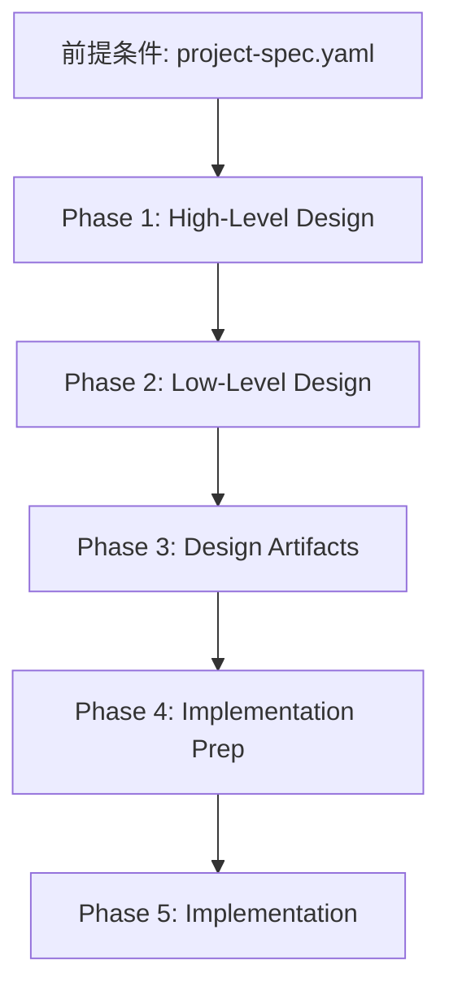

# フェーズ概要

このドキュメントは、TDD開発フロー全5フェーズの概要と、各フェーズの成果物を一覧化します。

## 📊 フェーズ一覧

| Phase | 名称 | 絵文字 | 成果物数 | 所要時間目安 | prompts |
| :--- | :--- | :--- | :--- | :--- | :--- |
| **Phase 1** | High-Level Design | ▶️🗾 | 2個 | 30分 | `01-high-level-design.md` |
| **Phase 2** | Low-Level Design | 📚️🖼️ | 2個 | 1時間 | `02-low-level-design.md` |
| **Phase 3** | Design Artifacts | 📋️🗂️🧬 | 4個 | 1時間 | `03-design-artifacts.md` |
| **Phase 4** | Implementation Prep | 🎭⛏️ | 2個 | 30分 | `04-implementation-prep.md` |
| **Phase 5** | Implementation | 👁️🎨🪨🚧 | N個 | 可変 | `05-implementation.md` |

**注意**: 所要時間目安は参考値です。実際の時間は機能の複雑さによって変動します。

## 📋 各フェーズの詳細

### Phase 1: High-Level Design（高レベル設計）

**目的**: プロジェクト全体の設計方針を定義し、サービス・セクションの指導原則を確立する。

**成果物**:

| # | ファイル名 | 配置場所 | テンプレート | 役割 |
| :--- | :--- | :--- | :--- | :--- |
| 1 | GUIDING_PRINCIPLES.md | `develop/{service}/` | `workflow/GUIDING_PRINCIPLES.md` | サービスの指導原則 |
| 2 | （REQUIREMENTS_ANALYSIS_PIPE.md） | `develop/{service}/` | `workflow/REQUIREMENTS_ANALYSIS_PIPE.md` | 要件分析手順書（参照用） |

**完了条件**:

- ✅ GUIDING_PRINCIPLES.mdが生成され、リント検証が合格している
- ✅ サービスの目的と責務が明確に定義されている
- ✅ 3大層分離の適用方針が記述されている

---

### Phase 2: Low-Level Design（低レベル設計）

**目的**: 3大層分離の観点で、機能設計書と画面仕様書を作成し、実装の詳細を定義する。

**成果物**:

| # | ファイル名 | 配置場所 | テンプレート | 役割 |
| :--- | :--- | :--- | :--- | :--- |
| 1 | func-spec.md | `develop/{service}/{section}/` | `docs/func-spec.template.md` | 機能設計書 |
| 2 | uiux-spec.md | `develop/{service}/{section}/` | `docs/uiux-spec.template.md` | 画面仕様書 |

**完了条件**:

- ✅ func-spec.mdが生成され、リント検証が合格している
- ✅ uiux-spec.mdが生成され、リント検証が合格している
- ✅ 3大層分離の観点で要件が定義されている
- ✅ UI層の責務分離（Route/Component）が明確になっている

---

### Phase 3: Design Artifacts（設計成果物）

**目的**: 機能設計書と画面仕様書を分析し、3大層分離アーキテクチャに準拠した実装ファイルリストとデータフロー図を作成する。

**成果物**:

| # | ファイル名 | 配置場所 | テンプレート | 役割 |
| :--- | :--- | :--- | :--- | :--- |
| 1 | {section}-spec.yaml | `app/specs/{service}/` | `docs/spec.yaml` | 外部変数仕様書 |
| 2 | types.ts | `app/specs/{service}/` | （手動作成） | 型定義 |
| 3 | file-list.md | `develop/{service}/{section}/` | `workflow/file-list.template.md` | 実装ファイルリスト |
| 4 | data-flow-diagram.md | `develop/{service}/{section}/` | （手動作成） | データフロー図 |

**完了条件**:

- ✅ section-spec.yamlが生成され、リント検証が合格している
- ✅ types.tsが生成され、型定義が正しい
- ✅ file-list.mdが生成され、3大層分離に準拠している
- ✅ data-flow-diagram.mdが生成され、データフローが正確に可視化されている

---

### Phase 4: Implementation Prep（実装準備）

**目的**: モックポリシーと開発手順書を作成し、実装フェーズでのTDD開発を円滑に進める準備を整える。

**成果物**:

| # | ファイル名 | 配置場所 | テンプレート | 役割 |
| :--- | :--- | :--- | :--- | :--- |
| 1 | MOCK_POLICY.md | `develop/{service}/{section}/` | `workflow/MOCK_POLICY.md` | モックポリシー |
| 2 | TDD_WORK_FLOW.md | `develop/{service}/{section}/` | `workflow/TDD_WORK_FLOW.md` | 開発手順書 |

**完了条件**:

- ✅ MOCK_POLICY.mdが生成され、モック方針が明確に定義されている
- ✅ TDD_WORK_FLOW.mdが生成され、実装手順が具体化されている
- ✅ file-list.mdの各ファイルに対して実装順序が決定している

---

### Phase 5: Implementation（実装）

**目的**: TDD（テスト駆動開発）の原則に従い、E2Eテスト→CSS実装→実装ループの順序で実装を完了する。

**成果物**:

| # | カテゴリ | ファイル例 | 配置場所 | テンプレート | 役割 |
| :--- | :--- | :--- | :--- | :--- | :--- |
| 1 | E2Eテスト | screen.spec.ts | `tests/e2e/{service}/` | `test/e2e-screen-test.template.ts` | 画面遷移テスト |
| 2 | E2Eテスト | {section}.spec.ts | `tests/e2e/{service}/` | `test/e2e-section-test.template.ts` | 機能テスト |
| 3 | CSS | layer2-{section}.css | `app/styles/{service}/` | （手動作成） | Component Styles |
| 4 | CSS | layer3.ts | `app/styles/{service}/` | （手動作成） | Flexbox/Grid Layout |
| 5 | CSS | layer4.ts | `app/styles/{service}/` | （手動作成） | Structure Exceptions |
| 6 | Route | {service}.{section}.tsx | `app/routes/` | `code/route.template.tsx` | データフロー制御 |
| 7 | Components | {Component}.tsx | `app/components/{service}/{section}/` | `code/component.template.tsx` | UI部品 |
| 8 | Components | {Component}.test.tsx | `app/components/{service}/{section}/` | `test/component-test.template.tsx` | コンポーネントテスト |
| 9 | Logic | {logic}.ts | `app/lib/{service}/{section}/` | `code/logic.template.ts` | 純粋ロジック |
| 10 | Logic | {logic}.test.ts | `app/lib/{service}/{section}/` | `test/logic-test.template.ts` | ロジックテスト |
| 11 | Data-IO | {dataAccess}.server.ts | `app/data-io/{service}/{section}/` | `code/data-io.template.ts` | 副作用処理 |
| 12 | Data-IO | {dataAccess}.test.ts | `app/data-io/{service}/{section}/` | `test/data-io-test.template.ts` | Data-IOテスト |

**実装順序**:

1. E2Eテスト（👁️）
2. CSS実装（🎨）
3. Route実装（🪨）
4. Components実装（🚧🪨）
5. Logic実装（🚧🪨）
6. Data-IO実装（🚧🪨）

**完了条件**:

- ✅ E2E Screen TestとE2E Section Testが実装され、合格している
- ✅ CSS実装（Layer 2, 3, 4）が完了している
- ✅ Routeが実装され、loader/actionが動作している
- ✅ Componentsがすべて実装され、テストが合格している
- ✅ Logicがすべて実装され、100%テストカバレッジを達成している
- ✅ Data-IOがすべて実装され、テストが合格している
- ✅ すべてのガードレールが合格している
- ✅ 変更がコミットされている

---

## 🔄 フェーズ間の依存関係

**依存関係の原則**:

- 各フェーズは、前フェーズの成果物に依存します
- フェーズをスキップすることはできません
- 前フェーズが完了していない場合、次フェーズを開始してはなりません

---

## 📚 参照ドキュメント

- `docs/flow-formula.md`: 開発フロー数式マニフェストの詳細
- `docs/master-rules.md`: 最上位行動原則
- `docs/guardrails.md`: ガードレール実行ルール
- `prompts/*.md`: 各フェーズの具体的な実行手順
