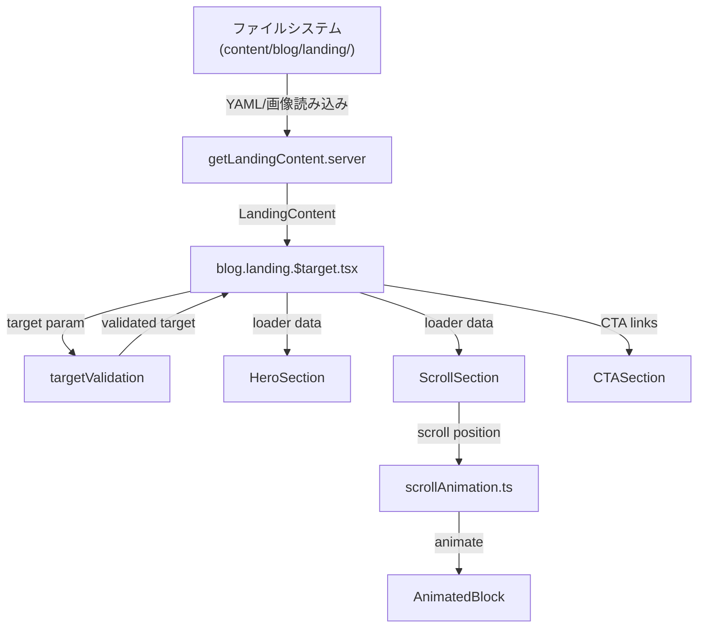

# 【機能追加提案】ClaudeMix Landing Page - スクロール駆動型技術デモンストレーション

- **サービス**: `blog`
- **セクション**: `landing`
- **関連ドキュメント**:
  - `develop/blog/landing/FEATURE_OVERVIEW.md` (The Sound Edge LP設計書 - 参考資料)
  - `develop/blog/landing/STORY_DESIGN.md` (漫画化設定案 - 参考資料)
  - `docs/CSS_structure/STYLING_CHARTER.md` (スタイリング規律)
  - `CLAUDE.md` (プロジェクト規範)

---

## 1. 提案概要

ClaudeMixボイラープレートの技術力（Remix + Cloudflare + 3層アーキテクチャ + AI協調開発）を視覚的に提示するための、**スクロール駆動型ランディングページ機能**を追加し、ターゲット別の価値提案と漫画表現による差別化を実現します。

---

## 2. 変更内容 (As-Is / To-Be)

### 現状 (As-Is)

- ClaudeMixには**ランディングページが存在せず**、技術力を効果的に伝える専用の導線がない
- ブログ機能（投稿一覧・詳細）のみで、**サービス全体の価値提案**が弱い
- ターゲット（エンジニア、デザイナー、マネージャー等）別のメッセージングができていない
- Remix.runのような洗練されたスクロールエクスペリエンスがなく、**技術デモンストレーションの場がない**

### 修正後 (To-Be)

- **`/blog/landing/{target}`** でターゲット別LPを提供（例: `/blog/landing/engineer`）
- **Remix.run風のスクロールアニメーション**で技術力を視覚的にデモンストレーション
- **漫画コンテンツ**（ワンピース エッグヘッド編の世界観）で親しみやすさと技術力を両立
- **段階的CTA導線**:
  1. スクロールで技術力を体感
  2. ターゲット別の価値提案を理解
  3. ドキュメント/GitHub/デモへ誘導
- **ClaudeMixカラーテーマ**（シアン、黒、アクセントカラー）で統一感を演出

**主要コンテナ構成**:
```
LP全体コンテナ
├── 漫画（イメージ）コンテナ      # 静的な漫画パネル配列
├── スクロールアクションコンテナ    # ブロックアニメーション
│   └── スクロールアクションパーツ  # 個別アニメーション要素
├── サブミットコンテナ（CTA）       # ドキュメント/GitHubへの誘導
└── フッター                      # 法務リンク
```

---

## 3. 背景・目的

### 背景

- **技術力の視覚的証明が必要**: MVPボイラープレートとして、実装品質の高さを示す「看板」が必要
- **Remix性能のアピール**: スクロールアニメーション、初回ロード最適化など、Remixの強みを体現する場がない
- **差別化の欠如**: 他のボイラープレートとの差別化要素（漫画×技術）を活かせていない
- **The Sound Edge設計の活用**: 既に存在するLP設計資産（FEATURE_OVERVIEW.md, STORY_DESIGN.md）を、ClaudeMix向けに転用可能
- **ターゲット戦略**: エンジニア、デザイナー、マネージャーなど、異なるペルソナへの訴求が必要

### 目的

- **目的1**: ClaudeMixの技術スタック（Remix + Cloudflare + 3層アーキテクチャ）を**実装品質で証明**
- **目的2**: スクロールアニメーションによる**Remix性能のデモンストレーション**（60fps、滑らかなスクロール、最適化）
- **目的3**: 漫画表現による**独自のブランディング確立**（技術力 × 親しみやすさ）
- **目的4**: ターゲット別LP（`/blog/landing/{target}`）による**柔軟な価値提案**
- **目的5**: 既存の設計規律（SSoT、3層アーキテクチャ、STYLING_CHARTER）の**実装見本**としての活用

---

## 4. 変更の妥当性 (Pros / Cons)

`@ArchitectureGuardian` の視点に基づき、この変更がプロジェクトの設計思想に合致するかを評価します。

### Pros (利点)

- **技術デモンストレーションの場**: ClaudeMixの設計原則（3層アーキテクチャ、SSoT、CSS規律）を実装例として提示できる
- **Remix性能の証明**: スクロールアニメーション、初回ロード最適化、Cloudflare Edge配信など、技術スタックの強みを体現
- **設計規律の遵守**: STYLING_CHARTER、spec.yaml（SSoT）、3層アーキテクチャに完全準拠した実装が可能
- **スケーラビリティ**: `content/blog/landing/{target}/`構造により、ターゲット追加が容易（最大6サービス対応可能）
- **差別化要素**: 漫画×技術という独自表現により、他のボイラープレートと明確に差別化
- **既存資産の活用**: The Sound Edge設計書（FEATURE_OVERVIEW.md, STORY_DESIGN.md）を参考にでき、設計コストを削減
- **Outside-In TDD適用**: E2E → 実装 → Unit という開発フローの実践例となる

### Cons (懸念点)

- **初期実装コストが高い**: 漫画アセット作成、スクロールアニメーション実装、ターゲット別コンテンツ作成
- **メンテナンスコスト**: 複雑なスクロールアニメーションのブラウザ互換性、性能最適化の継続的調整
- **初回ロード性能への影響**: 大量の漫画画像（WebP最適化必須）、アニメーションJSの読み込み
- **CSS規律の妥協**: Critical CSSのインライン化など、性能最適化のための例外処理が必要
- **スコープの拡大リスク**: LP追加により、ブログ機能以外の責務が増え、プロジェクト複雑化の可能性

### 総合評価

**Consは存在するものの**、以下の理由により、この変更は**非常に妥当性が高い**と判断します：

1. **ClaudeMixのコア価値を体現**: 技術力の視覚的証明という、ボイラープレートに必要不可欠な要素
2. **設計原則の実装見本**: 3層アーキテクチャ、SSoT、STYLING_CHARTERの実践例として、他の機能実装の指針となる
3. **性能最適化の妥協は文書化**: Critical CSSインライン化などの例外は、`landing-spec.yaml`と`docs/thinking/`で理由を明記し、透明性を確保
4. **段階的実装が可能**: 最初は1ターゲット（engineer）のみ実装し、効果検証後にスケール可能
5. **既存資産の活用**: The Sound Edge設計書を参考にすることで、設計フェーズを短縮可能

**実装方針**:
- 初期は`/blog/landing/engineer`（エンジニア向け）のみ実装
- 性能最適化（WebP、遅延ロード、Critical CSS）を徹底
- すべての妥協点を`landing-spec.yaml`と`docs/thinking/`で文書化
- E2Eテストは最低限（ナビゲーション、スクロール、CTA）に絞る

---

## 5 設計フロー

以下の設計ドキュメントを上から順に確認し、編集内容を追記します。

### 🗾 GUIDING_PRINCIPLES.md

**編集場所**: `develop/blog/GUIDING_PRINCIPLES.md`

**編集内容**:
- **セクション4（セクション間連携と共通化方針）** の「セクション定義」に`landing`セクションを追加
- 追加内容:
  ```markdown
  - **`landing`**: ターゲット別ランディングページ。ClaudeMixの技術力を視覚的にデモンストレーションし、スクロールアニメーション、漫画コンテンツ、CTAボタンで価値提案を行う
  ```
- **URL設計セクション**に以下を追加:
  ```markdown
  - **ランディングページ**: `/blog/landing/:target` → `app/routes/blog.landing.$target.tsx`
    - 例: `/blog/landing/engineer`（エンジニア向けLP）
  ```

---

### 📚️ func-spec.md

**新規作成場所**: `develop/blog/landing/func-spec.md`

**記載内容の骨子**:
- **機能概要**: Landing Page - ターゲット別技術デモンストレーション
- **所属サービス**: blog の landing セクション
- **機能の目的**: ClaudeMixの技術力を視覚的に証明、Remix性能のデモ、漫画表現による差別化
- **実装優先度**: MEDIUM（初期は engineer ターゲットのみ実装）
- **基本機能**:
  1. スクロールアニメーション（Intersection Observer API使用、60fps維持）
  2. 漫画パネル表示（WebP形式、遅延ロード）
  3. ターゲット別コンテンツ配信（URLパラメータ: `/blog/landing/:target`）
  4. CTA導線（ドキュメント、GitHub、デモへのリンク）
  5. レスポンシブ対応（モバイル/デスクトップ）
- **データフロー**:
  - loader: ターゲットパラメータ取得 → コンテンツファイル読み込み（`content/blog/landing/{target}/content.yaml`） → 漫画アセットパス取得
  - UI: スクロール位置検出 → アニメーション適用 → CTA表示
- **スコープ外**: フォーム送信、ユーザー登録、分析トラッキング（初期実装では除外）

---

### 🖼️ uiux-spec.md

**新規作成場所**: `develop/blog/landing/uiux-spec.md`

**記載内容の骨子**:
- **セクション概要**: Landing Page（ターゲット別技術デモ）
- **レイアウトコンポーネント構造**（Mermaid図）:
  ```
  LandingPage (Route)
  ├── HeroSection（ファーストビュー、漫画パネル1-2枚）
  ├── ScrollSection（スクロールアニメーション領域）
  │   └── AnimatedBlock × N（個別アニメーション要素）
  ├── MangaPanelGrid（漫画パネル配列）
  ├── CTASection（ドキュメント/GitHubへのリンク）
  └── LandingFooter（法務リンク）
  ```
- **並列配置規範**:
  - MangaPanelGrid: CSS Grid（レスポンシブ、モバイル1列/デスクトップ2列）
  - AnimatedBlock: Flexbox縦積み、Intersection Observer連携
- **状態遷移ルール**:
  - スクロール位置 → アニメーション発火（閾値: ビューポート70%）
  - 画像遅延ロード → `loading="lazy"`属性使用
- **CSS戦略**:
  - Layer 1: ClaudeMixカラー（`--color-lp-primary: シアン`、`--color-lp-dark: 黒`）をglobals.cssに追加
  - Layer 2: `app/styles/blog/layer2-landing.css`（漫画パネル、CTAボタンスタイル）
  - Layer 3: `app/styles/blog/layer3-landing.ts`（Grid/Flexレイアウト定義）
  - Layer 4: `app/styles/blog/layer4-landing.ts`（スクロールアニメーション`@keyframes`）
  - **妥協点**: Critical CSS（Above-the-fold）のみ`<style>`タグでインライン化（性能最適化のため、`landing-spec.yaml`に理由を明記）

---

### 📋️ spec.yaml

**新規作成場所**: `app/specs/blog/landing-spec.yaml`（SSoT）

**記載内容の骨子**:
```yaml
metadata:
  feature_name: "blog-landing"
  slug: "landing"
  version: "1.0.0"

targets:
  - slug: "engineer"
    label: "エンジニア"
    manga_panels: 8

colors:
  primary: "#22d3ee"       # シアン
  dark: "#0a0a0a"          # 黒
  accent_gold: "#BFA978"   # アクセント

scroll_animation:
  trigger_offset: 0.7      # ビューポート70%
  duration_ms: 800
  easing: "cubic-bezier(0.4, 0, 0.2, 1)"

cta:
  button_text: "ドキュメントを見る"
  links:
    - label: "GitHub"
      url: "https://github.com/..."
    - label: "デモ"
      url: "/blog"

performance:
  critical_css_inline: true   # 妥協点（理由: 初回ロード最適化）
  lazy_load_images: true
  image_format: "webp"

ui_selectors:
  manga_panel: "[data-testid='manga-panel']"
  scroll_action: "[data-testid='scroll-action']"
  cta_button: "[data-testid='cta-button']"
```

---

### 🗂️ file-list.md

**新規作成場所**: `develop/blog/landing/file-list.md`

**記載内容の骨子**:
- **E2Eテスト**: `tests/e2e/blog/landing/landing-navigation.spec.ts`（ページ表示、CTA導線）
- **Route層**: `app/routes/blog.landing.$target.tsx`（URL: `/blog/landing/:target`、loaderでコンテンツ取得）
- **UI層（Components）**:
  - `HeroSection.tsx`（ファーストビュー）
  - `MangaPanel.tsx`（漫画パネル単体）
  - `ScrollSection.tsx`（スクロールアニメーション領域）
  - `AnimatedBlock.tsx`（個別アニメーション要素）
  - `CTASection.tsx`（CTAボタン群）
  - `LandingFooter.tsx`（フッター）
- **純粋ロジック層（lib）**:
  - `scrollAnimation.ts`（スクロール位置計算、アニメーション判定）
  - `targetValidation.ts`（ターゲットパラメータ検証）
- **副作用層（data-io）**:
  - `getLandingContent.server.ts`（コンテンツYAML読み込み）
  - `getMangaAssets.server.ts`（漫画画像パス取得）
- **CSS層**:
  - `app/styles/blog/layer2-landing.css`
  - `app/styles/blog/layer3-landing.ts`
  - `app/styles/blog/layer4-landing.ts`

---

### 🧬 data-flow-diagram.md

**新規作成場所**: `develop/blog/landing/data-flow-diagram.md`

**記載内容の骨子**（Mermaid図）:


---

## 6 TDD_WORK_FLOW.md 簡易版

以下の全項目に対して、実際のパスと編集内容を1行で記載します。完全な計画ではなく、大枠がわかれば十分です。

### 👁️ e2e-screen-test

**該当なし**（LPは画面単位のE2Eテストではなく、セクション単位でテストする）

---

### 👁️ e2e-section-test

- `tests/e2e/section/blog/landing.spec.ts`: LP表示、ターゲットパラメータ検証、スクロールアニメーション動作、CTA導線確認のE2Eテスト

---

### 🎨 CSS実装 (layer2.css, layer3.ts, layer4.ts)

- `app/styles/globals.css`: LPカラー変数追加（`--color-lp-primary: #22d3ee`, `--color-lp-dark: #0a0a0a`, `--color-lp-accent: #BFA978`）
- `app/styles/blog/layer2-landing.css`: 漫画パネル、CTAボタン、LPフッターの見た目定義
- `app/styles/blog/layer3-landing.ts`: MangaPanelGrid（CSS Grid）、ScrollSection（Flexbox縦積み）のレイアウトクラス生成
- `app/styles/blog/layer4-landing.ts`: スクロールアニメーション用`@keyframes`定義（fadeInUp, slideIn等）

---

### 🪨 route

- `app/routes/blog.landing.$target.tsx`:
  - URL: `/blog/landing/:target`、loaderでターゲットパラメータ取得・検証
  - `getLandingContent.server.ts`でコンテンツYAML読み込み
  - `getMangaAssets.server.ts`で漫画画像パス取得
  - HeroSection, ScrollSection, MangaPanelGrid, CTASection, LandingFooterをレンダリング
  - ErrorBoundaryでターゲット不正時のフォールバック表示

---

### 🚧 components.test

- `app/components/blog/landing/HeroSection.test.tsx`: ファーストビュー表示テスト
- `app/components/blog/landing/MangaPanel.test.tsx`: 漫画パネル画像読み込み、遅延ロードテスト
- `app/components/blog/landing/ScrollSection.test.tsx`: スクロールアニメーション領域の構造テスト
- `app/components/blog/landing/AnimatedBlock.test.tsx`: 個別アニメーション要素の表示・非表示テスト
- `app/components/blog/landing/CTASection.test.tsx`: CTAボタン群のリンク検証テスト
- `app/components/blog/landing/LandingFooter.test.tsx`: フッター法務リンクテスト

---

### 🪨 components

- `app/components/blog/landing/HeroSection.tsx`: ファーストビュー（漫画パネル1-2枚、キャッチコピー）
- `app/components/blog/landing/MangaPanel.tsx`: 漫画パネル単体（``、WebP形式）
- `app/components/blog/landing/ScrollSection.tsx`: スクロールアニメーション領域（AnimatedBlock × N を配置）
- `app/components/blog/landing/AnimatedBlock.tsx`: 個別アニメーション要素（Intersection Observer連携、data-testid付与）
- `app/components/blog/landing/CTASection.tsx`: CTAボタン群（ドキュメント、GitHub、デモへのリンク）
- `app/components/blog/landing/LandingFooter.tsx`: LPフッター（法務リンク、プライバシーポリシー等）

---

### 🚧 logic.test

- `app/lib/blog/landing/scrollAnimation.test.ts`: スクロール位置計算、アニメーション発火判定のユニットテスト
- `app/lib/blog/landing/targetValidation.test.ts`: ターゲットパラメータ検証（正常値、不正値、デフォルト値）のユニットテスト

---

### 🪨 logic

- `app/lib/blog/landing/scrollAnimation.ts`: スクロール位置計算、ビューポート閾値判定（70%）、アニメーション発火ロジック（純粋関数）
- `app/lib/blog/landing/targetValidation.ts`: ターゲットパラメータ検証（`engineer`等の許可リスト照合）、デフォルト値フォールバック（純粋関数）

---

### 🚧 data-io.test

- `app/data-io/blog/landing/getLandingContent.server.test.ts`: コンテンツYAML読み込み、パース処理のユニットテスト（ファイル存在確認、エラーハンドリング）
- `app/data-io/blog/landing/getMangaAssets.server.test.ts`: 漫画画像パス取得、ファイル存在確認のユニットテスト

---

### 🪨 data-io

- `app/data-io/blog/landing/getLandingContent.server.ts`: `content/blog/landing/{target}/content.yaml`を読み込み、パースしてLandingContent型で返す
- `app/data-io/blog/landing/getMangaAssets.server.ts`: `content/blog/landing/{target}/manga/`配下の画像ファイル一覧を取得、パス配列で返す

---

### その他

- `app/specs/blog/landing-spec.yaml`: LP設定の単一真実の源（SSoT）- ターゲット、カラー、アニメーション、CTA、性能設定を定義
- `content/blog/landing/engineer/content.yaml`: エンジニア向けコンテンツ（キャッチコピー、説明文、CTA文言）
- `content/blog/landing/engineer/manga/*.webp`: エンジニア向け漫画画像アセット（8枚）
- `docs/thinking/landing-css-inline.md`: Critical CSSインライン化の判断経緯を記録（性能最適化の妥協点）
- `develop/blog/landing/TECHNICAL_DESIGN.md`: 技術設計書（Layer別の詳細設計、コンポーネント仕様、データフロー）
- `develop/blog/landing/IMPLEMENTATION_PLAN.md`: 実装手順書（タスク分解、依存関係、検証ポイント）
