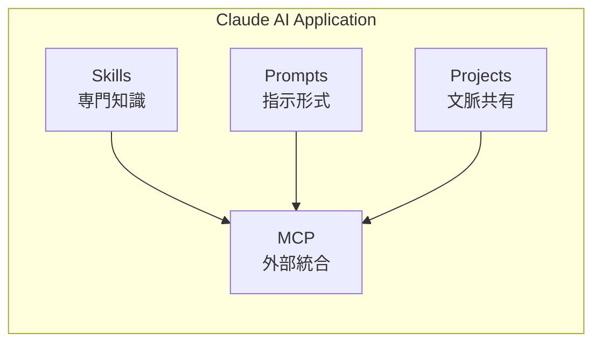

# Claude 公式ベストプラクティス総まとめ


**統合ソース**: Skills, Prompts, Projects, MCP公式ガイド

## 1. 全体像

### Claude エコシステムの4本柱



### 各コンポーネントの役割

| コンポーネント | 役割 | 実装形式 | 起動方法 |
|:---|:---|:---|:---|
| **Skills** | 専門知識のパッケージ化 | `.claude/skills/*/SKILL.md` | モデル起動（自動） |
| **Prompts** | 指示テンプレート | `.claude/commands/*.md` | ユーザー起動（`/command`） |
| **Projects** | プロジェクト文脈 | `.claude/CLAUDE.md` | 自動読み込み |
| **MCP** | 外部ツール統合 | `.claude/mcp.json` | API呼び出し |

---

## 2. Skills

### 核心原則

✅ **1 Skill = 1 機能** （焦点化）
✅ **descriptionが命** （発見性）
✅ **モデル起動型** （自動適用）

### 実装パターン

```yaml
---
name: requirement-clarifier
description: |
  Clarifies ambiguous user requirements through structured questioning.
  Use when: user provides vague specifications, unclear feature requests,
  or when requirements lack concrete examples.
allowed-tools: Read, Grep
---

# Requirement Clarification Expert

## When to Use
- User request lacks specific details
- Multiple interpretations possible
- Edge cases unclear

## Process
1. Identify ambiguous points
2. Ask targeted questions using Given-When-Then format
3. Request concrete examples
4. Confirm understanding

## Example Output
<clarified_requirements>
  <feature>User authentication</feature>
  <specific_requirements>
    <requirement>Support email/password login</requirement>
    <requirement>Include "Remember me" functionality</requirement>
    <requirement>Password reset via email</requirement>
  </specific_requirements>
  <out_of_scope>
    <item>Social login (Google, Facebook)</item>
    <item>Two-factor authentication</item>
  </out_of_scope>
</clarified_requirements>
```

### ベストプラクティス

1. **具体的なキーワードを含める**: "PDF extraction", "authentication", "data validation"
2. **使用タイミングを明記**: "Use when...", "Activate if..."
3. **ツール制限**: セキュリティ重視の場合は`allowed-tools`を指定
4. **チームテスト**: 実際のプロジェクトで検証

---

## 3. Prompts

### 推奨技術階層（公式順序）

1. ✅ **明確性と直接性** ← 最優先
2. ✅ **マルチショット例示**
3. ✅ **思考の連鎖（CoT）**
4. ✅ **XMLタグ活用**
5. ✅ **システムプロンプト**

### 技術別実装例

#### 明確性と直接性

```markdown
# .claude/commands/write-design-doc.md

あなたは要件定義の専門家です。以下の形式で設計書を作成してください:

## 必須項目
1. **機能の目的**: 1文で明確に記述
2. **入出力定義**: TypeScript型定義と具体例
3. **制約事項**: 技術的制約、ビジネス制約
4. **スコープ外機能**: 明示的に実装しない機能をリスト化

## 出力形式
<requirements>
  <overview>[1文の要約]</overview>
  <input_output>
    <input>[TypeScript型定義]</input>
    <output>[TypeScript型定義]</output>
  </input_output>
  <constraints>
    <constraint>[制約1]</constraint>
  </constraints>
  <out_of_scope>
    <item>[実装しない機能1]</item>
  </out_of_scope>
</requirements>
```

#### マルチショット例示

```markdown
# .claude/commands/example-driven-implementation.md

以下の形式でコードを実装してください:

## 例1: 単純な純粋関数
入力: `formatDate("2025-01-18")`
期待出力: `"2025年1月18日"`

実装:
\`\`\`typescript
export function formatDate(isoDate: string): string {
  const date = new Date(isoDate);
  return `${date.getFullYear()}年${date.getMonth() + 1}月${date.getDate()}日`;
}
\`\`\`

## 例2: エラーハンドリング付き
入力: `formatDate("invalid")`
期待出力: Error thrown

実装:
\`\`\`typescript
export function formatDate(isoDate: string): string {
  const date = new Date(isoDate);
  if (isNaN(date.getTime())) {
    throw new Error('Invalid date format');
  }
  return `${date.getFullYear()}年${date.getMonth() + 1}月${date.getDate()}日`;
}
\`\`\`

## あなたのタスク
$ARGUMENTS
```

#### 思考の連鎖（CoT）

```markdown
# .claude/commands/tdd-cycle.md

TDDサイクルを実行してください。各ステップで思考プロセスを示してください:

## Step 1: Red（失敗するテストを書く）
思考プロセス:
- 期待される動作は?
- どのエッジケースをテストすべきか?
- テストの構造は?

テストコード:
[生成されるテスト]

## Step 2: Green（最小限の実装）
思考プロセス:
- テストを通す最小限のコードは?
- 過度な実装をしていないか?

実装コード:
[生成される実装]

## Step 3: Refactor（リファクタリング）
思考プロセス:
- コードの重複は?
- より明確な命名は?
- 抽象化の余地は?

リファクタ後のコード:
[改善されたコード]
```

---

## 4. Projects

### CLAUDE.md の黄金律

✅ **頻繁に使用する情報のみ**
✅ **反復的に改善**
✅ **チームでレビュー**

### 理想的な構成

```markdown
# Project Name

## プロジェクト概要
[プロジェクトの目的、対象ユーザー、価値提案]

## 共通コマンド
- `npm run dev`: 開発サーバー起動（ポート3000）
- `npm test`: 全テスト実行
- `npm run lint`: リント実行

## ディレクトリ構造
\`\`\`
app/
├── routes/          # Remixルート
├── components/      # UIコンポーネント
├── lib/             # 純粋ロジック層
└── data-io/         # 副作用層
\`\`\`

## コードスタイル
- TypeScript厳格モード
- Prettier自動フォーマット
- 3層分離アーキテクチャ遵守

## テストポリシー
- E2EファースEnd（Outside-In TDD）
- 各層ごとに単体テスト
- カバレッジ80%以上

## 注意事項
- Remixの`loader`/`action`はサーバー専用（`.server.ts`推奨）
- クライアント側でのファイルシステムアクセス不可
- 環境変数は`.env`で管理（gitignore必須）

## 禁止事項
- `any`型の使用（型安全性の徹底）
- 直接的なDOM操作（Reactの原則に反する）
- 層の責務を越える実装（3層分離違反）
```

### コンテキスト管理

```bash
# タスク完了ごとに実行
/clear

# 新しいタスク開始
# → 無関係な過去の文脈をクリア
```

---

## 5. MCP

### アーキテクチャ理解

```
Host (Claude Code)
  ├─ Client 1 ←→ Server 1 (lint-checker)
  ├─ Client 2 ←→ Server 2 (test-runner)
  └─ Client 3 ←→ Server 3 (coverage-checker)
```

### 設定例

`.claude/mcp.json`:

```json
{
  "mcpServers": {
    "lint-checker": {
      "command": "node",
      "args": ["scripts/lint-template/engine.js"],
      "description": "コーディング規律チェック"
    },
    "test-runner": {
      "command": "npm",
      "args": ["test", "--", "--run"],
      "description": "テスト実行"
    },
    "coverage-checker": {
      "command": "npm",
      "args": ["run", "test:coverage"],
      "description": "カバレッジ検証"
    }
  }
}
```

### 実装ベストプラクティス

1. **最小権限**: サーバーには必要最小限の権限のみ
2. **エラーハンドリング**: 適切なエラー処理と復旧
3. **明確な説明**: `description`で用途を明確に

---

## 6. 統合ワークフロー

### 典型的な開発フロー

```
1. [Projects] CLAUDE.mdでプロジェクト文脈を共有
   ↓
2. [Skills] requirement-clarifierが要件を明確化
   ↓
3. [Prompts] /write-design-docで設計書作成
   ↓
4. [Skills] remix-design-workflow-expertが3層分離を適用
   ↓
5. [Prompts] /tdd-cycleでテスト駆動開発
   ↓
6. [Skills] outside-in-tdd-practitionerがE2Eファースト適用
   ↓
7. [MCP] lint-checker, test-runnerで品質検証
   ↓
8. [Prompts] /clear で文脈クリア、次のタスクへ
```

### 品質保証フロー

```
実装完了
  ↓
[MCP] lint-checker起動
  ├─ 合格 → 次へ
  └─ 不合格 → [Skills] code-reviewerが自動修正
       ↓
[MCP] test-runner起動
  ├─ 合格 → 次へ
  └─ 不合格 → [Skills] test-fixerが修正
       ↓
[MCP] coverage-checker起動
  ├─ 80%以上 → ✅ 完了
  └─ 80%未満 → [Skills] test-writerが追加テスト作成
```

---

## 7. Remix-boilerplate適用戦略

### Layer 1: 公式準拠の実装

#### Skills実装

```
.claude/skills/layer1-official/
├── requirements-clarification-expert.md
├── prompt-engineering-expert.md
├── context-manager.md
├── xml-structuring-specialist.md
└── tool-integration-architect.md
```

**各Skillの役割**:
- **requirements-clarification-expert**: 曖昧な要求を明確化（Prompts技術1: 明確性）
- **prompt-engineering-expert**: 効果的なプロンプト作成支援（Prompts技術2: 例示）
- **context-manager**: 段階的情報開示（Prompts技術8: 長文コンテキスト）
- **xml-structuring-specialist**: XMLタグによる構造化（Prompts技術4）
- **tool-integration-architect**: MCP統合設計

#### Prompts実装

```
.claude/commands/layer1-official/
├── structured-task.md                # XMLタグ活用
├── example-driven-implementation.md  # マルチショット例示
├── write-design-doc.md               # 明確性と直接性
├── tdd-cycle.md                      # 思考の連鎖（CoT）
└── role-based-agent.md               # システムプロンプト
```

#### Projects設定

`.claude/CLAUDE.md`:

```markdown
# ClaudeMix - Claude Official Best Practices Implementation

## Layer 1: 公式ベストプラクティス

### プロジェクト原則
1. プロンプトエンジニアリング優先（ファインチューニング前）
2. 明確性と具体性の徹底
3. 例示による学習促進
4. 段階的な情報開示

### 開発プロセス
1. Explore（調査）: コードを書かない
2. Plan（計画）: 明確な計画を立てる
3. Code（実装）: TDDサイクルで実装
4. Commit（コミット）: 品質チェック後にコミット

[以下、プロジェクト固有の詳細]
```

#### MCP設定

`.claude/mcp.json`:

```json
{
  "mcpServers": {
    "lint-mcp": {
      "command": "node",
      "args": ["scripts/lint-template/engine.js"],
      "description": "Layer 1: コーディング規律チェック（公式推奨）"
    },
    "test-mcp": {
      "command": "npm",
      "args": ["test"],
      "description": "Layer 1: テスト自動実行（公式推奨）"
    }
  }
}
```

### Layer 2: Remix特化の実装

#### Skills実装

```
.claude/skills/layer2-remix-specific/
├── service-section-pattern-expert.md
├── remix-design-workflow-expert.md
├── remix-3-layer-architect.md
├── css-5-layer-specialist.md
├── outside-in-tdd-practitioner.md
└── mvp-scope-guardian.md
```

**Layer 1との統合**:
- Layer 1の`requirements-clarification-expert`が要件を明確化
- Layer 2の`service-section-pattern-expert`が{service}/{section}に落とし込み
- Layer 1の`xml-structuring-specialist`で構造化
- Layer 2の`remix-design-workflow-expert`が3層分離適用

#### Prompts実装

```
.claude/commands/layer2-remix-specific/
├── run-design-workflow.md
├── design-section.md
├── generate-3-layer-route.md
├── generate-5-layer-css.md
├── verify-test-coverage.md
└── full-quality-check.md
```

#### CLAUDE.md拡張

```markdown
# ClaudeMix

## Layer 1: 公式ベストプラクティス
[前述]

## Layer 2: Remix特化設計思想

### {service}/{section}パターン
- 1 service = 1画面
- 1 section = 1機能
- 未定義セクションは実装禁止

### 定義済みサービス
#### Service: blog
- セクション: posts, post-detail
- 禁止: sort, filter, search（未要求）

### 3層分離アーキテクチャ
- UI層: routes, components
- Logic層: lib（純粋関数のみ）
- Data-IO層: data-io（副作用のみ）

### Outside-In TDD
1. E2Eテスト（失敗）
2. UI層実装+テスト
3. Logic層実装+テスト
4. Data-IO層実装+テスト
5. E2Eテスト（成功）
```

---

## 8. まとめ

### 4本柱の連携

| 要素 | 目的 | Layer 1適用 | Layer 2適用 |
|:---|:---|:---|:---|
| **Skills** | 専門知識 | 公式推奨のプロンプト技術 | Remix特化アーキテクチャ |
| **Prompts** | 指示形式 | 明確性・例示・CoT | 設計フロー・TDD |
| **Projects** | 文脈共有 | プロジェクト背景・原則 | {service}/{section}定義 |
| **MCP** | 外部統合 | 品質チェック自動化 | 層別テスト検証 |

### 移行の優先順位

1. **Phase 1**: Layer 1（公式準拠）実装 → 普遍的価値
2. **Phase 2**: Layer 2（Remix特化）追加 → 独自価値
3. **Phase 3**: 統合テスト・ドキュメント整備

### 期待される効果

✅ **理解に基づく協調**: AIが「なぜ」を理解して実行
✅ **一貫性の自動保持**: Skillsによる品質担保
✅ **柔軟性の獲得**: プロジェクト特性への適応
✅ **開発効率の向上**: 自動化とベストプラクティスの統合

---

## 9. 参考リンク

- **Skills**: https://code.claude.com/docs/en/skills
- **Prompts**: https://docs.claude.com/en/docs/build-with-claude/prompt-engineering/overview
- **Projects**: https://www.anthropic.com/engineering/claude-code-best-practices
- **MCP**: https://docs.claude.com/en/docs/mcp
- **GitHub (MCP)**: https://github.com/modelcontextprotocol
