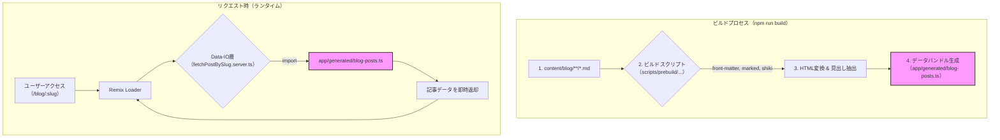

今回のテーマは「**ブログの表示速度を極限まで高めるためのHTMLプレビルド設計**」です。
この記事は、以下のような方に向けて書いています。

- Webサイトのパフォーマンス、特にTTFB（Time To First Byte）に課題を感じている開発者
- Jamstackアーキテクチャの具体的な実装方法に興味がある方
- RemixやViteを使ったビルドプロセスの最適化に関心がある方

この記事を読むと、TTFBを劇的に改善するプレビルドの考え方がわかり、動的なコンテンツ生成処理をビルド時にオフロードする具体的な実装方法を学べます。

今日の学びを一言でいうと
「**重い処理はビルド時に終わらせ、ランタイムは静的データを返すだけに徹する**」
です！

## はじめに：なぜ「プレビルド」なのか？

ブログやメディアサイトにおいて、ページの表示速度はユーザー体験を左右する最も重要な要素の一つです。特に、サーバーが最初の1バイトを返すまでの時間、いわゆるTTFBは、ユーザーが「速い」と感じるかどうかの分かれ目になります。

従来の動的なサイトでは、ユーザーが記事にアクセスするたびに、サーバー側でMarkdownファイルを読み込み、HTMLに変換し、シンタックスハイライトを適用する、といった重い処理が実行されていました。これではアクセスが集中した際にパフォーマンスが低下し、TTFBの遅延は避けられません。

この課題を解決するために、私たちはJamstackアーキテクチャのベストプラクティスに沿った「プレビルドシステム」を設計・導入しました。

## 設計思想：何を解決したかったか

私たちが直面した壁は、大きく分けて二つありました。

1.  **パフォーマンスの壁**: リクエストごとの動的変換処理がCPU負荷を高め、表示遅延の原因となっていました。
2.  **設計上の壁**: 生成されたHTMLファイルをGitで管理すると、元となるMarkdownファイルとの同期が崩れるリスクがありました。コンテンツの「唯一の真実の源（Single Source of Truth）」が曖昧になるのは、保守性の観点から致命的です。

これらの課題を解決するため、私たちは「**ビルド時に全ての重い処理を完了させ、ランタイムの責務を最小化する**」というアプローチを選択しました。

## アーキテクチャ解説

このプレビルドシステムの全体像は以下のようになります。ビルドプロセスとランタイム（リクエスト時）で役割が明確に分離されているのが特徴です。



### ビルドプロセスの流れ

`npm run build` を実行すると、`prebuild` スクリプトが起動します。

1.  **Markdownファイルの探索**: `content/blog/posts/` 配下にある全ての `.md` ファイルを探索します。
2.  **変換処理**: 各ファイルに対して、以下の重い処理を実行します。
    -   `gray-matter` でFrontmatter（メタデータ）を抽出
    -   `marked` でMarkdown本文をHTMLに変換
    -   `shiki` でコードブロックのシンタックスハイライトを適用
    -   見出し情報を抽出し、目次生成用のデータを作成
3.  **データバンドル生成**: 全ての記事の変換結果（HTMLコンテンツ、メタデータ、見出し情報）を一つのTypeScriptファイル `app/generated/blog-posts.ts` にまとめます。このファイルはGitの管理対象から除外します（`.gitignore` に追加）。

### ランタイムの動作

ユーザーが記事ページにアクセスすると、Remixの `loader` 関数が実行されます。

1.  `loader` はデータIO層の関数 `fetchPostBySlug` を呼び出します。
2.  `fetchPostBySlug` は、ビルド時に生成されたデータバンドル `app/generated/blog-posts.ts` を **直接インポート** します。
3.  データバンドル内の `Map` オブジェクトを使い、リクエストされた `slug` に対応する記事データを瞬時に取得して返します。

このアーキテクチャにより、ランタイムではファイルI/OやCPU負荷の高い変換処理が一切発生せず、メモリからデータを返すだけの極めて軽量な動作が実現されます。

## コード抜粋：ビルドスクリプトとデータバンドル

実際のビルドプロセスを担うスクリプトと、その生成物を見てみましょう。

### ビルドスクリプトの責務 (`scripts/prebuild/generate-blog-posts.js`)

このスクリプトは、前述の変換処理を行い、最終的にデータバンドルを生成する役割を担います。

```javascript:scripts/prebuild/generate-blog-posts.js
// 抜粋：記事データを生成し、ファイルに書き出す部分
import fs from 'fs/promises';
import path from 'path';

async function generateBlogData() {
  // 1. 全てのMarkdownファイルから記事データを生成 (変換処理を含む)
  const allPosts = await processAllMarkdownFiles();

  // 2. データを高速に参照するためのMapを作成
  const postsMap = new Map(allPosts.map(post => [post.slug, post]));

  // 3. データバンドル用のTypeScriptコードを生成
  const dataBundleContent = `
    import type { BlogPost } from '~/specs/blog/types';

    export const allPosts: BlogPost[] = ${JSON.stringify(allPosts, null, 2)};

    const postsMap = new Map<string, BlogPost>(allPosts.map(p => [p.slug, p]));

    export function getPostBySlug(slug: string): BlogPost | undefined {
      return postsMap.get(slug);
    }
  `;

  // 4. ファイルに書き出す
  const outputPath = path.resolve('app/generated/blog-posts.ts');
  await fs.writeFile(outputPath, dataBundleContent);
}
```

### データIO層の責務 (`app/data-io/blog/post-detail/fetchPostBySlug.server.ts`)

ランタイムで記事データを取得するコードは、驚くほどシンプルになります。

```typescript:app/data-io/blog/post-detail/fetchPostBySlug.server.ts
import { getPostBySlug as getFromBundle } from '~/generated/blog-posts';

export function fetchPostBySlug(slug: string) {
  // ビルド済みデータバンドルから関数を呼び出すだけ
  const post = getFromBundle(slug);
  return post;
}
```

## 今回の学びと感想

今回のプレビルドシステム導入から得られた最大の学びは、「**責務の分離がパフォーマンスと保守性の両方を向上させる**」という点です。ランタイムから重い処理を完全に切り離し、ビルドプロセスにその責務を移譲することで、ユーザーには最高の表示速度を提供しつつ、開発者はコンテンツ（Markdown）の管理に集中できる環境が整いました。

記事数が増えることによるビルド時間の増加というトレードオフはありますが、CI/CDによる自動化と、それによって得られるランタイムの信頼性とパフォーマンスのメリットは、そのデメリットを遥かに上回ると考えています。

同じようにWebサイトのパフォーマンスで悩んでいる方がいれば、この「プレビルド」という考え方が一つの強力な解決策になるはずです。