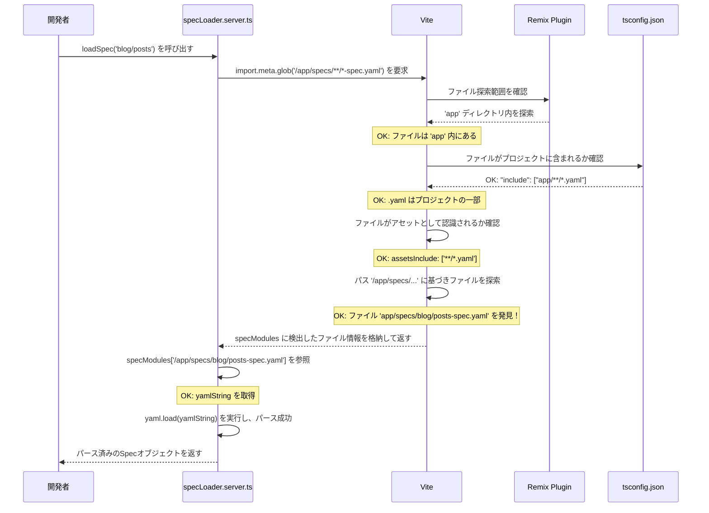

## 発生した問題

RemixとViteで構成されたプロジェクトで、`/blog` ページにアクセスすると500サーバーエラーが発生しました。

原因は、サーバーサイドで記事のメタデータを読み込むために使用していた `specLoader.server.ts` 内の `import.meta.glob` が、対象の `.yaml` ファイルを検出できず、`specModules` が空のオブジェクト `[]` になってしまうことでした。

```typescript
// app/spec-loader/specLoader.server.ts

// ...
const specModules = import.meta.glob('/app/specs/**/*-spec.yaml', {
  // ...
});

// ...
if (typeof yamlString !== 'string') {
  // この時点で specModules が空のため、yamlString が undefined となりエラーが発生
  throw new Error(
    `Spec file not found for feature: ${featurePath} (path: ${modulePath})`,
  );
}
```

## 原因分析：複数の要因の積み重ね

この問題は単一の原因ではなく、以下の4つの要因が複合的に絡み合っていました。一つずつ解決していくことで、最終的に根本原因にたどり着きました。

### 1. Viteの監視範囲外にファイルが存在した

*   **事象**: 当初、`spec.yaml` はプロジェクトルート直下の `develop` ディレクトリに配置されていました。
*   **問題**: RemixのViteプラグインは `app` ディレクトリを重点的に監視するため、その外にある `develop` ディレクトリ内のファイルは `import.meta.glob` の探索対象から漏れてしまっていました。
*   **対策**: ファイルを `app/specs/` ディレクトリに移動しました。

### 2. TypeScriptのコンパイル対象外だった

*   **事象**: `tsconfig.json` の `include` 配列に、`app` ディレクトリ内の `.yaml` ファイルを対象とするパターン (`"app/**/*.yaml"`) が含まれていませんでした。
*   **問題**: これにより、たとえファイルを `app` 配下に移動しても、TypeScriptおよびViteからプロジェクトの一部として認識されませんでした。
*   **対策**: `tsconfig.json` の `include` に `"app/**/*.yaml"` を追加しました。

### 3. Viteのアセットとして認識されていなかった

*   **事象**: Viteはデフォルトで `.yaml` をインポート可能なアセットとして認識しません。
*   **問題**: `import.meta.glob` で `?raw` クエリを使ってファイルを文字列としてインポートするには、Viteにそのファイル形式をアセットとして明示的に教える必要がありました。
*   **対策**: `vite.config.ts` に `build.assetsInclude: ['**/*.yaml']` を追加しました。

### 4. 最終的なブロッカー：パスのタイポ（1文字違い）

*   **事象**: 上記1〜3をすべて解決した後もエラーが継続しました。
*   **問題**: ファイルは `app/specs/` (複数形) に配置されていましたが、`specLoader.server.ts` 内の `import.meta.glob` のパスが `/app/spec/` (単数形) になっていました。このわずか1文字の違いが、ファイルを見つけられない最後の原因でした。
*   **対策**: `specLoader.server.ts` のパスを `/app/specs/` に修正しました。

## シーケンス図で見る解決までの流れ



## まとめ

`import.meta.glob` が期待通りに動作しない場合、以下の点を確認することが重要です。

1.  **ファイルパス**: `import.meta.glob` のパスパターンは正しいか？（タイポはないか？）
2.  **Viteの監視範囲**: ファイルはViteが監視するディレクトリ（Remixの場合は `app`）内にあるか？
3.  **TypeScriptの `include`**: `tsconfig.json` でファイルがプロジェクトの一部として認識されているか？
4.  **Viteの `assetsInclude`**: `?raw` などでインポートする場合、ファイル形式がViteのアセットとして認識されているか？

今回のケースのように、複数の設定が絡み合って問題を引き起こすことは珍しくありません。一つずつ仮説を立てて検証していく地道な作業が、解決への一番の近道でした。