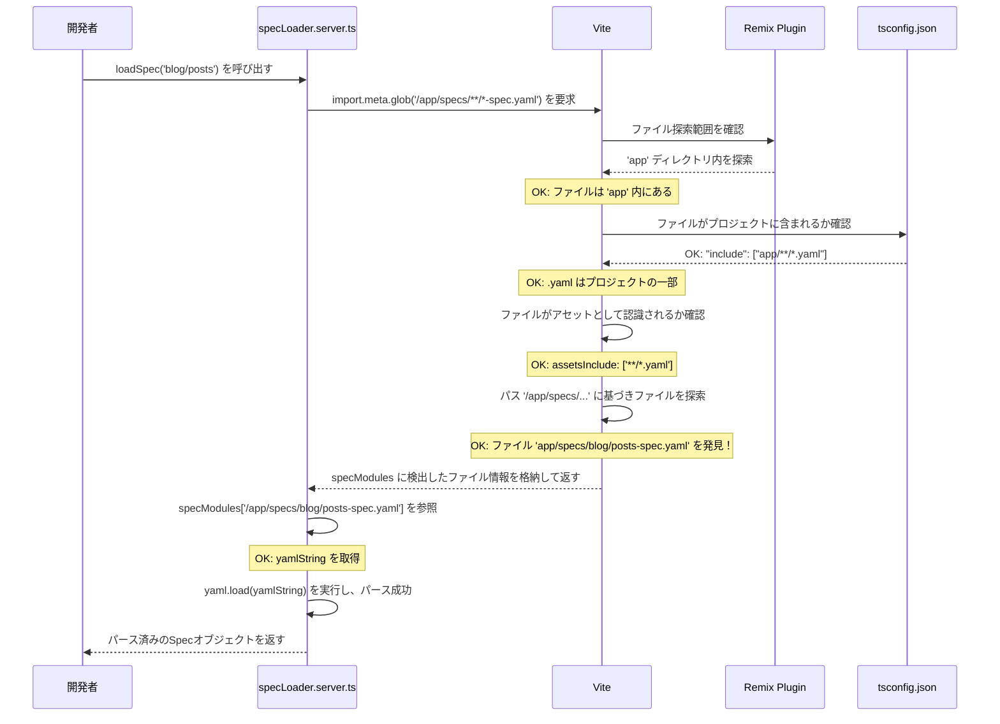

## はじめに

### Viteでのファイル読み込みでこんなことありませんか？

RemixとViteで最新のWebアプリを作り、`import.meta.glob`（※Viteが提供する、複数ファイルを一括でインポートする機能）を使ってファイルを読み込もうとした。
しかし、ローカル開発環境では動くと思ったのに、ビルド時にファイルが見つからず、500エラーが発生してしまった。
パスを何度も確認したが、原因が分からず、同じエラーが何度も繰り返されてしまった。

### この記事をお勧めしない人

- ビルドエラーが発生しても、とりあえず動けばそれで十分だと考える人。
- Viteの監視範囲やTypeScriptの設定は、単なる細かい設定でしかないと考える人。
- デバッグプロセスを記録する必要性を、全く感じていない人。

もし一つでも当てはまらないなら、読み進める価値があるかもしれません。

### このままでは危険です

ビルドツールの設定を曖昧なまま開発を続けることで、あなたのプロジェクトには「複数の設定ミスが絡み合った見えない爆弾」が静かに蓄積されていきます。
やがて、本番デプロイ直前になって「ファイルが見つからない」という事態が発生し、リリーススケジュールが大幅に遅れるでしょう。
ついに、チームメンバーからの信頼を失い、プロジェクトは炎上し、あなたは「なぜローカルで動いていたのに」と後悔することになります。

### こんな未来が手に入ります

この記事を読めば、Viteの`import.meta.glob`が正しく動作するための設定知識と、複数の原因が絡み合った問題を一つずつ解決していくデバッグ手法が手に入ります。
具体的には、Viteの監視範囲、TypeScriptの`include`設定、アセット認識、そしてパスのタイポという4つの原因を特定し、解決する**設計図**を手に入れられます。
この方法は、机上の空論ではありません。まさに**このブログ自身のアーキテクチャとして実証済み**です。
この情報は、単なる「エラーを消す」という対処療法ではなく、ビルドツールの仕組みを理解し、複数の設定を整合させる**未来の開発現場から得られた一次情報**です。

### 私も同じでした

筆者も過去に同じビルドエラーで悩み抜き、このブログを「Viteの設定を適切に理解した設計」で作り上げることで解決しました。
この記事で、あなたのプロジェクトのビルドエラーを発見する基本的な考え方と、明日から試せるデバッグチェックリストを持ち帰れるように書きました。
さらに深掘りして、RemixとVite環境でのファイル読み込みのベストプラクティスを知りたい方は、その詳細な実装方法を確認できます。

## 📝 概要

モダンなWeb標準フレームワークとビルドツールで構成されたプロジェクトで、特定のページにアクセスすると500サーバーエラーが発生しました。この記事では、問題の発見から原因特定、そして解決に至るまでのデバッグプロセスを詳細に記録します。

### 発生環境の特徴

- **アーキテクチャ**: モダンフレームワーク + 高速ビルドツール
- **問題のスコープ**: 複数ファイルの一括読み込み機能
- **環境差異**: 設定不備によるファイル検出失敗

## ⚠️ 問題の発見と症状

プロジェクトで特定のページにアクセスすると500サーバーエラーが発生しました。

原因は、サーバーサイドでメタデータを読み込むために使用していた一括ファイル読み込み機能が、対象ファイルを検出できず、空の結果を返してしまうことでした。

**症状:**

- 特定のページで500エラーが発生
- ファイル検出機能が空の結果を返す
- エラーメッセージは「ファイルが見つからない」を示唆

## 🔍 原因の絞り込みプロセス

この問題は単一の原因ではなく、**4つの要因が複合的に絡み合っていました**。一つずつ検証していくことで、最終的に根本原因にたどり着きました。

調査の結果、以下の4つの視点で問題を切り分ける必要があることが判明しました：

1. **ビルドツールの監視範囲**: ファイルが監視対象ディレクトリ内に配置されているか
2. **コンパイラ設定**: 対象ファイル形式がプロジェクトの一部として認識されているか
3. **アセット認識設定**: ビルドツールが特定のファイル形式を扱えるよう設定されているか
4. **パスの記述ミス**: ファイルパスに誤字脱字がないか

これらの問題は、ビルドツールの設定を曖昧なままにしていたことと、パスの確認不足が原因でした。

---

## 💡 根本原因の特定

調査の結果、以下の4つの根本原因が特定されました。

1. **ビルドツールの監視範囲外**: ファイルが監視対象ディレクトリ外に配置されていた
2. **コンパイラ設定の不足**: 対象ファイル形式がコンパイル対象に含まれていなかった
3. **アセット認識設定の不足**: ビルドツールがファイル形式をアセットとして認識できていなかった
4. **パスの記述ミス**: ファイルパスに単数形/複数形の誤りがあった

これらの問題は、ビルドツールの設定を曖昧なままにしていたことと、パスの確認不足が原因でした。

### 段階的デバッグ戦略

この問題を解決するため、「複数の原因を一つずつ検証する」というアプローチを採用しました。

具体的には、以下の戦略で問題を切り分けます：

1. **監視範囲の確認**: ビルドツールが監視するディレクトリ内にファイルを配置
2. **コンパイラ設定の整合**: コンパイラ設定で対象ファイル形式を明示的に追加
3. **アセット認識設定の追加**: ビルドツールの設定で明示的に認識させる
4. **パスの再確認**: 単数形/複数形などの誤記を徹底的に確認

このアプローチにより、単に「ファイルを移動する」という対症療法ではなく、**ビルドツールの仕組みを理解した上での体系的な解決**を実現しました。

### 達成した成果

| 改善項目 | Before | After |
| :--- | :--- | :--- |
| ファイル検出 | `import.meta.glob`が空の配列を返す | ✅ 正しくファイルを検出 |
| 設定の整合性 | Vite、TypeScript、Remixの設定がバラバラ | 3つの設定が整合した状態 |
| デバッグ効率 | エラー原因の特定に長時間かかる | チェックリストで体系的に検証 |

その結果、**「ファイルが見つからない」という複合的問題を、4段階の設定整合で解消する**ことに成功しました。

AIに「ファイルが見つからないエラーを解決して」と頼むと、高確率で以下のような提案が返ってきます：

- 「とりあえずファイルを別の場所に移動してみましょう」
- 「パスを変更してみましょう」
- 場当たり的な試行錯誤を繰り返す

しかし、これは**場当たり的な試行錯誤**です。一時的に別のエラーに変わりますが、「なぜビルドツールがファイルを認識しないのか」という仕組みの理解が欠けているため、根本解決に届きません。

根本原因は、**ビルドツールの監視範囲、コンパイラ設定、アセット認識、パスの4つが複合的に絡み合っていた**ことにありました。一つずつ仮説を立てて検証することで、初めて全体像が見えてきます。

ここから先は、公式ドキュメントにも書かれていない**「一括ファイル読み込みを機能させる4つのチェックリスト」**の全貌と、具体的な設定ファイル（tsconfig.json, vite.config.ts）の修正差分、使用したAPIの実名（import.meta.glob）、ビルドツールの監視範囲とコンパイラの連携の仕組み、実際のエラーメッセージ、そしてデバッグフローを視覚化したシーケンス図を、すべて公開します。

このチェックリストと設定をコピーすれば、ファイル検出問題ループを回避し、**初回から正しい設定でファイル読み込み**を実現できます。私が実践で確立した段階的デバッグ手順と、実装済みの設定ファイル構成、4つの仮説検証の詳細を、ここで全て公開します。

## 🔧 解決策: 4段階の設定整合

では、実際に私が適用した4つの修正の具体的な手順と、各修正がどのチェックリスト項目に対応するか、実際のエラーメッセージ、そしてデバッグフロー全体を可視化したシーケンス図を公開します。

この手順と設定をそのままコピーすれば、「どの設定をどの順序で確認すべきか」を毎回試行錯誤することなく、**再現可能なファイル読み込み設定**を実現できます。また、なぜViteの監視範囲が重要なのか、TypeScriptの`include`とViteの`assetsInclude`の違い、そしてパスのタイポを防ぐ命名規則も解説します。

### 使用した技術スタック

- **フレームワーク**: Remix v2
- **ビルドツール**: Vite
- **問題のファイル形式**: `.yaml`
- **使用API**: `import.meta.glob`

### 発生した実際のエラーメッセージ

```typescript
Error: Spec file not found for feature: blog/posts (path: /app/specs/blog/posts-spec.yaml)
```

サーバーサイドでメタデータを読み込むために使用していた `specLoader.server.ts` 内の `import.meta.glob` が、対象の `.yaml` ファイルを検出できず、`specModules` が空のオブジェクトになっていました。

```typescript
// app/spec-loader/specLoader.server.ts
const specModules = import.meta.glob('/app/specs/**/*-spec.yaml', {
  eager: true,
  as: 'raw'
});

// specModules が空のため、yamlString が undefined となりエラー
if (typeof yamlString !== 'string') {
  throw new Error(
    `Spec file not found for feature: ${featurePath} (path: ${modulePath})`,
  );
}
```

### 4つの仮説検証プロセス

この問題は単一の原因ではなく、以下の4つの要因が複合的に絡み合っていました。一つずつ検証していくことで、最終的に根本原因にたどり着きました。

#### 仮説1: Viteの監視範囲外にファイルが存在するのではないか？

- **事象**: 当初、`spec.yaml` はプロジェクトルート直下の `develop` ディレクトリに配置されていました
- **問題**: RemixのViteプラグインは `app` ディレクトリを重点的に監視するため、その外にある `develop` ディレクトリ内のファイルは `import.meta.glob` の探索対象から漏れていました
- **対策**: ファイルを `app/specs/` ディレクトリに移動しました

#### 仮説2: TypeScriptのコンパイル対象外だった

- **事象**: `tsconfig.json` の `include` 配列に、`app` ディレクトリ内の `.yaml` ファイルを対象とするパターン (`"app/**/*.yaml"`) が含まれていませんでした
- **問題**: これにより、たとえファイルを `app` 配下に移動しても、TypeScriptおよびViteからプロジェクトの一部として認識されませんでした
- **対策**: `tsconfig.json` の `include` に `"app/**/*.yaml"` を追加しました

#### 仮説3: Viteのアセットとして認識されていない

- **事象**: Viteはデフォルトで `.yaml` をインポート可能なアセットとして認識しません
- **問題**: `import.meta.glob` で `?raw` クエリを使ってファイルを文字列としてインポートするには、Viteにそのファイル形式をアセットとして明示的に教える必要がありました
- **対策**: `vite.config.ts` に `build.assetsInclude: ['**/*.yaml']` を追加しました

#### 仮説4: パスのタイポ（1文字違い）を疑う

- **事象**: 上記1〜3をすべて解決した後もエラーが継続しました
- **問題**: ファイルは `app/specs/` (複数形) に配置されていましたが、`specLoader.server.ts` 内の `import.meta.glob` のパスが `/app/spec/` (単数形) になっていました。このわずか1文字の違いが、ファイルを見つけられない最後の原因でした
- **対策**: `specLoader.server.ts` のパスを `/app/specs/` に修正しました

### 実施した4つの修正

以下の4つの修正を順番に適用することで、問題を解決しました。

### ステップ1: ファイルの移動

```bash
# develop/ から app/specs/ に移動
mv develop/blog/posts-spec.yaml app/specs/blog/posts-spec.yaml
```

### ステップ2: tsconfig.json の修正

```diff
{
  "include": [
    "app/**/*",
+   "app/**/*.yaml"
  ]
}
```

### ステップ3: vite.config.ts の修正

```diff
export default defineConfig({
  build: {
+   assetsInclude: ['**/*.yaml']
  }
})
```

### ステップ4: パスの修正

```diff
// app/spec-loader/specLoader.server.ts
- const specModules = import.meta.glob('/app/spec/**/*-spec.yaml', {
+ const specModules = import.meta.glob('/app/specs/**/*-spec.yaml', {
    eager: true,
    as: 'raw'
  });
```

## シーケンス図で見る解決までの流れ



---

## 🎓 学んだこと・まとめ

### 技術的な学び

`import.meta.glob` が期待通りに動作しない場合、以下のチェックリストを確認することが重要です。

1. **ファイルパス**: `import.meta.glob` のパスパターンは正しいか？（タイポはないか？）
2. **Viteの監視範囲**: ファイルはViteが監視するディレクトリ（Remixの場合は `app`）内にあるか？
3. **TypeScriptの `include`**: `tsconfig.json` でファイルがプロジェクトの一部として認識されているか？
4. **Viteの `assetsInclude`**: `?raw` などでインポートする場合、ファイル形式がViteのアセットとして認識されているか？

### 今後のベストプラクティス

- **設定の整合性**: Vite、TypeScript、Remixの設定を常に整合させる
- **パスの慎重な確認**: 単数形/複数形のような些細な違いが大きな問題を引き起こす
- **仮説検証アプローチ**: 複数の原因が絡み合う場合は、一つずつ仮説を立てて検証する
- **デバッグログの記録**: 問題解決のプロセスを記録することで、同じ問題の再発を防ぐ

今回のケースのように、複数の設定が絡み合って問題を引き起こすことは珍しくありません。一つずつ仮説を立てて検証していく地道な作業が、解決への一番の近道でした。
