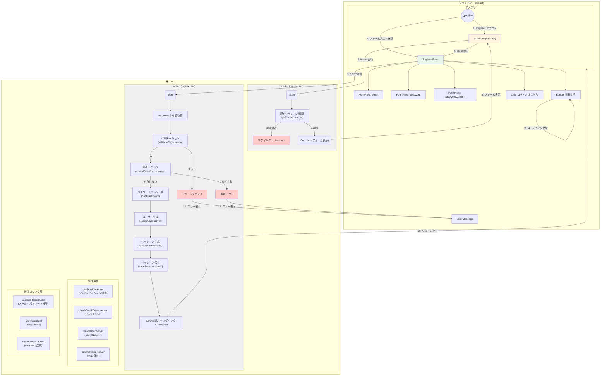
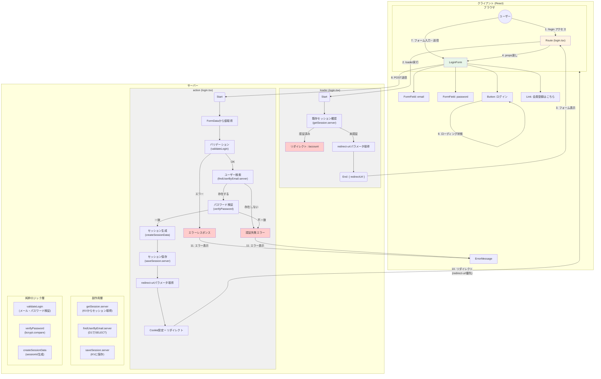
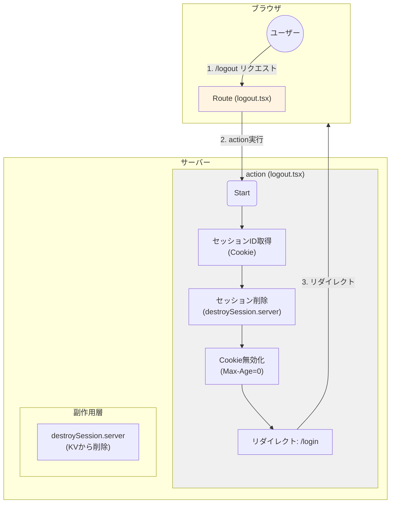
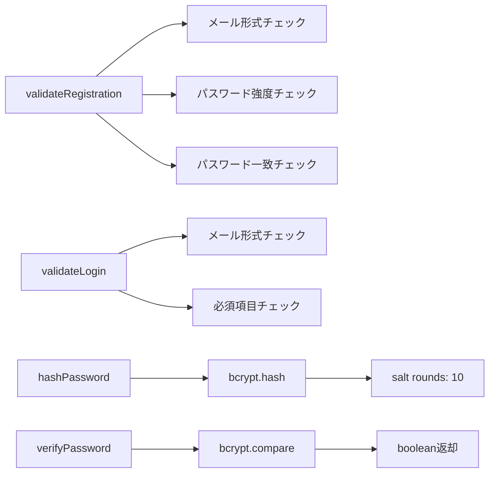
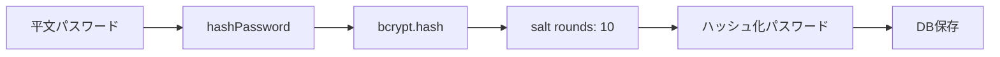
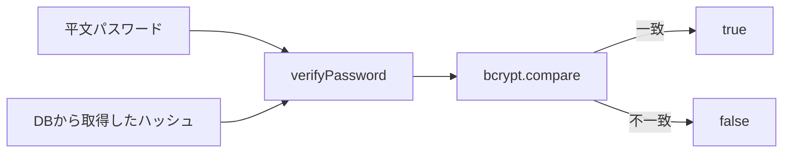
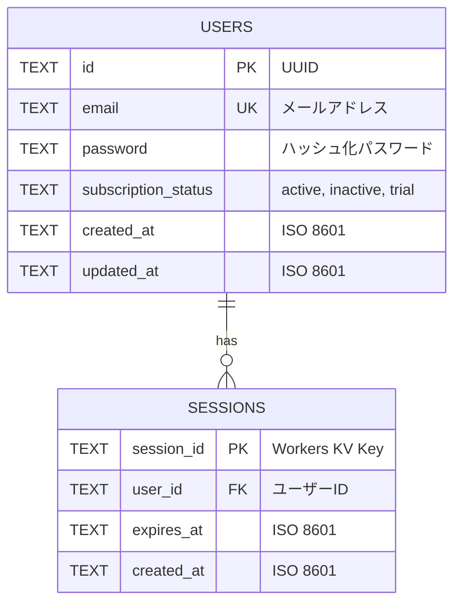

# data-flow-diagram.md - authentication Section

## 目的

`file-list.md`を基に、`authentication`セクションのコンポーネント間の依存関係とデータフローをMermaid図として可視化する。

---

## データフロー図

### 会員登録フロー



---

### ログインフロー



---

### ログアウトフロー



---

## コンポーネント責務

| コンポーネント | 責務 | 依存先 |
| :--- | :--- | :--- |
| **register.tsx** | 会員登録ページのRoute定義、loader/action処理 | RegisterForm, validateRegistration, createUser.server, hashPassword |
| **login.tsx** | ログインページのRoute定義、loader/action処理 | LoginForm, validateLogin, findUserByEmail.server, verifyPassword |
| **logout.tsx** | ログアウト処理専用Route（actionのみ） | destroySession.server |
| **RegisterForm** | 会員登録フォームUI、バリデーションエラー表示 | FormField, Button, ErrorMessage (common) |
| **LoginForm** | ログインフォームUI、バリデーションエラー表示 | FormField, Button, ErrorMessage (common) |

---

## 純粋ロジック層の関数依存関係



### 純粋ロジック層の責務

| 関数 | 入力 | 処理 | 出力 |
| :--- | :--- | :--- | :--- |
| **validateRegistration** | email, password, passwordConfirm | メール形式、パスワード強度、一致確認 | ValidationError[] |
| **validateLogin** | email, password | メール形式、必須項目確認 | ValidationError[] |
| **hashPassword** | password: string | bcryptでハッシュ化 | hashedPassword: string |
| **verifyPassword** | password: string, hash: string | bcryptで比較 | boolean |

---

## 副作用層の関数依存関係

```mermaid
graph TD
    A[createUser.server] --> B[D1 Database]
    B --> C[INSERT INTO users]
    C --> D[User型返却]

    E[findUserByEmail.server] --> F[D1 Database]
    F --> G[SELECT FROM users WHERE email]
    G --> H[User型 | null返却]

    I[checkEmailExists.server] --> J[D1 Database]
    J --> K[SELECT COUNT FROM users WHERE email]
    K --> L[boolean返却]

    M[getSession.server] --> N[Cloudflare Workers KV]
    N --> O[SessionData | null返却]

    P[saveSession.server] --> Q[Cloudflare Workers KV]
    Q --> R[SET with TTL]

    S[destroySession.server] --> T[Cloudflare Workers KV]
    T --> U[DELETE]
```

### 副作用層の責務

| 関数 | 副作用の種類 | 依存リソース | 入力 | 出力 |
| :--- | :--- | :--- | :--- | :--- |
| **createUser.server** | DB書き込み | D1 Database | email, hashedPassword | User |
| **findUserByEmail.server** | DB読み取り | D1 Database | email | User \| null |
| **checkEmailExists.server** | DB読み取り | D1 Database | email | boolean |
| **getSession.server** | KV読み取り、Cookie読み取り | Workers KV, HTTP Request | - | SessionData \| null |
| **saveSession.server** | KV書き込み、Cookie書き込み | Workers KV, HTTP Response | SessionData | void |
| **destroySession.server** | KV削除、Cookie無効化 | Workers KV, HTTP Response | sessionId | void |

---

## セキュリティフロー

### パスワードハッシュ化フロー



### パスワード検証フロー



### セッション生成フロー

```mermaid
graph LR
    A[ユーザー認証成功] --> B[createSessionData]
    B --> C[crypto.randomUUID]
    C --> D[sessionId生成]
    D --> E[expiresAt計算<br/>(現在時刻 + 7日)]
    E --> F[SessionData作成]
    F --> G[saveSession.server]
    G --> H[Workers KV保存<br/>(TTL: 7日)]
    H --> I[Cookie設定<br/>(HttpOnly, Secure, SameSite=Lax)]
```

---

## エラーハンドリングフロー

### 会員登録エラー

```mermaid
graph TD
    A[register action] --> B{バリデーション}
    B -- エラー --> C[ValidationError[] 返却]
    B -- OK --> D{メールアドレス重複?}
    D -- 重複 --> E[email_exists エラー返却]
    D -- OK --> F{ユーザー作成成功?}
    F -- 失敗 --> G[creation_failed エラー返却]
    F -- 成功 --> H{セッション生成成功?}
    H -- 失敗 --> I[session_creation_failed エラー返却]
    H -- 成功 --> J[リダイレクト: /account]

    style C fill:#ffcccc
    style E fill:#ffcccc
    style G fill:#ffcccc
    style I fill:#ffcccc
    style J fill:#e8f5e9
```

### ログインエラー

```mermaid
graph TD
    A[login action] --> B{バリデーション}
    B -- エラー --> C[ValidationError[] 返却]
    B -- OK --> D{ユーザー存在?}
    D -- 存在しない --> E[invalid_credentials エラー]
    D -- 存在する --> F{パスワード一致?}
    F -- 不一致 --> E
    F -- 一致 --> G{セッション生成成功?}
    G -- 失敗 --> H[session_creation_failed エラー返却]
    G -- 成功 --> I[リダイレクト]

    style C fill:#ffcccc
    style E fill:#ffcccc
    style H fill:#ffcccc
    style I fill:#e8f5e9
```

---

## リダイレクト動作フロー

### ログイン後のリダイレクト

```mermaid
graph TD
    A[login action成功] --> B{redirect-urlパラメータ存在?}
    B -- Yes --> C[パラメータのURLへリダイレクト]
    B -- No --> D[デフォルト: /account へリダイレクト]

    E[例: /login?redirect-url=/account/settings] --> F[ログイン成功後]
    F --> G[リダイレクト: /account/settings]

    H[例: /login (パラメータなし)] --> I[ログイン成功後]
    I --> J[リダイレクト: /account]
```

### 既にログイン済みの場合

```mermaid
graph TD
    A[/register または /login アクセス] --> B[loader実行]
    B --> C{セッション有効?}
    C -- Yes --> D[リダイレクト: /account]
    C -- No --> E[フォーム表示]
```

---

## データベーススキーマ図



> **注**: SESSIONSはCloudflare Workers KVに保存されます（D1ではありません）

---

**最終更新**: 2025-12-23
