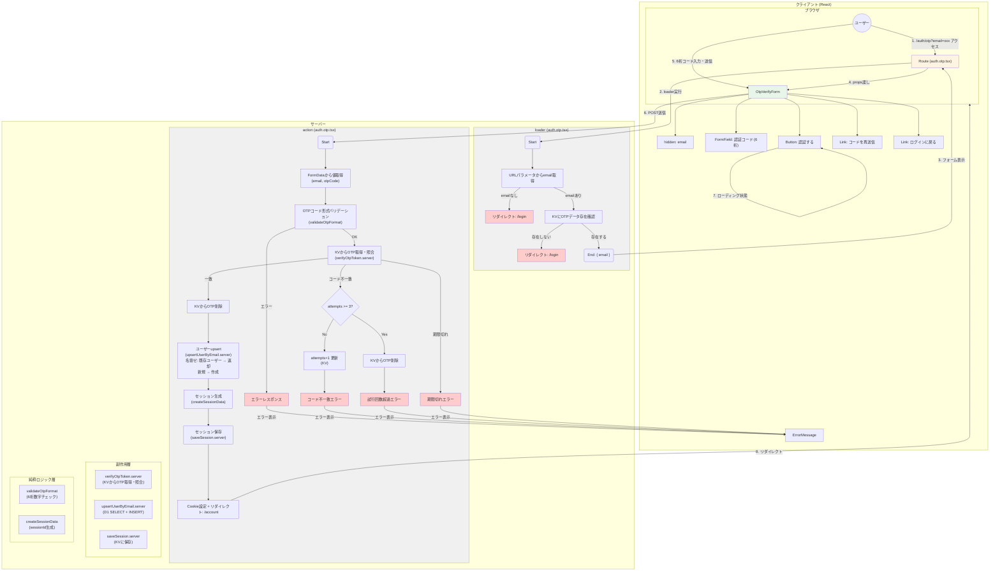

# data-flow-diagram.md - authentication Section

## 目的

`file-list.md`を基に、`authentication`セクションのコンポーネント間の依存関係とデータフローをMermaid図として可視化する。

---

## データフロー図

### 会員登録フロー

---

### ログインフロー

---

### ログアウトフロー

---

### パスワードリセットメール送信フロー

### パスワードリセット実行フロー

---

### OTPコード送信フロー

---

### OTP検証・ログインフロー

---

## コンポーネント責務

| コンポーネント | 責務 | 依存先 |
| :--- | :--- | :--- |
| **register.tsx** | 会員登録ページのRoute定義、loader/action処理 | RegisterForm, validateRegistration, createUser.server, hashPassword |
| **login.tsx** | ログインページのRoute定義、loader/action処理 | LoginForm, validateLogin, findUserByEmail.server, verifyPassword |
| **logout.tsx** | ログアウト処理専用Route（actionのみ） | destroySession.server |
| **forgot-password.tsx** | パスワードリセットメール送信ページのRoute定義、loader/action処理 | ForgotPasswordForm, findUserByEmail.server, sendPasswordResetEmail.server |
| **reset-password.$token.tsx** | パスワードリセット実行ページのRoute定義、loader/action処理 | ResetPasswordForm, getPasswordResetToken.server, updateUserPassword.server, hashPassword |
| **auth.otp.tsx** | OTP検証ページのRoute定義、loader防衛/action処理 | OtpVerifyForm, validateOtpFormat, verifyOtpToken.server, upsertUserByEmail.server |
| **RegisterForm** | 会員登録フォームUI、バリデーションエラー表示 | FormField, Button, ErrorMessage (common) |
| **LoginForm** | ログインフォームUI、バリデーションエラー表示 | FormField, Button, ErrorMessage (common) |
| **ForgotPasswordForm** | パスワードリセットメール送信フォームUI、ヘルプテキスト表示 | FormField, Button, ErrorMessage (common) |
| **ResetPasswordForm** | パスワードリセット実行フォームUI、トークン検証 | FormField, Button, ErrorMessage (common) |
| **OtpVerifyForm** | OTPコード検証フォームUI、エラー表示 | FormField, Button, ErrorMessage, Link (common) |

---

## 純粋ロジック層の関数依存関係

### 純粋ロジック層の責務

| 関数 | 入力 | 処理 | 出力 |
| :--- | :--- | :--- | :--- |
| **validateRegistration** | email, password, passwordConfirm | メール形式、パスワード強度、一致確認 | ValidationError[] |
| **validateLogin** | email, password | メール形式、必須項目確認 | ValidationError[] |
| **hashPassword** | password: string | bcryptでハッシュ化 | hashedPassword: string |
| **verifyPassword** | password: string, hash: string | bcryptで比較 | boolean |
| **generateAuthToken** | - | crypto.getRandomValuesで6桁OTP生成 | string (6桁数字) |
| **validateOtpFormat** | code: string | 正規表現 `^\d{6}$` で形式チェック | boolean |

---

## 副作用層の関数依存関係

### 副作用層の責務

| 関数 | 副作用の種類 | 依存リソース | 入力 | 出力 |
| :--- | :--- | :--- | :--- | :--- |
| **createUser.server** | DB書き込み | D1 Database | email, hashedPassword | User |
| **findUserByEmail.server** | DB読み取り | D1 Database | email | User \| null |
| **checkEmailExists.server** | DB読み取り | D1 Database | email | boolean |
| **getSession.server** | KV読み取り、Cookie読み取り | Workers KV, HTTP Request | - | SessionData \| null |
| **saveSession.server** | KV書き込み、Cookie書き込み | Workers KV, HTTP Response | SessionData | void |
| **destroySession.server** | KV削除、Cookie無効化 | Workers KV, HTTP Response | sessionId | void |
| **saveOtpToken.server** | KV書き込み | Workers KV | email, code | void |
| **verifyOtpToken.server** | KV読み取り・書き込み | Workers KV | email, code | OtpVerifyResult |
| **upsertUserByEmail.server** | DB読み取り・書き込み | D1 Database | email | User |
| **checkOtpRateLimit.server** | KV読み取り・書き込み | Workers KV | email | boolean |
| **sendAuthEmail.server** | 外部API呼び出し | Resend API | email, code | void |

---

## セキュリティフロー

### パスワードハッシュ化フロー

### パスワード検証フロー

### セッション生成フロー

---

## エラーハンドリングフロー

### 会員登録エラー

### ログインエラー

---

## リダイレクト動作フロー

### ログイン後のリダイレクト

### Google OAuth後のリダイレクト

### 既にログイン済みの場合

---

## データベーススキーマ図

> **注**: SESSIONSはCloudflare Workers KVに保存されます（D1ではありません）

---

**最終更新**: 2026-02-10
