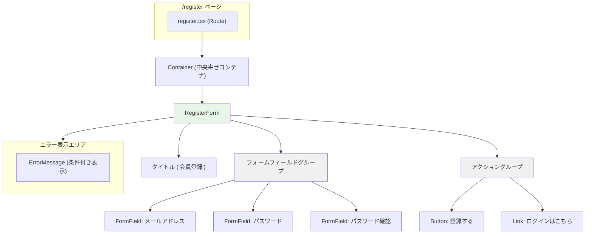
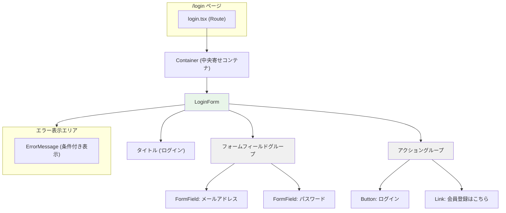
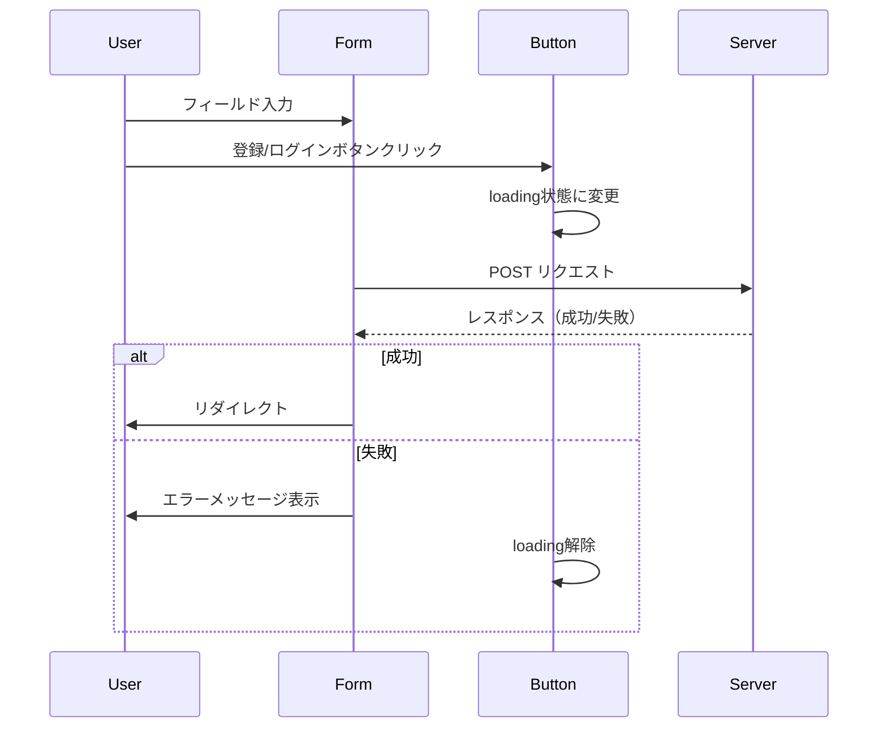

# authentication - UI/UX設計書

## 🛑 ドキュメント利用に関する注意書きとスコープ定義

> この設計書は、新規開発のための詳細な仕様書ではありません。AIエージェントによるコーディングと、人間による高効率な保守運用を目的とした**「アーキテクチャ・マップ」**です。

### I. 🎯 目指す方向とドキュメントの役割

| 項目 | 目的と役割 |
| :--- | :--- |
| **役割の焦点** | 新規開発よりも保守・修正に重点を置く。修正時のデバッグパスを最短化することが最大の目的です。 |
| **陳腐化の防止** | 頻繁に変わる具体的な情報（色、サイズ、影など）は一切記載しません。ドキュメントの役割を**構造（抽象）に限定することで、コード実装の詳細が変わっても陳腐化しない「構造的な真実の源泉」**を維持します。 |
| **一望性の確保** | UI/UX設計において、修正時に最も認知負荷が高い**「親子構造」「並列配置」「状態遷移ルール」**の3点に絞り、最小の目的を1つのドキュメントで迅速に確認できる状態を保証します。 |

### II. 🗺️ ドキュメントのスコープ（責務の境界線）

> この設計書は、サービスの**「セクション単位」**で、構造的な抽象レイヤーに特化しています。記載すべき情報と、コードに委ねる情報の境界線を明確にしてください。

#### 1. 📂 内部スコープ：このドキュメントで定義するもの（抽象）

| 項目 | 責務の対象 | 規律 |
| :--- | :--- | :--- |
| **サービススコープ** | セクション固有のコンポーネント、ロジック | Route/Componentの責務分離、セクション固有の構造（親子、並列）、セクション固有の状態遷移のルールを明確に定義します。 |
| **CSS抽象レイヤー** | 構造と配置の論理 | コンポーネント間の親子構造、並列配置（flex/grid）の論理、例外構造のルール（疑似要素など）といった、UIの骨格となる抽象的なルールのみを記載します。 |

#### 2. 🚫 外部スコープ：コードまたは別ドキュメントに委ねるもの（具体）

| 項目 | 委ねる場所 | 理由 |
| :--- | :--- | :--- |
| **アプリケーションスコープ** | App全体のUIXガイド、デザインシステム | 画面共通やセクションを横断して利用される共通コンポーネント（例: `.button-primary`、`.page-container`など）の定義は、このセクション設計書ではなく、アプリケーション全体のUIXガイドを参照してください。 |
| **CSS詳細** | Tailwind Config, Layer 1/2 の実装 | 具体的なスタイル値（色コード、スペーシング値、フォントサイズ、影、ボーダー定義など）は、**コード（Tailwindクラスまたはトークン）**を参照してください。この設計書に具体的なCSSプロパティを記載することは厳禁です。 |
| **セクション共通** | 共通コンポーネント設計書 | 複数セクションで再利用されるコンポーネントの設計は、該当の共通コンポーネント設計書を参照してください。 |

> 🔑 **原則**: 抽象は設計書に、具象はコードに。保守者はコードを見る前に、まずこの設計書を見て構造的な問題を切り分けてください。

---

## 📋 セクション概要

### セクション名

Authentication (認証)

### 所属サービス

**account** の **authentication** セクションに配置

### セクションの目的

ユーザーが安全に会員登録・ログイン・ログアウトできるインターフェースを提供し、セキュアな認証フローを実現する。

---

## 🚗 データフロー設計 (Route責務)

このセクションは、会員登録とログインの2つの主要なRouteで構成されます。

### 1. Register Route (app/routes/register.tsx)

Loader

- **責務**: 既にログイン済みの場合は`/account`へリダイレクト
- **認証チェック**: セッション検証を実行し、認証済みなら`/account`へ自動遷移
- **データソース**:
  - `app/data-io/account/common/getSession.server.ts`: セッション取得
  - `app/lib/account/common/validateSession.ts`: セッション検証
- **出力**: 未認証の場合はnull（フォーム表示）、認証済みの場合はリダイレクト

Action

- **責務**: 会員登録処理の実行
- **処理フロー**:
  1. FormDataから入力値取得（email, password, passwordConfirm）
  2. バリデーション実行（`app/lib/account/authentication/validateRegistration.ts`）
  3. メールアドレス重複チェック（`app/data-io/account/authentication/checkEmailExists.server.ts`）
  4. パスワードハッシュ化（`app/lib/account/authentication/hashPassword.ts`）
  5. ユーザー作成（`app/data-io/account/authentication/createUser.server.ts`）
  6. セッション生成（`app/lib/account/common/createSessionData.ts`）
  7. セッション保存（`app/data-io/account/common/saveSession.server.ts`）
  8. Cookie設定して`/account`へリダイレクト
- **エラーハンドリング**: バリデーションエラーまたは重複エラーをJSON形式で返却

### 2. Login Route (app/routes/login.tsx)

Loader

- **責務**: 既にログイン済みの場合は`/account`へリダイレクト
- **認証チェック**: セッション検証を実行し、認証済みなら`/account`へ自動遷移
- **データソース**: Register Routeと同様
- **出力**: 未認証の場合はnull（フォーム表示）、認証済みの場合はリダイレクト

Action

- **責務**: ログイン処理の実行
- **処理フロー**:
  1. FormDataから入力値取得（email, password）
  2. バリデーション実行（`app/lib/account/authentication/validateLogin.ts`）
  3. ユーザー検索（`app/data-io/account/authentication/findUserByEmail.server.ts`）
  4. パスワード検証（`app/lib/account/authentication/verifyPassword.ts`）
  5. セッション生成（`app/lib/account/common/createSessionData.ts`）
  6. セッション保存（`app/data-io/account/common/saveSession.server.ts`）
  7. Cookie設定してリダイレクト（`redirect-url`パラメータ優先、デフォルト`/account`）
- **エラーハンドリング**: バリデーションエラーまたは認証失敗エラーをJSON形式で返却

### 3. Logout Route (app/routes/logout.tsx)

Loader

- **責務**: なし（Actionのみ）

Action

- **責務**: ログアウト処理の実行
- **処理フロー**:
  1. セッションID取得（Cookie）
  2. セッション削除（`app/data-io/account/common/destroySession.server.ts`）
  3. Cookie無効化
  4. `/login`へリダイレクト

---

## 🧩 レイアウトのコンポーネント構造規範 (Layout Hierarchy Map)

### Register Page 構造図



### Login Page 構造図



---

## 🎨 コンポーネント設計規範 (Component Spec)

### 1. RegisterForm

**配置**: `app/components/account/authentication/RegisterForm.tsx`

**親子構造**:

- **親**: register.tsx Route
- **子**: FormField × 3, Button, ErrorMessage, Link

**状態遷移ルール**:

```mermaid
stateDiagram-v2
    [*] --> Default: 初回表示
    Default --> Filling: ユーザー入力開始
    Filling --> Submitting: 登録ボタンクリック
    Submitting --> Error: バリデーションエラー/重複エラー
    Submitting --> Success: 登録成功
    Error --> Filling: 再入力
    Success --> [*]: /account へリダイレクト
```

**並列配置ルール**:

- **フォームフィールドグループ**: 縦並び（vertical stack）、等間隔
- **アクショングループ**: 縦並び（Button + Link）

### 2. LoginForm

**配置**: `app/components/account/authentication/LoginForm.tsx`

**親子構造**:

- **親**: login.tsx Route
- **子**: FormField × 2, Button, ErrorMessage, Link

**状態遷移ルール**:

```mermaid
stateDiagram-v2
    [*] --> Default: 初回表示
    Default --> Filling: ユーザー入力開始
    Filling --> Submitting: ログインボタンクリック
    Submitting --> Error: バリデーションエラー/認証失敗
    Submitting --> Success: ログイン成功
    Error --> Filling: 再入力
    Success --> [*]: リダイレクト
```

**並列配置ルール**:

- **フォームフィールドグループ**: 縦並び（vertical stack）、等間隔
- **アクショングループ**: 縦並び（Button + Link）

### 3. ForgotPasswordForm

**配置**: `app/components/account/authentication/ForgotPasswordForm.tsx`

**親子構造**:

- **親**: forgot-password.tsx Route
- **子**: FormField × 1, Button, Link, HelpText（ヘルプテキスト）

**状態遷移ルール**:

```mermaid
stateDiagram-v2
    [*] --> Default: 初回表示
    Default --> Filling: メールアドレス入力
    Filling --> Submitting: 送信ボタンクリック
    Submitting --> Success: メール送信成功
    Submitting --> Error: 送信失敗
    Error --> Filling: 再入力
    Success --> [*]: 成功メッセージ表示
```

**並列配置ルール**:

- **フォームフィールドグループ**: 縦並び（vertical stack）
- **ヘルプテキスト**: フォーム下部に配置、小さめのフォントサイズ、灰色テキスト
- **アクショングループ**: 縦並び（Button + Link）

**ヘルプテキスト内容**:

- **メールが届かない場合**:
  - 「迷惑メールフォルダをご確認ください」
  - 「登録時のメールアドレスをご確認ください」
  - 「数分経っても届かない場合は、再度お試しください」

### 4. ResetPasswordForm

**配置**: `app/components/account/authentication/ResetPasswordForm.tsx`

**親子構造**:

- **親**: reset-password.$token.tsx Route
- **子**: FormField × 2, Button, ErrorMessage

**状態遷移ルール**:

```mermaid
stateDiagram-v2
    [*] --> TokenValidation: トークン検証中
    TokenValidation --> Invalid: トークン無効/期限切れ
    TokenValidation --> Default: トークン有効
    Default --> Filling: パスワード入力
    Filling --> Submitting: リセットボタンクリック
    Submitting --> Error: バリデーションエラー
    Submitting --> Success: リセット成功
    Error --> Filling: 再入力
    Success --> [*]: /login へリダイレクト
    Invalid --> [*]: エラーメッセージ表示
```

**並列配置ルール**:

- **フォームフィールドグループ**: 縦並び（vertical stack）、等間隔
- **アクショングループ**: 縦並び（Button）

---

## 📐 認可されたレイアウトパターン (Authorized Layout Patterns)

このセクションで使用が認可されているレイアウトパターンのみを記載します。

### 1. 中央寄せコンテナ (Centered Container)

**適用対象**: register.tsx, login.tsx の最上位コンテナ

**構造ルール**:

- **配置方式**: Flexbox（`display: flex`）
- **方向**: 縦方向（`flex-direction: column`）
- **主軸配置**: 中央寄せ（`justify-content: center`）
- **交差軸配置**: 中央寄せ（`align-items: center`）
- **最小高さ**: ビューポート全体（`min-height: 100vh`）

### 2. フォームフィールドグループ (Form Field Group)

**適用対象**: RegisterForm, LoginForm 内のフィールドグループ

**構造ルール**:

- **配置方式**: Flexbox
- **方向**: 縦方向（`flex-direction: column`）
- **間隔**: 等間隔（`gap`トークン使用）

### 3. アクショングループ (Action Group)

**適用対象**: RegisterForm, LoginForm 内のボタン・リンクエリア

**構造ルール**:

- **配置方式**: Flexbox
- **方向**: 縦方向（`flex-direction: column`）
- **間隔**: 等間隔（`gap`トークン使用）
- **ボタン幅**: 全幅（`width: 100%`）

---

## 🔄 状態遷移規範 (State Transition Map)

### 1. RegisterForm の状態遷移

| 状態 | 表示内容 | ユーザーアクション | 次の状態 |
| :--- | :--- | :--- | :--- |
| **Default** | 空のフォーム | フィールド入力開始 | Filling |
| **Filling** | 入力途中のフォーム | 登録ボタンクリック | Submitting |
| **Submitting** | ローディング状態のボタン | サーバー応答待機 | Error または Success |
| **Error** | エラーメッセージ表示 | フィールド再入力 | Filling |
| **Success** | （表示なし） | 自動リダイレクト | /account |

### 2. LoginForm の状態遷移

| 状態 | 表示内容 | ユーザーアクション | 次の状態 |
| :--- | :--- | :--- | :--- |
| **Default** | 空のフォーム | フィールド入力開始 | Filling |
| **Filling** | 入力途中のフォーム | ログインボタンクリック | Submitting |
| **Submitting** | ローディング状態のボタン | サーバー応答待機 | Error または Success |
| **Error** | エラーメッセージ表示 | フィールド再入力 | Filling |
| **Success** | （表示なし） | 自動リダイレクト | redirect-url または /account |

### 3. フィールドレベルの状態遷移

| 状態 | トリガー | UI変化 |
| :--- | :--- | :--- |
| **Default** | 初回表示 | 標準スタイル |
| **Focused** | フォーカス取得 | フォーカススタイル適用 |
| **Error** | バリデーションエラー | エラースタイル + エラーメッセージ表示 |
| **Disabled** | 送信中 | 入力不可スタイル |

---

## 📱 レスポンシブ戦略 (Responsive Strategy)

### ブレークポイント

`app/specs/account/common-spec.yaml`の`responsive.breakpoints`を参照：

- **Mobile**: 768px未満
- **Tablet**: 768px以上、1024px未満
- **Desktop**: 1024px以上

### レイアウト調整ルール

| デバイス | フォームコンテナ幅 | フィールド幅 | ボタン幅 |
| :--- | :--- | :--- | :--- |
| **Mobile** | 全幅（padding適用） | 全幅 | 全幅 |
| **Tablet** | 固定幅（中央寄せ） | 全幅 | 全幅 |
| **Desktop** | 固定幅（中央寄せ） | 全幅 | 全幅 |

> 具体的な幅の値は、Tailwindクラスまたはデザイントークンで定義

---

## ♿ アクセシビリティ戦略 (Accessibility Strategy)

### 1. フォームアクセシビリティ

| 要素 | 要件 | 実装方法 |
| :--- | :--- | :--- |
| **フィールドラベル** | すべての入力欄に明確なラベルを提供 | `<label>`要素と`for`属性の関連付け |
| **エラーメッセージ** | エラー発生時、スクリーンリーダーに通知 | `aria-live="assertive"`、`aria-describedby`でエラーと関連付け |
| **必須フィールド** | 必須項目であることを明示 | `required`属性、`aria-required="true"` |
| **バリデーション** | リアルタイムまたは送信時にバリデーション実行 | クライアント側検証 + サーバー側検証 |

### 2. キーボードナビゲーション

| 操作 | 動作 |
| :--- | :--- |
| **Tab** | 次のフィールドへフォーカス移動 |
| **Shift + Tab** | 前のフィールドへフォーカス移動 |
| **Enter** | フォーム送信（ボタンフォーカス時） |
| **Escape** | エラーメッセージを閉じる（ErrorMessage内） |

### 3. ARIA ラベル

`app/specs/account/authentication-spec.yaml`の`accessibility.aria_labels`を参照して実装

---

## 🔐 セキュリティ関連UI要件

### 1. パスワードフィールド

- **type属性**: `password`（マスキング表示）
- **オートコンプリート**: `autocomplete="new-password"`（会員登録）、`autocomplete="current-password"`（ログイン）
- **パスワード表示トグル**: 将来実装（現在のMVPでは不要）

### 2. エラーメッセージの表示原則

- **具体的な失敗理由を開示しない**: 「メールアドレスまたはパスワードが正しくありません」
- **NG例**: 「パスワードが間違っています」「このメールアドレスは存在しません」

### 3. CSRF対策

- **将来実装**: CSRFトークンをhidden fieldとして含める
- **現在のMVP**: Remix標準のCSRF対策に依存

---

## 🧪 インタラクション設計 (Interaction Design)

### 1. フォーム送信フロー



### 2. リダイレクト動作

| シナリオ | リダイレクト先 | 条件 |
| :--- | :--- | :--- |
| **会員登録成功** | `redirect-url` または `/account` | hidden フィールド経由 |
| **ログイン成功（redirect-url指定あり）** | クエリパラメータの`redirect-url` | パラメータが存在する場合 |
| **ログイン成功（redirect-url指定なし）** | `/account` | デフォルト |
| **Google OAuth成功（redirect-url指定あり）** | `oauth_redirect` Cookieの値 | Cookie が存在する場合 |
| **Google OAuth成功（redirect-url指定なし）** | `/account` | デフォルト |
| **既にログイン済み** | `/account` | loader時点で検出 |
| **ログアウト成功** | `/login` | 常に |

---

## 📝 備考

### 依存コンポーネント（commonセクション）

- **FormField**: フォーム入力フィールド（ラベル、入力欄、エラー表示）
- **Button**: ボタンコンポーネント（primary variant、ローディング状態）
- **ErrorMessage**: エラーメッセージ表示（error type）

これらのコンポーネントの詳細仕様は`develop/account/common/uiux-spec.md`を参照。

---

**最終更新**: 2025-12-23
