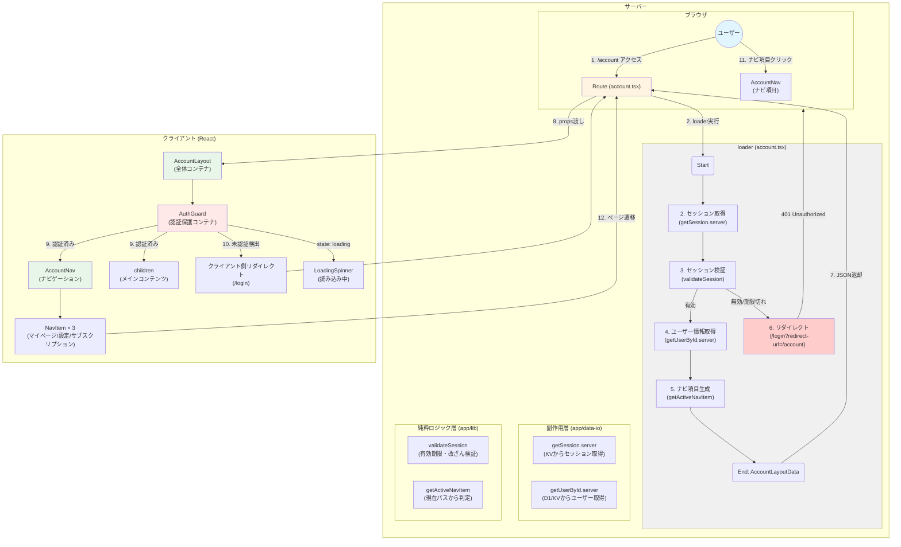
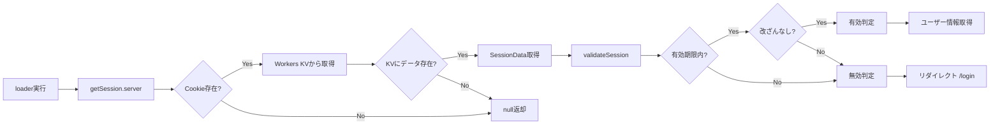
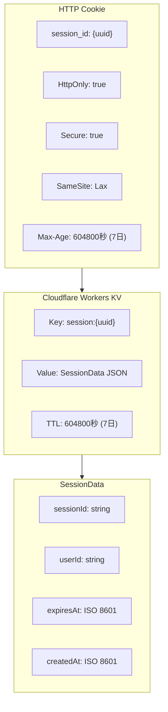
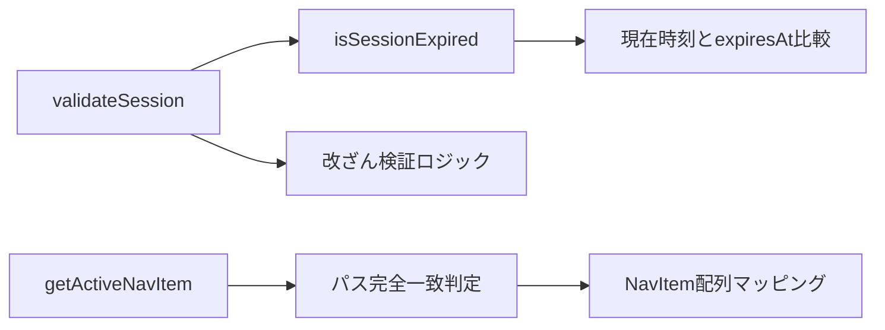
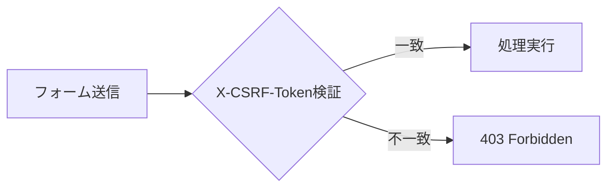
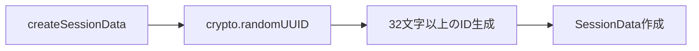
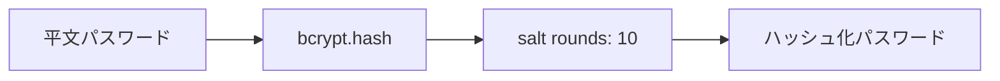

# data-flow-diagram.md - common Section

## 目的

`file-list.md`を基に、`common`セクションのコンポーネント間の依存関係とデータフローをMermaid図として可視化する。

---

## データフロー図



---

## フロー説明

### 認証済みユーザーの初回ロード（1→9）

1. ユーザーが`/account`にアクセス
2. Routeが`loader`を実行
   - `getSession.server`: Cloudflare Workers KVからセッション取得（CookieのsessionIdを使用）
   - `validateSession`: セッションの有効期限と改ざんをチェック
   - セッションが有効な場合:
     - `getUserById.server`: D1またはKVからユーザー情報を取得
     - `getActiveNavItem`: 現在のパス（/account）からアクティブなナビ項目を判定
3. `loader`が`AccountLayoutData`をJSON返却
4. Routeが`AccountLayout`にpropsを渡す
   - `AccountLayout` → `AuthGuard` → `AccountNav`, `children`をレンダリング
5. `AuthGuard`が認証状態を確認（loaderから取得したデータの存在で判定）
6. 認証済みの場合、`AccountNav`とメインコンテンツを表示

### 未認証ユーザーのリダイレクト（1→6）

1. ユーザーが`/account`にアクセス
2. Routeが`loader`を実行
   - `getSession.server`: セッションが存在しないまたは取得失敗
   - `validateSession`: セッションが無効または期限切れ
3. `loader`が`401 Unauthorized`とリダイレクトレスポンスを返却
   - リダイレクト先: `/login?redirect-url=/account`
   - クエリパラメータ`redirect-url`でログイン後の遷移先を指定

### クライアント側の認証保護（10）

10. `AuthGuard`がloaderデータをチェック
    - データが存在しない場合（セッション無効など）
    - クライアント側で`/login`へリダイレクト
    - これはサーバー側リダイレクトが失敗した場合のフォールバック

### ナビゲーション遷移（11→12）

11. ユーザーが`AccountNav`のナビ項目をクリック
    - 例: 「設定」をクリック → `/account/settings`へ遷移
    - 例: 「サブスクリプション」をクリック → `/account/subscription`へ遷移
12. 遷移先のRouteが同様のloader処理を実行

---

## セッション管理のデータフロー

### セッション取得と検証の詳細フロー



### セッションデータの構造



---

## コンポーネント責務

| コンポーネント | 責務 | 依存先 |
| :--- | :--- | :--- |
| **AccountLayout** | 全体レイアウト管理、認証保護の提供 | AuthGuard, AccountNav |
| **AuthGuard** | セッション検証、未認証時リダイレクト、ローディング状態管理 | - |
| **AccountNav** | ナビゲーション表示、アクティブ項目の強調 | - |
| **FormField** | フォーム入力フィールド（ラベル、エラー表示） | - |
| **Button** | ボタン（variant、ローディング状態） | - |
| **ErrorMessage** | エラーメッセージ表示（自動閉じ、手動閉じ） | - |

---

## データ依存関係

### loaderからの入力（認証済み）

loaderが返却するデータ:

- ユーザーを一意に識別する情報
- 連絡先情報（メールアドレス等）
- サブスクリプションの契約状態
- ナビゲーション項目リスト（ラベル、パス、アイコン、アクティブ状態）

> 具体的な型定義は `app/specs/account/types.ts` を参照

### 状態管理（Client Side）

- `AuthGuard`: `loading: boolean` - セッション検証中の状態
- `AccountNav`: なし（propsベース）
- `ErrorMessage`: `isVisible: boolean` - 表示/非表示、`dismissTimer: Timer` - 自動閉じタイマー

---

## エラーハンドリングのフロー

```mermaid
graph TD
    A[loader実行] --> B{セッション取得成功?}
    B -- No --> C[AuthError: session_invalid]
    B -- Yes --> D{セッション有効?}
    D -- No --> E[AuthError: session_expired]
    D -- Yes --> F{ユーザー情報取得成功?}
    F -- No --> G[AuthError: unauthorized]
    F -- Yes --> H[正常レンダリング]

    C --> I[/login?redirect-url=/account]
    E --> I
    G --> I

    subgraph ErrorTypes["エラー種類"]
        C
        E
        G
    end

    style C fill:#ffcccc
    style E fill:#ffcccc
    style G fill:#ffcccc
```

### エラーメッセージ

| エラー種類 | メッセージ | リダイレクト先 |
| :--- | :--- | :--- |
| session_invalid | セッションが無効です。再度ログインしてください。 | /login |
| session_expired | セッションが期限切れです。再度ログインしてください。 | /login |
| unauthorized | ログインが必要です。 | /login |

> 具体的なメッセージは `app/specs/account/common-spec.yaml` で定義

---

## 純粋ロジック層の関数依存関係



### 純粋ロジック層の責務

| 関数 | 入力 | 処理 | 出力 |
| :--- | :--- | :--- | :--- |
| **validateSession** | SessionData | 有効期限チェック、改ざん検証 | boolean (有効/無効) |
| **isSessionExpired** | expiresAt: string | 現在時刻と比較 | boolean (期限切れ/有効) |
| **createSessionData** | userId: string | sessionId生成、expiresAt計算 | SessionData |
| **getActiveNavItem** | currentPath: string, navItems: NavItem[] | パス一致判定 | NavItem[] (isActiveフラグ付き) |

---

## 副作用層の関数依存関係

```mermaid
graph TD
    A[getSession.server] --> B[Request.headers.cookie]
    B --> C[Cookie解析]
    C --> D[Cloudflare Workers KV]
    D --> E[SessionData | null]

    F[saveSession.server] --> G[SessionData生成]
    G --> H[Workers KV保存 with TTL]
    H --> I[Set-Cookie header生成]

    J[destroySession.server] --> K[Workers KV削除]
    K --> L[Cookie無効化 header生成]

    M[getUserById.server] --> N[D1 Database / Workers KV]
    N --> O[User | null]
```

### 副作用層の責務

| 関数 | 副作用の種類 | 依存リソース |
| :--- | :--- | :--- |
| **getSession.server** | KV読み取り、Cookie読み取り | Cloudflare Workers KV, HTTP Request |
| **saveSession.server** | KV書き込み、Cookie書き込み | Cloudflare Workers KV, HTTP Response |
| **destroySession.server** | KV削除、Cookie無効化 | Cloudflare Workers KV, HTTP Response |
| **getUserById.server** | DB/KV読み取り | D1 Database / Cloudflare Workers KV |

---

## セキュリティフロー

### CSRF対策（将来実装）



### セッションID生成



### パスワードハッシュ化（認証セクションで実装）



> セキュリティ設定の詳細は `app/specs/account/common-spec.yaml` の `security` セクションを参照
