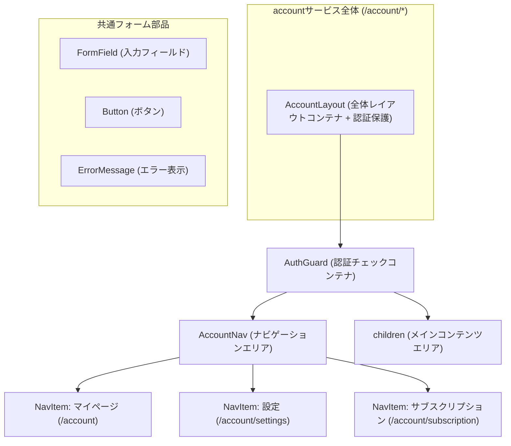

# common - UI/UX設計書

## 🛑 ドキュメント利用に関する注意書きとスコープ定義

> この設計書は、新規開発のための詳細な仕様書ではありません。AIエージェントによるコーディングと、人間による高効率な保守運用を目的とした**「アーキテクチャ・マップ」**です。

### I. 🎯 目指す方向とドキュメントの役割

| 項目 | 目的と役割 |
| :--- | :--- |
| **役割の焦点** | 新規開発よりも保守・修正に重点を置く。修正時のデバッグパスを最短化することが最大の目的です。 |
| **陳腐化の防止** | 頻繁に変わる具体的な情報（色、サイズ、影など）は一切記載しません。ドキュメントの役割を**構造（抽象）に限定することで、コード実装の詳細が変わっても陳腐化しない「構造的な真実の源泉」**を維持します。 |
| **一望性の確保** | UI/UX設計において、修正時に最も認知負荷が高い**「親子構造」「並列配置」「状態遷移ルール」**の3点に絞り、最小の目的を1つのドキュメントで迅速に確認できる状態を保証します。 |

### II. 🗺️ ドキュメントのスコープ（責務の境界線）

> この設計書は、サービスの**「セクション単位」**で、構造的な抽象レイヤーに特化しています。記載すべき情報と、コードに委ねる情報の境界線を明確にしてください。

#### 1. 📂 内部スコープ：このドキュメントで定義するもの（抽象）

| 項目 | 責務の対象 | 規律 |
| :--- | :--- | :--- |
| **サービススコープ** | セクション固有のコンポーネント、ロジック | Route/Componentの責務分離、セクション固有の構造（親子、並列）、セクション固有の状態遷移のルールを明確に定義します。 |
| **CSS抽象レイヤー** | 構造と配置の論理 | コンポーネント間の親子構造、並列配置（flex/grid）の論理、例外構造のルール（疑似要素など）といった、UIの骨格となる抽象的なルールのみを記載します。 |

#### 2. 🚫 外部スコープ：コードまたは別ドキュメントに委ねるもの（具体）

| 項目 | 委ねる場所 | 理由 |
| :--- | :--- | :--- |
| **アプリケーションスコープ** | App全体のUIXガイド、デザインシステム | 画面共通やセクションを横断して利用される共通コンポーネント（例: `.button-primary`、`.page-container`など）の定義は、このセクション設計書ではなく、アプリケーション全体のUIXガイドを参照してください。 |
| **CSS詳細** | Tailwind Config, Layer 1/2 の実装 | 具体的なスタイル値（色コード、スペーシング値、フォントサイズ、影、ボーダー定義など）は、**コード（Tailwindクラスまたはトークン）**を参照してください。この設計書に具体的なCSSプロパティを記載することは厳禁です。 |
| **セクション共通** | 共通コンポーネント設計書 | 複数セクションで再利用されるコンポーネントの設計は、該当の共通コンポーネント設計書を参照してください。 |

> 🔑 **原則**: 抽象は設計書に、具象はコードに。保守者はコードを見る前に、まずこの設計書を見て構造的な問題を切り分けてください。

---

## 📋 セクション概要

### セクション名

Common Components (共通コンポーネント)

### 所属サービス

**account** の **common** セクションに配置

### セクションの目的

アカウントサービス全体でセキュアで一貫したレイアウト、認証保護、共通フォーム部品を提供し、ユーザーが安心してアカウント情報を管理できるようにする。

---

## 🚗 データフロー設計 (Route責務)

このセクションの共通コンポーネントは、`/account`配下のすべてのRouteから利用されます。データの取得は各Routeの`loader`で行われます。

### Loader（親Routeレベル: app/routes/account.tsx）

- **責務**: `/account`配下の全ページで使用される共通データ（ユーザー情報、ナビゲーション項目）を読み込み、認証チェックを実行
- **認証チェック**: セッション検証を実行し、未認証時は`/login`へリダイレクト
- **データソース**:
  - `app/data-io/account/common/getSession.server.ts`: セッション取得
  - `app/lib/account/common/validateSession.ts`: セッション検証
  - `app/data-io/account/common/getUserById.server.ts`: ユーザー情報取得

### Action

- **責務**: このセクションには`action`は不要（共通コンポーネントは表示と認証保護を担当）
- **処理フロー**: なし

---

## 🧩 レイアウトのコンポーネント構造規範 (Layout Hierarchy Map)

このセクションは、`/account`配下のページ全体におけるレイアウトコンテナの階層構造を定義する**地図**です。

### 構造図

### 責務の説明

| コンテナ名 | 責務 |
| :--- | :--- |
| **AccountLayout** | `/account`配下の全ページの構造を定義。認証保護、ナビゲーション、メインコンテンツの縦配置を管理 |
| **AuthGuard** | セッション検証を実行し、未認証時は`/login`へリダイレクト。認証済み時は子コンポーネントをレンダリング |
| **AccountNav** | アカウント関連ページへのナビゲーション。マイページ、設定、サブスクリプションへのリンクを提供 |
| **children** | 各ページのメインコンテンツを表示するエリア（プロフィール表示、設定フォーム、サブスクリプション管理など） |
| **FormField** | フォーム入力フィールド。ラベル、入力欄、エラーメッセージを含む |
| **Button** | アクションボタン。primary/secondary/danger のバリエーション、ローディング状態を持つ |
| **ErrorMessage** | エラーメッセージ表示コンポーネント。error/warning/info の3種類 |

---

## 📐 認定済み並列配置 (Authorized Flexbox/Grid Layouts)

このセクションは、**不要なレイアウト実装の乱立を防ぐ**ため、このUIセクション内で**許可された並列配置パターンのみ**を定義するホワイトリストです。

---

### AccountNav内のナビゲーション項目配置

| 設計項目 | 定義 | 備考 |
| :--- | :--- | :--- |
| **対象コンテナ** | `AccountNav` | ナビゲーションエリア |
| **対象アイテム** | `NavItem` | 各ナビゲーション項目（マイページ、設定、サブスクリプション） |
| **想定アイテム数** | `固定: 3個` | マイページ、設定、サブスクリプションの3要素 |
| **レイアウトの意図** | `横並びで左揃え配置（gap指定あり）` | タブ形式で横並び配置 |

---

### FormField内の構造

| 設計項目 | 定義 | 備考 |
| :--- | :--- | :--- |
| **対象コンテナ** | `FormField` | フォーム入力フィールド |
| **対象アイテム** | `Label`, `Input`, `ErrorText` | ラベル、入力欄、エラーメッセージ |
| **想定アイテム数** | `固定: 2～3個` | ラベルと入力欄は必須、エラーメッセージは条件付き |
| **レイアウトの意図** | `縦並びでスタック配置` | ラベル→入力欄→エラーメッセージの順に縦配置 |

---

## ⚡ インタラクションと状態遷移の設計 (Component責務)

### 1. AccountLayout

**責務**: `/account`配下の全ページの共通レイアウトを提供し、認証保護を実行する

#### AccountLayoutの状態 (State)

- **認証中 (loading)**: セッション検証中。ローディング表示
- **認証成功 (authenticated)**: セッション検証成功。ナビゲーションとメインコンテンツを表示
- **認証失敗 (unauthenticated)**: セッション検証失敗。`/login`へリダイレクト

#### AccountLayoutのインタラクション (Interaction)

- **トリガー1**: ページ読み込み時
  - **応答**: セッション検証を実行
  - **成功時**: ナビゲーションとメインコンテンツを表示
  - **失敗時**: `/login?redirect-url=${currentPath}` へリダイレクト
  - **ローディング**: 検証中はスピナー表示

---

### 2. AuthGuard

**責務**: セッション検証を実行し、未認証ユーザーからの不正アクセスを防ぐ

#### AuthGuardの状態 (State)

- **検証中 (validating)**: セッション検証処理中
- **認証済み (authorized)**: セッション有効。子コンポーネントをレンダリング
- **未認証 (unauthorized)**: セッション無効または期限切れ。リダイレクト実行

#### AuthGuardのインタラクション (Interaction)

- **トリガー1**: コンポーネントマウント時
  - **応答**: セッション検証をlib層に委譲
  - **成功時**: childrenをレンダリング
  - **失敗時**: `/login?redirect-url=${currentPath}` へリダイレクト
  - **セッション期限切れ時**: メッセージ表示「セッションが期限切れです。再度ログインしてください。」

---

### 3. AccountNav

**責務**: アカウント関連ページへのナビゲーションを提供し、現在のページをハイライト表示する

#### AccountNavの状態 (State)

- **通常 (default)**: 3つのナビゲーション項目が表示されている状態
- **アクティブ (active)**: 現在のページに対応する項目がハイライト表示される状態
- **ホバー (hover)**: ナビゲーション項目にマウスをホバーした時の強調表示

#### AccountNavのインタラクション (Interaction)

- **トリガー1**: ナビゲーション項目をクリック
  - **応答**: 対応するページへ遷移（例: `/account`, `/account/settings`, `/account/subscription`）
  - **アニメーション**: クリック時に軽微な視覚フィードバック
- **トリガー2**: ページ遷移完了時
  - **応答**: 現在のページに対応する項目をアクティブ状態に更新
  - **視覚表現**: アクティブな項目に下線またはハイライト表示

---

### 4. FormField

**責務**: フォーム入力フィールドを表示し、エラー状態を視覚的に伝える

#### FormFieldの状態 (State)

- **通常 (default)**: 入力可能な状態。エラーなし
- **フォーカス (focused)**: 入力フィールドにフォーカスがある状態
- **エラー (error)**: バリデーションエラーがある状態。赤枠とエラーメッセージ表示
- **無効 (disabled)**: 入力不可の状態

#### FormFieldのインタラクション (Interaction)

- **トリガー1**: フォーカス時
  - **応答**: ボーダー色を変更（フォーカス状態を視覚的に示す）
  - **アクセシビリティ**: aria-invalid="false"
- **トリガー2**: バリデーションエラー時
  - **応答**: 赤枠表示、エラーメッセージを下部に表示
  - **アクセシビリティ**: aria-invalid="true", aria-describedby="{error-message-id}"

---

### 5. Button

**責務**: ユーザーのアクションをトリガーし、処理中の状態を視覚的に伝える

#### Buttonの状態 (State)

- **通常 (default)**: クリック可能な状態
- **ホバー (hover)**: マウスホバー時の強調表示
- **ローディング (loading)**: 処理中。スピナー表示、クリック無効
- **無効 (disabled)**: 非アクティブ。透明度50%、クリック無効

#### Buttonのインタラクション (Interaction)

- **トリガー1**: クリック時
  - **応答**: 関連するactionまたはイベントハンドラを実行
  - **ローディング状態**: 処理中はスピナー表示、テキストは"処理中..."
  - **視覚フィードバック**: クリック時に軽微なアニメーション
- **バリエーション**:
  - **primary**: 主要アクション（例: "保存"、"登録"）
  - **secondary**: 補助アクション（例: "キャンセル"）
  - **danger**: 危険なアクション（例: "削除"、"退会"）

---

### 6. ErrorMessage

**責務**: エラー、警告、情報メッセージを視覚的に表示する

#### ErrorMessageの状態 (State)

- **エラー (error)**: 赤色アイコン（×）、エラーメッセージ
- **警告 (warning)**: 黄色アイコン（!）、警告メッセージ
- **情報 (info)**: 青色アイコン（i）、情報メッセージ

#### ErrorMessageのインタラクション (Interaction)

- **トリガー1**: エラー発生時
  - **応答**: 該当箇所にメッセージを表示
  - **自動消去**: 5秒後に自動的にフェードアウト（infoとwarningのみ）
  - **手動閉じる**: ×ボタンクリックで即座に非表示
- **配置**:
  - **インライン表示**: フォーム下部に配置
  - **モーダル表示**: 画面中央にオーバーレイ表示（重要なエラーのみ）

---

## 🛠️ 例外構造と規律

このセクションでは、上記の規範で対応できない例外的な構造は現時点で存在しません。

将来的に例外が必要になった場合は、以下の形式で記載します：

### {例外構造の名前}

| 項目 | 内容 |
| :--- | :--- |
| **対象コンポーネント** | {コンポーネント名} |
| **例外の理由** | {なぜ通常の構造規範では対応できないのか} |
| **実装方法** | {疑似要素、子孫セレクタなどの具体的な実装方法の抽象的な説明} |

---

## 📱 レスポンシブ対応

### ブレークポイント戦略

| デバイス | 対応方針 |
| :--- | :--- |
| **モバイル (< 768px)** | AccountNavは縦並びスタック配置に変更 |
| **タブレット (768px ~ 1024px)** | AccountNavは横並びタブ形式で表示 |
| **デスクトップ (> 1024px)** | AccountNavは横並びタブ形式で表示 |

### レイアウト変更点

- **AccountNav**: モバイルではナビゲーション項目を縦並びに変更
- **FormField**: モバイルではラベルと入力欄の間隔を調整
- **Button**: モバイルでは全幅表示（横幅100%）

---

## 🔒 セキュリティ関連のUI表現

### セッション期限切れ時の表示

- **エラーメッセージ**: 「セッションが期限切れです。再度ログインしてください。」
- **リダイレクト**: `/login?redirect-url=${currentPath}`（ログイン後に元のページに戻る）
- **視覚表現**: ErrorMessageコンポーネントを使用（type: error）

### 認証エラー時の表示

- **エラーメッセージ**: 「メールアドレスまたはパスワードが正しくありません」（どちらが誤りか特定させない）
- **視覚表現**: FormFieldの下部にインライン表示
- **アクセシビリティ**: aria-live="assertive"でスクリーンリーダーに即座に通知

---

## 🎨 デザイントークン参照

具体的なスタイル値（色、サイズ、影など）は、以下のデザイントークンを参照してください：

- **Layer 1**: `app/styles/account/layer1.css` - デザイントークンの定義
- **Layer 2**: `app/styles/account/layer2.css` - カスタムクラスの定義
- **Tailwind設定**: `tailwind.config.ts` - プロジェクト全体のTailwind設定

**重要**: この設計書には具体的なCSS値を記載しません。実装時は必ずデザイントークンとTailwindクラスを使用してください。
