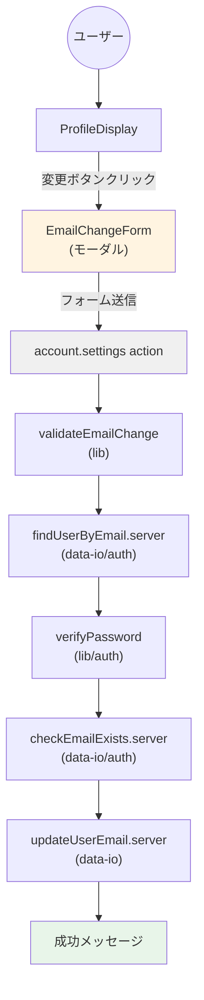
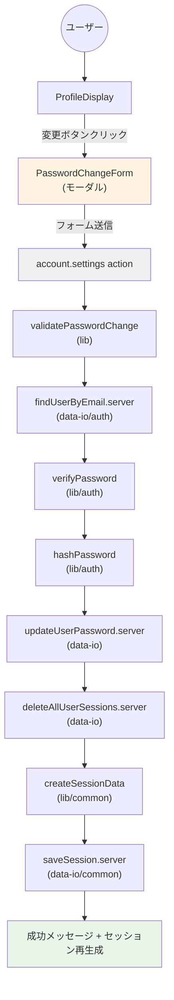
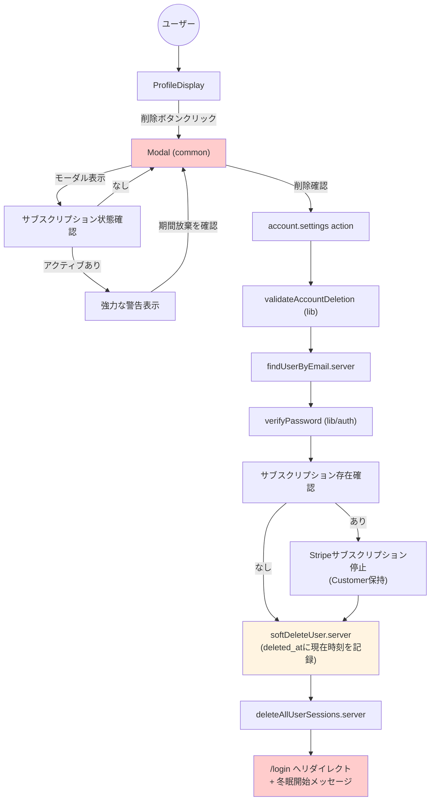
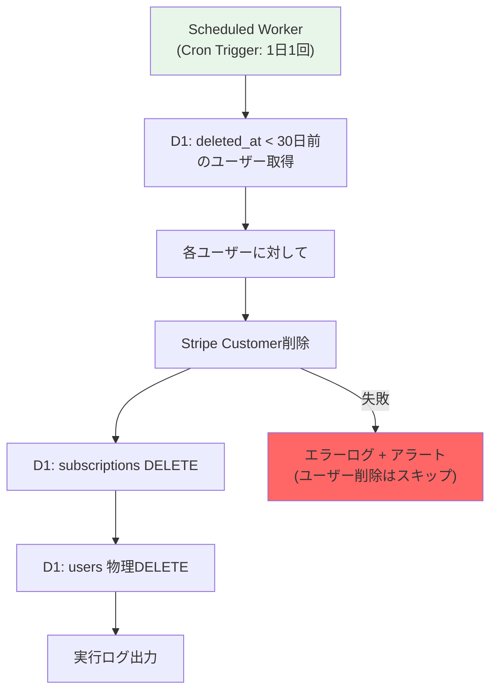
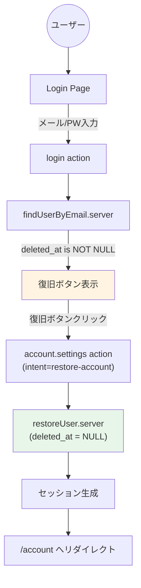
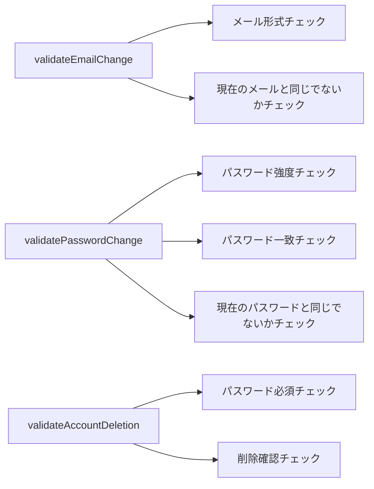
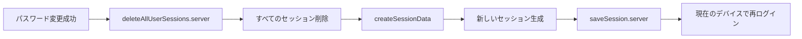

# data-flow-diagram.md - profile Section

## 目的

`file-list.md`を基に、`profile`セクションのコンポーネント間の依存関係とデータフローをMermaid図として可視化する。

---

## データフロー図

### メールアドレス変更フロー



### パスワード変更フロー



### アカウント削除フロー（論理削除版）



### 物理抹消バッチフロー（新規追加）



### アカウント復旧フロー（新規追加）



**重要な注意事項**:

- **Stripe停止の挙動**: 退会実行時は `Customer` を削除せず、サブスクリプションのみを停止状態にする。これにより、冬眠期間中の遅延Webhookを既存 `user_id` で受信可能。
- **べき等性の確保**: 物理削除後の遅延Webhookに対しても、システムは200を返し、ログに記録する。
- **冬眠期間**: 30日間は同一メールアドレスでの新規登録を制限（DB Unique制約）。
- **復旧**: 冬眠中の復旧ではサブスクリプションは自動再開されない。

---

## コンポーネント責務

| コンポーネント | 責務 | 依存先 |
| :--- | :--- | :--- |
| **account.settings.tsx** | プロフィール設定ページのRoute定義、action処理、論理削除（softDeleteUser呼び出し） | ProfileDisplay, validateEmailChange, updateUserEmail.server, softDeleteUser.server |
| **ProfileDisplay** | プロフィール情報表示、変更ボタン配置、アカウント削除UI（共通Modalを使用） | EmailChangeForm, PasswordChangeForm, Modal (common), Button (common), ErrorMessage (common) |
| **EmailChangeForm** | メールアドレス変更フォームUI（モーダル） | FormField, Button, ErrorMessage (common) |
| **PasswordChangeForm** | パスワード変更フォームUI（モーダル） | FormField, Button, ErrorMessage (common) |

---

## 純粋ロジック層の関数依存関係



---

## 副作用層の関数依存関係

```mermaid
graph TD
    A[updateUserEmail.server] --> B[D1 Database]
    B --> C[UPDATE users SET email, updated_at]

    D[updateUserPassword.server] --> E[D1 Database]
    E --> F[UPDATE users SET password, updated_at]

    G[softDeleteUser.server] --> H[D1 Database]
    H --> I[UPDATE users SET deleted_at = NOW()]

    M[restoreUser.server] --> N[D1 Database]
    N --> O[UPDATE users SET deleted_at = NULL]

    P[purgeExpiredUsers.server] --> Q[D1 Database]
    Q --> R[DELETE FROM users WHERE id]

    J[deleteAllUserSessions.server] --> K[Cloudflare Workers KV]
    K --> L[DELETE session:{userId}*]
```

---

## セキュリティフロー

### パスワード変更時のセッション管理



### アカウント削除時の処理

```text
アカウント退会確認 → Stripeサブスクリプション停止(Customer保持) → softDeleteUser(論理削除) → deleteAllUserSessions → /login + 冬眠メッセージ
```

---

**最終更新**: 2026-02-14
