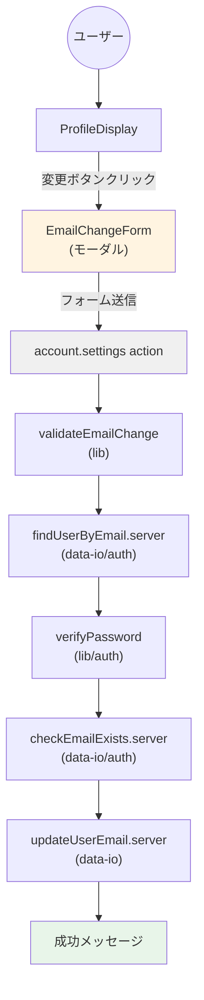
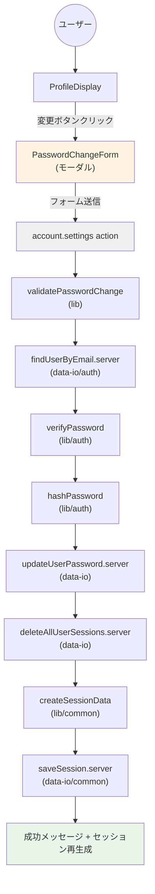
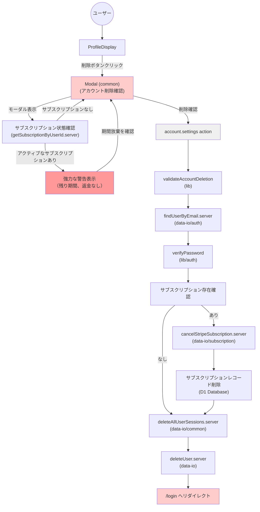
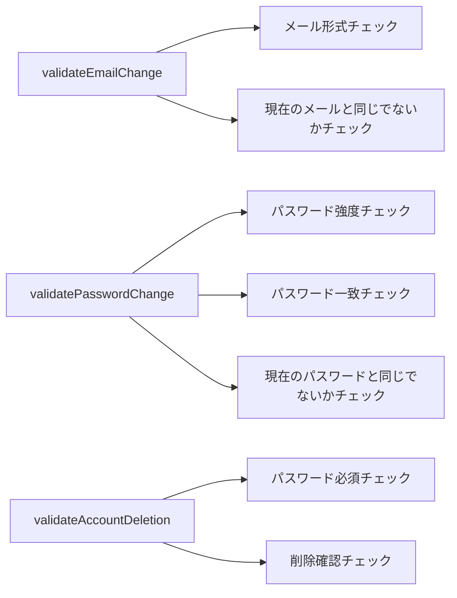
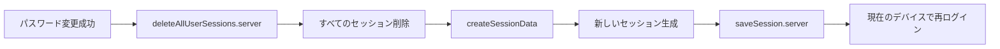

# data-flow-diagram.md - profile Section

## 目的

`file-list.md`を基に、`profile`セクションのコンポーネント間の依存関係とデータフローをMermaid図として可視化する。

---

## データフロー図

### メールアドレス変更フロー



### パスワード変更フロー



### アカウント削除フロー



---

## コンポーネント責務

| コンポーネント | 責務 | 依存先 |
| :--- | :--- | :--- |
| **account.settings.tsx** | プロフィール設定ページのRoute定義、action処理 | ProfileDisplay, validateEmailChange, updateUserEmail.server |
| **ProfileDisplay** | プロフィール情報表示、変更ボタン配置、アカウント削除UI（共通Modalを使用） | EmailChangeForm, PasswordChangeForm, Modal (common), Button (common), ErrorMessage (common) |
| **EmailChangeForm** | メールアドレス変更フォームUI（モーダル） | FormField, Button, ErrorMessage (common) |
| **PasswordChangeForm** | パスワード変更フォームUI（モーダル） | FormField, Button, ErrorMessage (common) |

---

## 純粋ロジック層の関数依存関係



---

## 副作用層の関数依存関係

```mermaid
graph TD
    A[updateUserEmail.server] --> B[D1 Database]
    B --> C[UPDATE users SET email, updated_at]

    D[updateUserPassword.server] --> E[D1 Database]
    E --> F[UPDATE users SET password, updated_at]

    G[deleteUser.server] --> H[D1 Database]
    H --> I[DELETE FROM users WHERE id]

    J[deleteAllUserSessions.server] --> K[Cloudflare Workers KV]
    K --> L[DELETE session:{userId}*]
```

---

## セキュリティフロー

### パスワード変更時のセッション管理



### アカウント削除時の処理

```mermaid
graph LR
    A[アカウント削除確認] --> B[deleteAllUserSessions.server]
    B --> C[すべてのセッション削除]
    C --> D[deleteUser.server]
    D --> E[ユーザーデータ削除]
    E --> F[/login へリダイレクト]
```

---

**最終更新**: 2025-12-23
