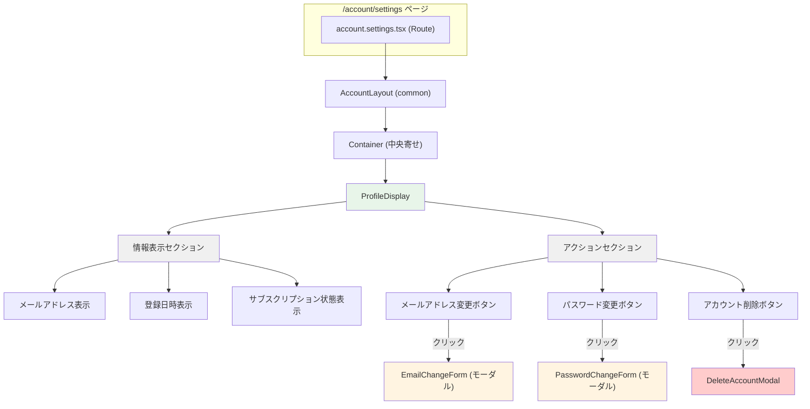
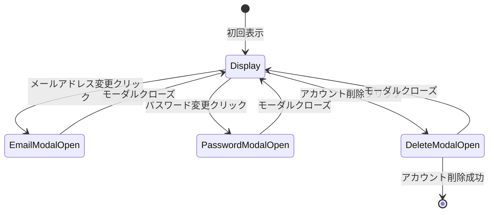
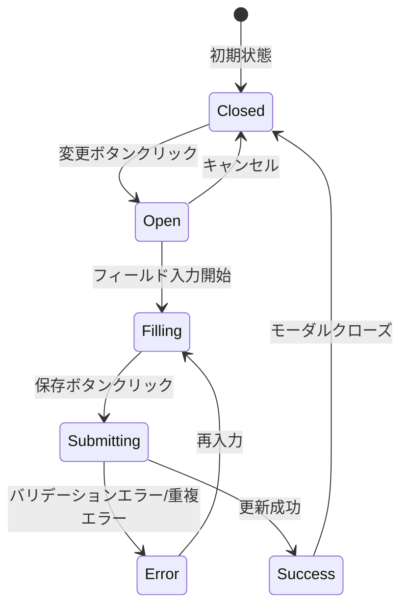
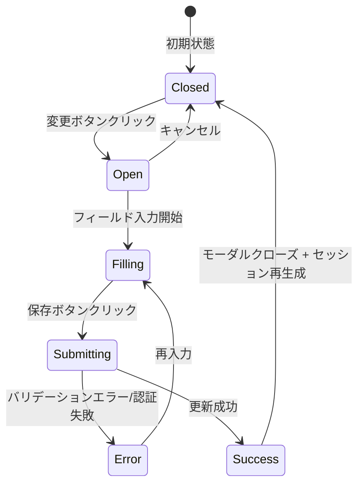
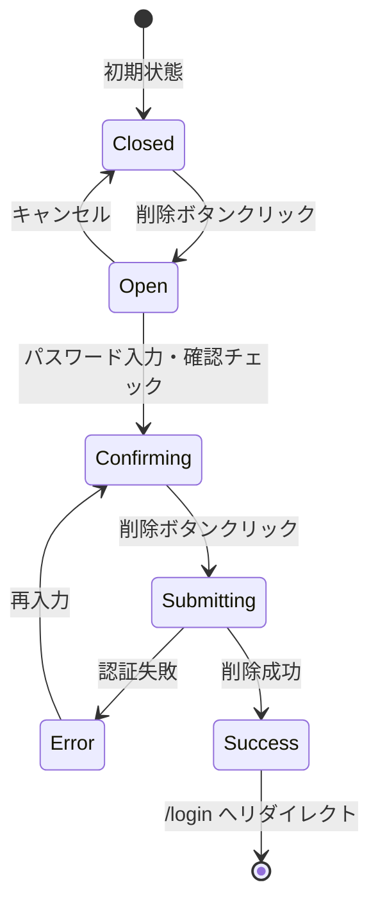
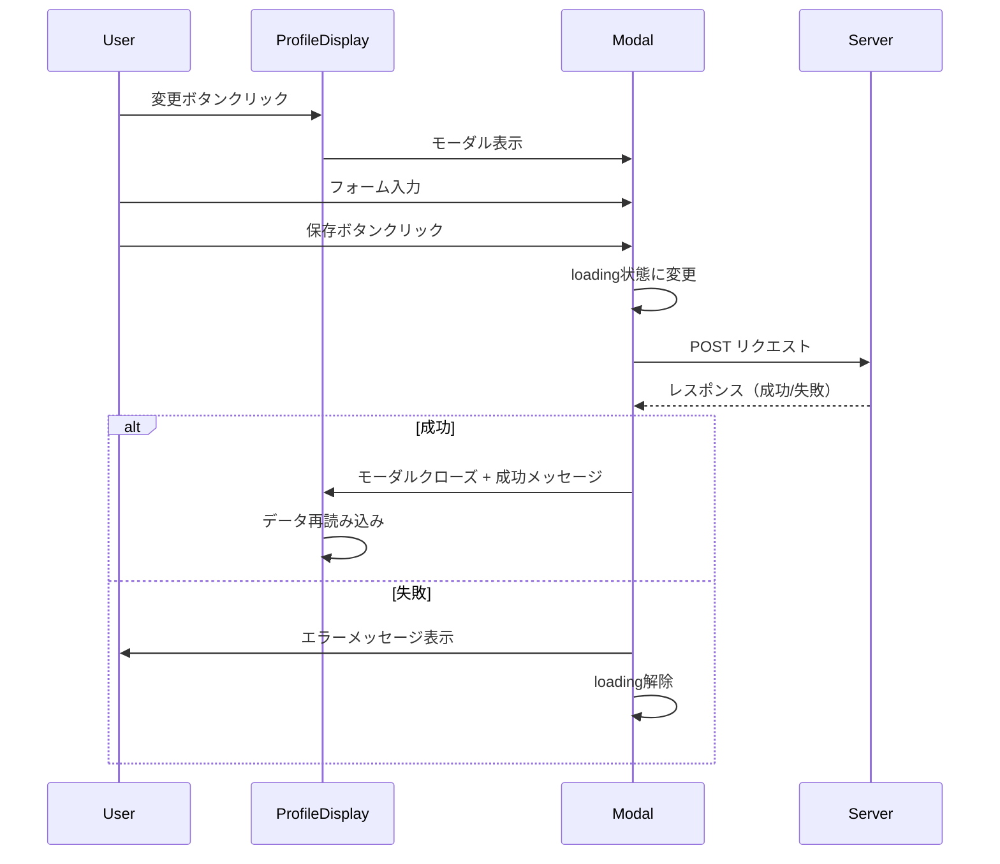
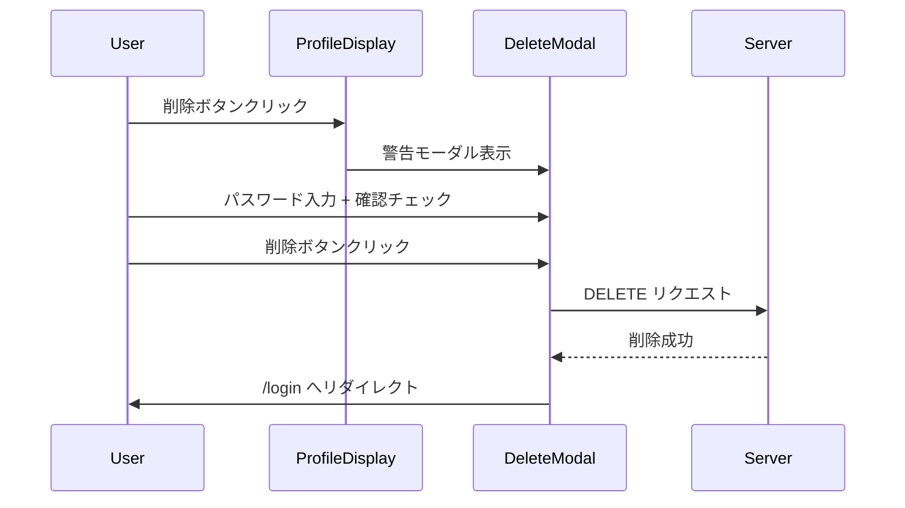

# profile - UI/UX設計書

## 🛑 ドキュメント利用に関する注意書きとスコープ定義

> この設計書は、新規開発のための詳細な仕様書ではありません。AIエージェントによるコーディングと、人間による高効率な保守運用を目的とした**「アーキテクチャ・マップ」**です。

### I. 🎯 目指す方向とドキュメントの役割

| 項目 | 目的と役割 |
| :--- | :--- |
| **役割の焦点** | 新規開発よりも保守・修正に重点を置く。修正時のデバッグパスを最短化することが最大の目的です。 |
| **陳腐化の防止** | 頻繁に変わる具体的な情報（色、サイズ、影など）は一切記載しません。ドキュメントの役割を**構造（抽象）に限定することで、コード実装の詳細が変わっても陳腐化しない「構造的な真実の源泉」**を維持します。 |
| **一望性の確保** | UI/UX設計において、修正時に最も認知負荷が高い**「親子構造」「並列配置」「状態遷移ルール」**の3点に絞り、最小の目的を1つのドキュメントで迅速に確認できる状態を保証します。 |

### II. 🗺️ ドキュメントのスコープ（責務の境界線）

> この設計書は、サービスの**「セクション単位」**で、構造的な抽象レイヤーに特化しています。記載すべき情報と、コードに委ねる情報の境界線を明確にしてください。

#### 1. 📂 内部スコープ：このドキュメントで定義するもの（抽象）

| 項目 | 責務の対象 | 規律 |
| :--- | :--- | :--- |
| **サービススコープ** | セクション固有のコンポーネント、ロジック | Route/Componentの責務分離、セクション固有の構造（親子、並列）、セクション固有の状態遷移のルールを明確に定義します。 |
| **CSS抽象レイヤー** | 構造と配置の論理 | コンポーネント間の親子構造、並列配置（flex/grid）の論理、例外構造のルール（疑似要素など）といった、UIの骨格となる抽象的なルールのみを記載します。 |

#### 2. 🚫 外部スコープ：コードまたは別ドキュメントに委ねるもの（具体）

| 項目 | 委ねる場所 | 理由 |
| :--- | :--- | :--- |
| **アプリケーションスコープ** | App全体のUIXガイド、デザインシステム | 画面共通やセクションを横断して利用される共通コンポーネント（例: `.button-primary`、`.page-container`など）の定義は、このセクション設計書ではなく、アプリケーション全体のUIXガイドを参照してください。 |
| **CSS詳細** | Tailwind Config, Layer 1/2 の実装 | 具体的なスタイル値（色コード、スペーシング値、フォントサイズ、影、ボーダー定義など）は、**コード（Tailwindクラスまたはトークン）**を参照してください。この設計書に具体的なCSSプロパティを記載することは厳禁です。 |
| **セクション共通** | 共通コンポーネント設計書 | 複数セクションで再利用されるコンポーネントの設計は、該当の共通コンポーネント設計書を参照してください。 |

> 🔑 **原則**: 抽象は設計書に、具象はコードに。保守者はコードを見る前に、まずこの設計書を見て構造的な問題を切り分けてください。

---

## 📋 セクション概要

### セクション名

Profile Management (プロフィール管理)

### 所属サービス

**account** の **profile** セクションに配置

### セクションの目的

ユーザーが自身のアカウント情報を安全に閲覧・編集し、必要に応じてアカウントを削除できるインターフェースを提供する。

---

## 🚗 データフロー設計 (Route責務)

このセクションは、プロフィール設定ページの1つの主要なRouteで構成されます。

### 1. Settings Route (app/routes/account.settings.tsx)

#### Loader

- **責務**: ユーザー情報の取得
- **認証チェック**: AuthGuard（commonセクション）で実行済み
- **データソース**:
  - loaderContext経由でユーザー情報を取得（親RouteのaccountLayoutから）
- **出力**: ユーザー情報（User型）

#### Action

- **責務**: プロフィール編集処理の実行
- **処理フロー**:
  1. intent判定（email-change, password-change, delete-account）
  2. 各intentに応じたバリデーション実行
  3. パスワード検証（本人確認）
  4. データ更新またはアカウント削除
  5. 成功/失敗レスポンス返却
- **エラーハンドリング**: バリデーションエラーまたは処理エラーをJSON形式で返却

---

## 🧩 レイアウトのコンポーネント構造規範 (Layout Hierarchy Map)

### Settings Page 構造図

---

## 🎨 コンポーネント設計規範 (Component Spec)

### 1. ProfileDisplay

**配置**: `app/components/account/profile/ProfileDisplay.tsx`

**親子構造**:

- **親**: account.settings.tsx Route
- **子**: 情報表示エリア、アクションボタン群

**状態遷移ルール**:

**並列配置ルール**:

- **情報表示セクション**: 縦並び（vertical stack）
- **アクションボタンセクション**: 縦並び（vertical stack）、等間隔

### 2. EmailChangeForm

**配置**: `app/components/account/profile/EmailChangeForm.tsx`

**親子構造**:

- **親**: ProfileDisplay（モーダルとして表示）
- **子**: FormField × 2, Button × 2, ErrorMessage

**状態遷移ルール**:

**並列配置ルール**:

- **フォームフィールドグループ**: 縦並び（vertical stack）
- **ボタングループ**: 横並び（horizontal）、保存/キャンセル

### 3. PasswordChangeForm

**配置**: `app/components/account/profile/PasswordChangeForm.tsx`

**親子構造**:

- **親**: ProfileDisplay（モーダルとして表示）
- **子**: FormField × 3, Button × 2, ErrorMessage

**状態遷移ルール**:

**並列配置ルール**:

- **フォームフィールドグループ**: 縦並び（vertical stack）
- **ボタングループ**: 横並び（horizontal）、保存/キャンセル

### 4. DeleteAccountModal

**配置**: `app/components/account/profile/DeleteAccountModal.tsx`

**親子構造**:

- **親**: ProfileDisplay（モーダルとして表示）
- **子**: 警告メッセージ, FormField, Checkbox, Button × 2

**状態遷移ルール**:

**並列配置ルール**:

- **警告メッセージ**: 上部に強調表示
- **フォームフィールド**: 縦並び（vertical stack）
- **ボタングループ**: 横並び（horizontal）、削除/キャンセル

---

## 📐 認可されたレイアウトパターン (Authorized Layout Patterns)

このセクションで使用が認可されているレイアウトパターンのみを記載します。

### 1. 情報表示セクション (Info Display Section)

**適用対象**: ProfileDisplay 内の情報表示エリア

**構造ルール**:

- **配置方式**: Flexbox
- **方向**: 縦方向（`flex-direction: column`）
- **間隔**: 等間隔（`gap`トークン使用）
- **各項目**: ラベル + 値の並列表示

### 2. アクションボタンセクション (Action Button Section)

**適用対象**: ProfileDisplay 内のボタンエリア

**構造ルール**:

- **配置方式**: Flexbox
- **方向**: 縦方向（`flex-direction: column`）
- **間隔**: 等間隔（`gap`トークン使用）
- **ボタン幅**: 全幅（`width: 100%`）

### 3. モーダルコンテナ (Modal Container)

**適用対象**: EmailChangeForm, PasswordChangeForm, DeleteAccountModal

**構造ルール**:

- **配置方式**: Fixed positioning（画面中央）
- **背景**: オーバーレイ（半透明背景）
- **モーダルボックス**: 中央寄せ、固定幅
- **コンテンツ**: 縦並び（`flex-direction: column`）

### 4. フォームフィールドグループ (Form Field Group)

**適用対象**: EmailChangeForm, PasswordChangeForm 内のフィールドグループ

**構造ルール**:

- **配置方式**: Flexbox
- **方向**: 縦方向（`flex-direction: column`）
- **間隔**: 等間隔（`gap`トークン使用）

### 5. モーダルボタングループ (Modal Button Group)

**適用対象**: モーダル内のボタンエリア

**構造ルール**:

- **配置方式**: Flexbox
- **方向**: 横方向（`flex-direction: row`）
- **間隔**: 等間隔（`gap`トークン使用）
- **配置**: 右寄せ（`justify-content: flex-end`）

---

## 🔄 状態遷移規範 (State Transition Map)

### 1. ProfileDisplay の状態遷移

| 状態 | 表示内容 | ユーザーアクション | 次の状態 |
| :--- | :--- | :--- | :--- |
| **Display** | プロフィール情報表示 | 変更ボタンクリック | モーダル表示 |
| **EmailModalOpen** | メールアドレス変更モーダル表示 | 保存/キャンセル | Display |
| **PasswordModalOpen** | パスワード変更モーダル表示 | 保存/キャンセル | Display |
| **DeleteModalOpen** | アカウント削除モーダル表示 | 削除/キャンセル | Display または /login |

### 2. フォーム共通の状態遷移

| 状態 | 表示内容 | ユーザーアクション | 次の状態 |
| :--- | :--- | :--- | :--- |
| **Open** | 空のフォーム | フィールド入力開始 | Filling |
| **Filling** | 入力途中のフォーム | 保存ボタンクリック | Submitting |
| **Submitting** | ローディング状態 | サーバー応答待機 | Error または Success |
| **Error** | エラーメッセージ表示 | フィールド再入力 | Filling |
| **Success** | （モーダルクローズ） | 自動的にクローズ | Closed |

### 3. DeleteAccountModal の特殊な状態遷移

| 状態 | 表示内容 | ユーザーアクション | 次の状態 |
| :--- | :--- | :--- | :--- |
| **Open** | 警告メッセージ + 空フォーム | パスワード入力・確認チェック | Confirming |
| **Confirming** | 入力完了状態 | 削除ボタンクリック | Submitting |
| **Submitting** | ローディング状態 | サーバー応答待機 | Error または Success |
| **Error** | エラーメッセージ表示 | 再入力 | Confirming |
| **Success** | （リダイレクト） | 自動的にリダイレクト | /login |

---

## 📱 レスポンシブ戦略 (Responsive Strategy)

### ブレークポイント

`app/specs/account/common-spec.yaml`の`responsive.breakpoints`を参照：

- **Mobile**: 768px未満
- **Tablet**: 768px以上、1024px未満
- **Desktop**: 1024px以上

### レイアウト調整ルール

| デバイス | コンテナ幅 | ボタン配置 | モーダル幅 |
| :--- | :--- | :--- | :--- |
| **Mobile** | 全幅（padding適用） | 縦並び | 全幅（padding適用） |
| **Tablet** | 固定幅（中央寄せ） | 縦並び | 固定幅（中央寄せ） |
| **Desktop** | 固定幅（中央寄せ） | 横並び | 固定幅（中央寄せ） |

> 具体的な幅の値は、Tailwindクラスまたはデザイントークンで定義

---

## ♿ アクセシビリティ戦略 (Accessibility Strategy)

### 1. モーダルアクセシビリティ

| 要素 | 要件 | 実装方法 |
| :--- | :--- | :--- |
| **フォーカストラップ** | モーダル内でフォーカスをトラップ | Tab/Shift+Tabでモーダル内を循環 |
| **Escapeキー** | Escapeでモーダルをクローズ | `onKeyDown`イベント処理 |
| **aria-modal** | モーダルであることを明示 | `aria-modal="true"` |
| **aria-labelledby** | モーダルタイトルと関連付け | タイトル要素のIDを参照 |

### 2. フォームアクセシビリティ

| 要素 | 要件 | 実装方法 |
| :--- | :--- | :--- |
| **フィールドラベル** | すべての入力欄に明確なラベルを提供 | `<label>`要素と`for`属性の関連付け |
| **エラーメッセージ** | エラー発生時、スクリーンリーダーに通知 | `aria-live="assertive"`、`aria-describedby`でエラーと関連付け |
| **必須フィールド** | 必須項目であることを明示 | `required`属性、`aria-required="true"` |

### 3. 削除確認のアクセシビリティ

| 要素 | 要件 | 実装方法 |
| :--- | :--- | :--- |
| **警告メッセージ** | 削除の重大性を明示 | `role="alert"`で強調 |
| **削除ボタン** | 危険な操作であることを明示 | `aria-label="アカウントを削除する（取り消し不可）"` |

### 4. キーボードナビゲーション

| 操作 | 動作 |
| :--- | :--- |
| **Tab** | 次のフォーカス可能要素へ移動 |
| **Shift + Tab** | 前のフォーカス可能要素へ移動 |
| **Enter** | フォーム送信（ボタンフォーカス時） |
| **Escape** | モーダルクローズ |

---

## 🔐 セキュリティ関連UI要件

### 1. パスワードフィールド

- **type属性**: `password`（マスキング表示）
- **オートコンプリート**:
  - 現在のパスワード: `autocomplete="current-password"`
  - 新しいパスワード: `autocomplete="new-password"`

### 2. 削除確認の表示原則

- **警告メッセージ**: 「この操作は取り消しできません」を強調表示
- **確認チェックボックス**: 「削除を確認しました」など、明確な文言
- **削除ボタン**: `variant="danger"`で危険性を視覚的に表現

### 3. エラーメッセージの表示原則

- **具体的な失敗理由を開示しない**: 「パスワードが正しくありません」（どのパスワードかは明示しない）

---

## 🧪 インタラクション設計 (Interaction Design)

### 1. モーダル表示フロー

### 2. アカウント削除フロー

---

## 📝 備考

### 依存コンポーネント（commonセクション）

- **AccountLayout**: プロフィール設定ページのレイアウトコンテナ
- **FormField**: フォーム入力フィールド
- **Button**: ボタンコンポーネント（primary, secondary, danger variant）
- **ErrorMessage**: エラーメッセージ表示

これらのコンポーネントの詳細仕様は`develop/account/common/uiux-spec.md`を参照。

### 実装時の判断事項

- **モーダル実装方法**: Radix UI、Headless UI、または独自実装
- **フォーカストラップ**: focus-trapライブラリまたは独自実装

---

**最終更新**: 2025-12-23
