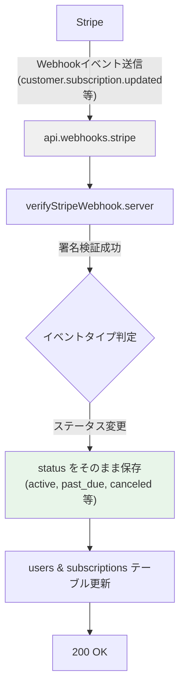
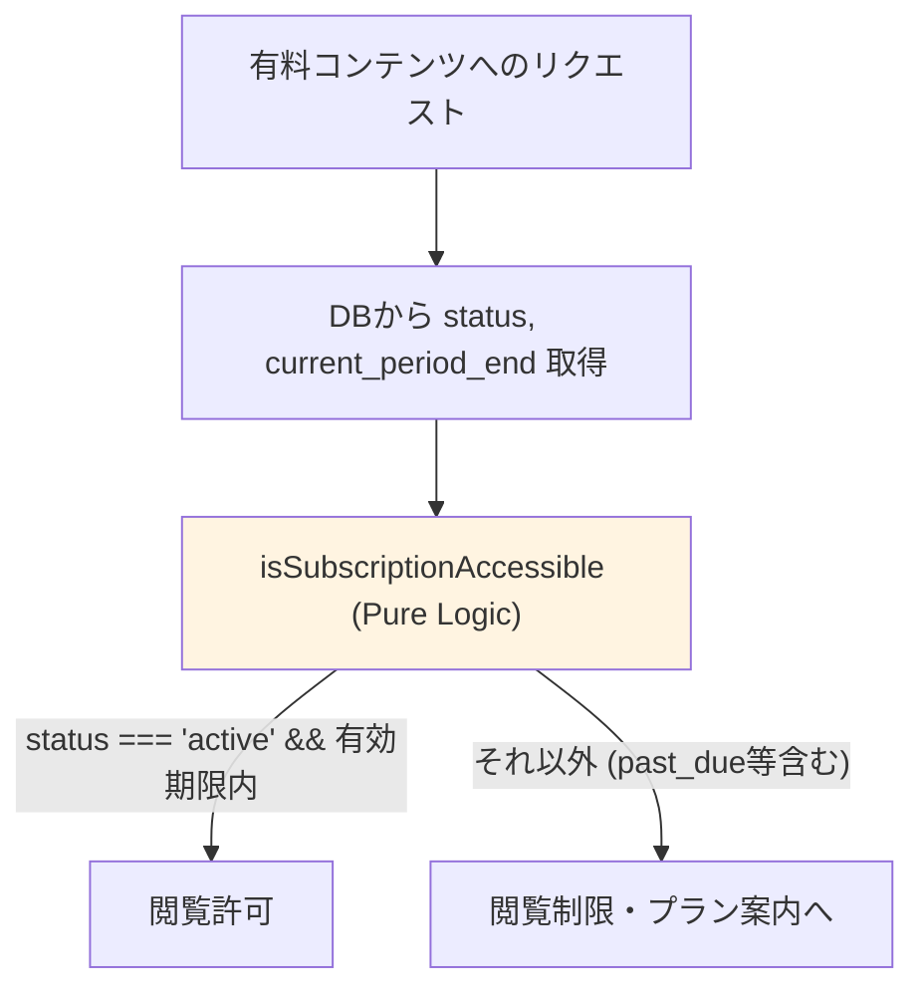
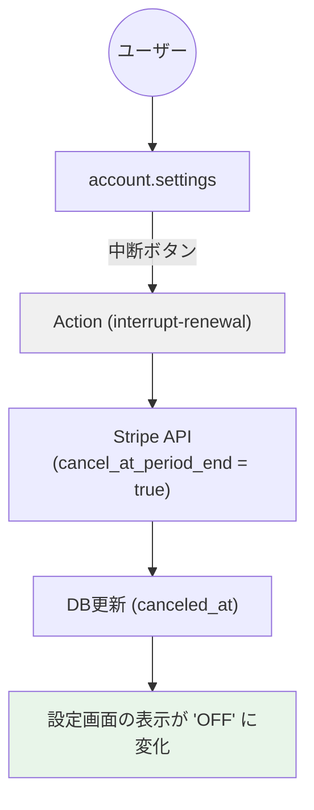

# data-flow-diagram.md - subscription Section

## 目的

`subscription`セクションのコンポーネント間の依存関係とデータフローを可視化する。

---

## データフロー図

### サブスクリプション状態同期フロー (Webhook)

### 権限判定フロー (SSoT)

### 自動更新トグルフロー (設定画面)

---

## 重要な設計方針

- **疎結合**: カード情報は自社DBで持たず、Stripeの `status` をマスターとする。
- **権利全う**: `cancel_at_period_end` を使用し、中断後も `active` 期間内はサービスを提供。
- **即時制限**: `past_due` は猶予期間を設けず、アプリ側で即座に非 `active` として扱う。

---

**最終更新**: 2026-02-05
