# data-flow-diagram.md - subscription Section

## 目的

`file-list.md`を基に、`subscription`セクションのコンポーネント間の依存関係とデータフローをMermaid図として可視化する。

---

## データフロー図

### プラン購読フロー

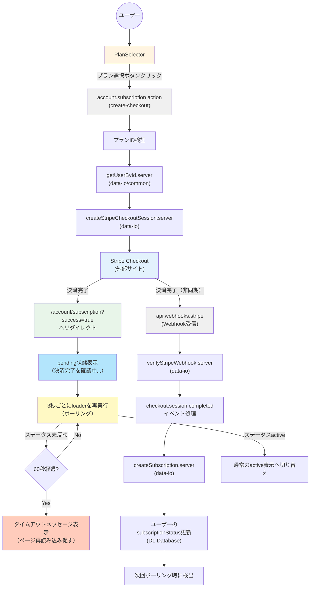

### サブスクリプション状態表示フロー

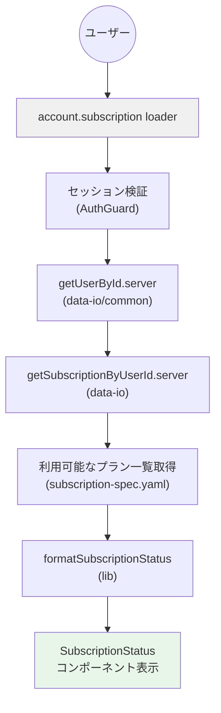

### サブスクリプションキャンセルフロー

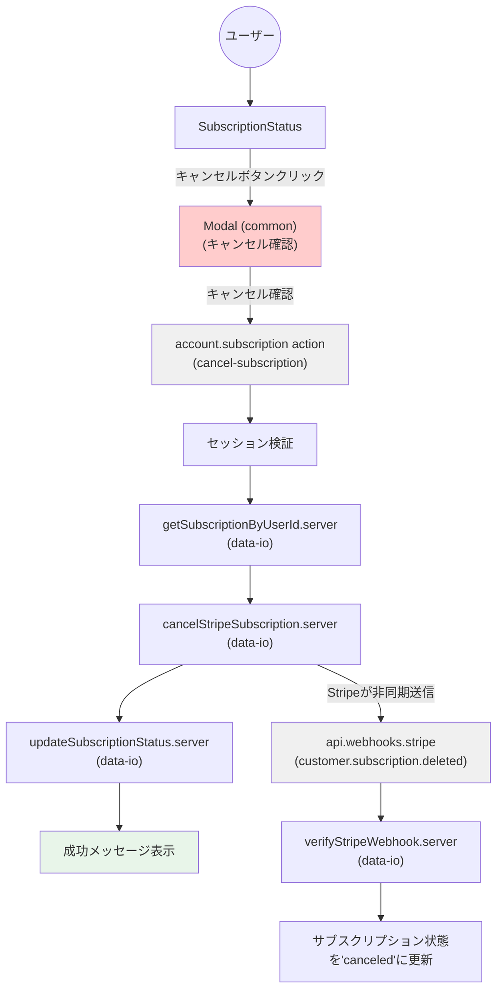

### Webhook処理フロー

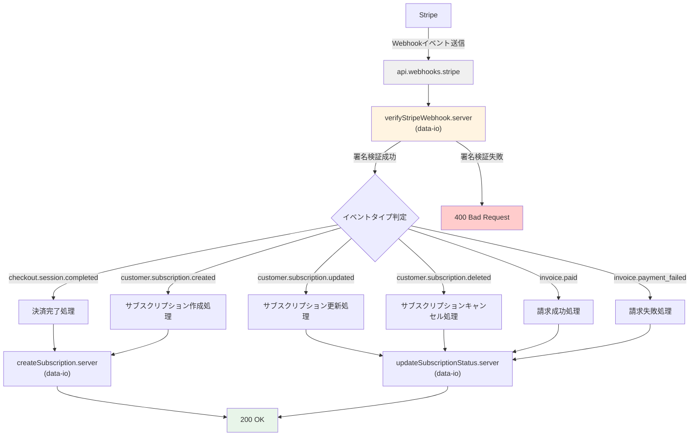

---

## コンポーネント責務

| コンポーネント | 責務 | 依存先 |
| :--- | :--- | :--- |
| **account.subscription.tsx** | サブスクリプション管理ページのRoute定義、loader/action処理 | PlanSelector, SubscriptionStatus, getSubscriptionByUserId.server, createStripeCheckoutSession.server |
| **api.webhooks.stripe.tsx** | Stripe Webhookの受信と処理、イベント署名検証 | verifyStripeWebhook.server, updateSubscriptionStatus.server, createSubscription.server |
| **PlanSelector** | プラン選択UI、購読ボタン配置 | Button (common), ErrorMessage (common) |
| **SubscriptionStatus** | サブスクリプション状態表示（Badge使用）、キャンセルUI（Modal使用） | Badge (common), Modal (common), Button (common), ErrorMessage (common) |

---

## 純粋ロジック層の関数依存関係

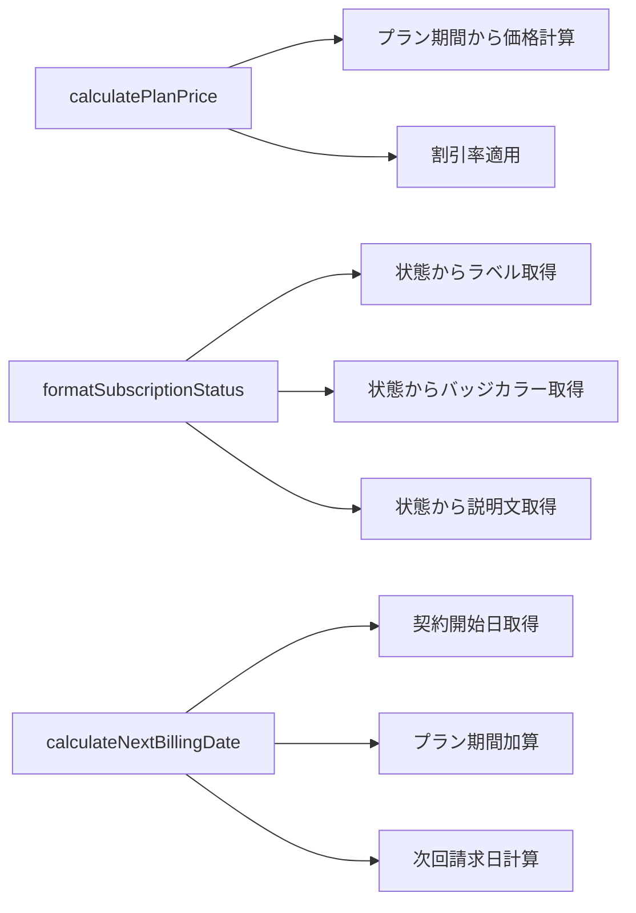

---

## 副作用層の関数依存関係

### Stripe API 連携

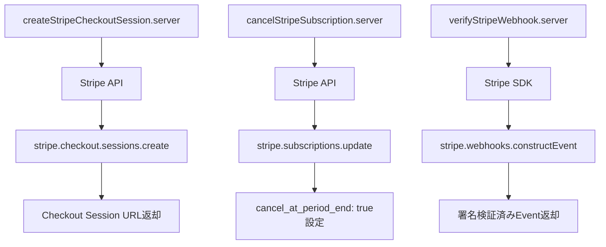

### データベース操作

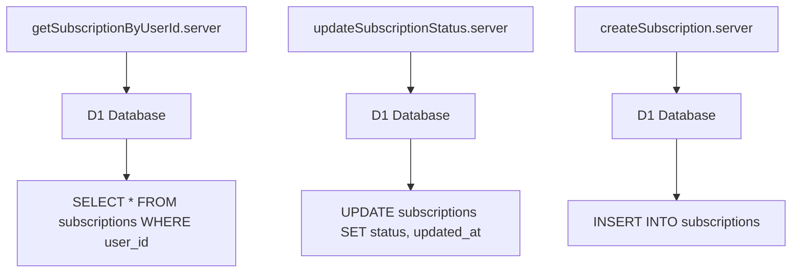

---

## セキュリティフロー

### Webhook署名検証フロー

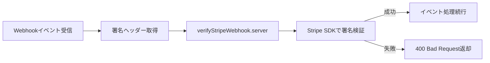

### Checkout Session作成時のセキュリティ

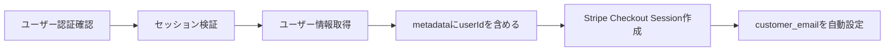

---

## プラン価格計算フロー

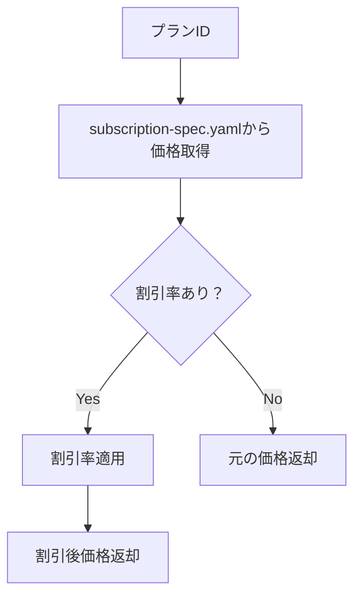

---

## サブスクリプション状態フォーマットフロー

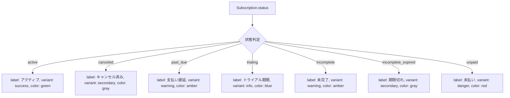

---

## 次回請求日計算フロー

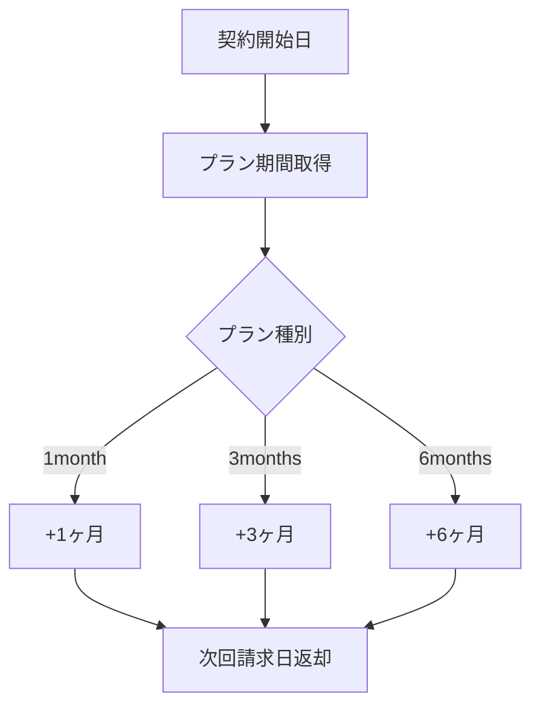

---

## Webhookイベント処理の詳細フロー

### checkout.session.completed イベント

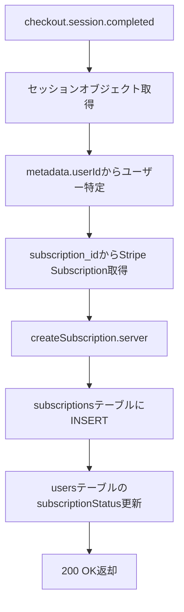

### customer.subscription.updated イベント

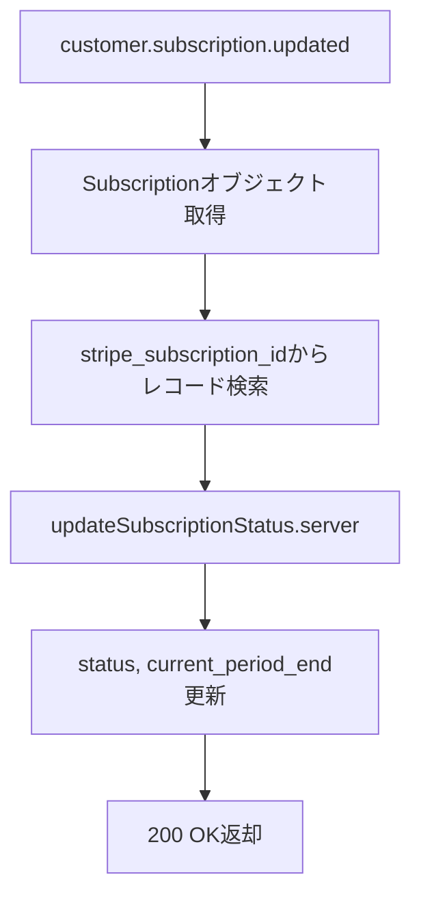

### invoice.payment_failed イベント

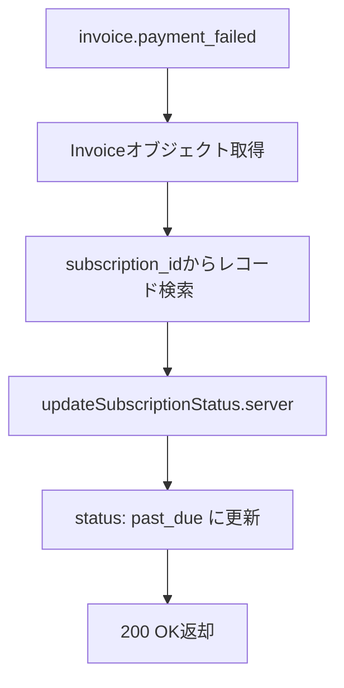

---

## エラーハンドリングフロー

### Stripe Checkout Session作成エラー

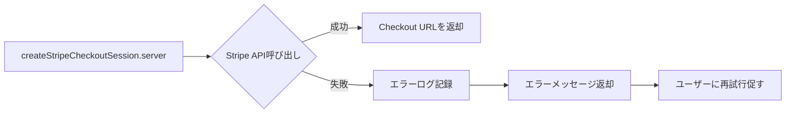

### Webhook処理エラー

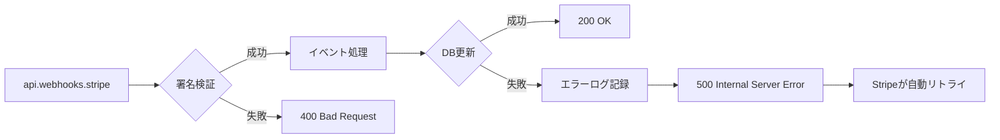

---

## パフォーマンス最適化ポイント

### Stripe Checkout Session作成の最適化

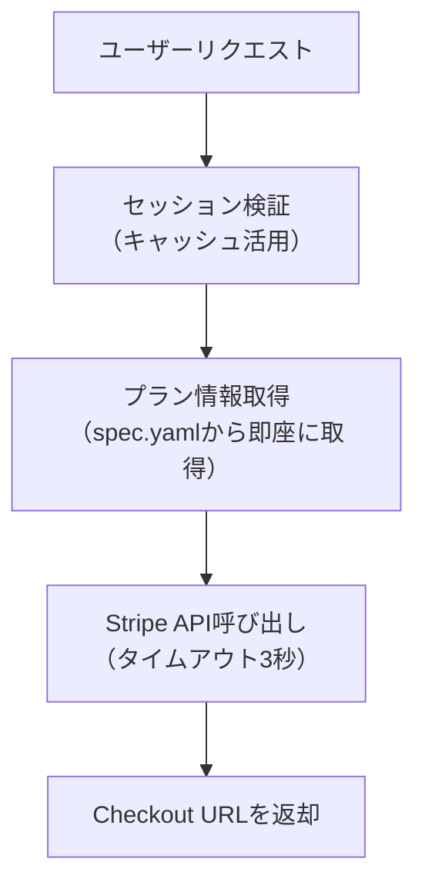

### Webhook処理の最適化

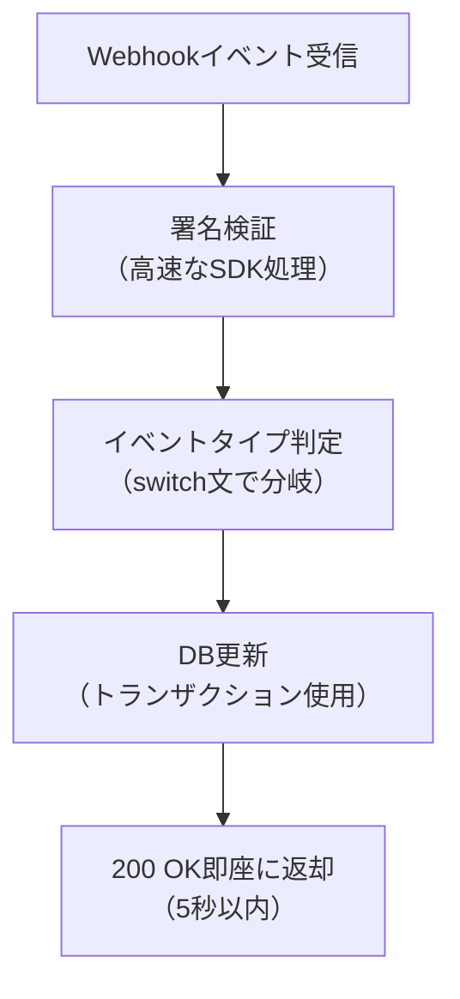

---

**最終更新**: 2025-12-23
