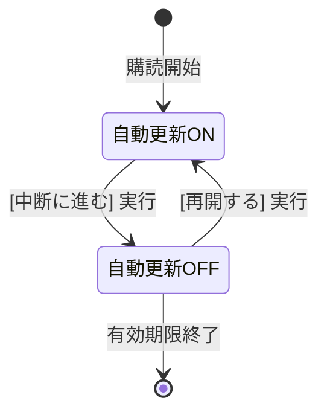

# uiux-spec.md - subscription Section

## 目的

このドキュメントは、`subscription`セクションのUI/UX設計を定義します。コンポーネント構造、状態遷移、インタラクションパターン、レスポンシブ対応、アクセシビリティ要件を包括的に記述します。

---

## 画面構成

### 1. サブスクリプション管理ページ (`/account/subscription`)

**役割**: 「プラン選択」に特化。

**純化方針**:
- 現在の契約プラン情報を表示して比較・検討させるUIを廃止し、次なるプランの選択（購入・追加）に集中させる。

**表示内容**:
- **プラン選択**: 利用可能なプラン一覧。
- **決済不履行時**: 「決済エラー」を明示し、再決済への最短導線（設定画面へのリンク等）を提示。

**主要コンポーネント構成**:

```
AccountLayout
  └─ Main Content Area
      ├─ 決済エラー時の通知（past_due時のみ表示）
      │
      └─ PlanSelector（プランの選択・追加）
          ├─ プランカード
          └─ プラン選択の制約: 自動更新中断中はボタンを disabled 化
              └─ 案内: 「プラン変更（追加）を行うには、まず更新を再開してください」
```

### 2. アカウント設定ページ (`/account/settings`)

**役割**: 「自動更新の制御」を担当。

**表示内容**:
- サブスクリプション状態項目
- **自動更新ON時**:
    - ボタン：`[自動更新の中断に進む]`
    - 確認ダイアログ：「中断しても YYYY/MM/DD までは全機能を利用可能です。次回の更新のみを停止します」と明示。確定で Stripe の `cancel_at_period_end = true` を実行。
- **自動更新OFF時**:
    - ボタン：`[自動更新を再開する]`
    - 注釈：「次の決済日は YYYY/MM/DD です（本日は決済されません）」と明示。

---

## コンポーネント詳細設計

### 1. PlanSelector

**ファイルパス**: `app/components/account/subscription/PlanSelector.tsx`

**責務**: 利用可能なプラン一覧を表示し、ユーザーがプランを選択できるUI

**インタラクション**:
- **プラン変更制限**: `isInterrupted === true` の場合、全プランの「購入/変更」ボタンを `disabled` に設定する。
- ツールチップ等で案内を表示する。


---

## 状態遷移図

### UI表示状態遷移 (自動更新)



---

## エラーハンドリング

### 決済不履行 (past_due) への対応
- 猶予期間は設けず、即座に権限を制限する。
- アカウント設定画面およびサブスクリプション画面で「決済エラー」を明示。
- 再決済（カード情報更新）への導線を提示する。

---

## バリデーション

### カード情報削除の制約
- **自動更新ON** の状態でのカード情報削除を禁止する。
- 「先に自動更新を中断してください」とエラーメッセージを表示する。

---

**最終更新**: 2026-02-05
