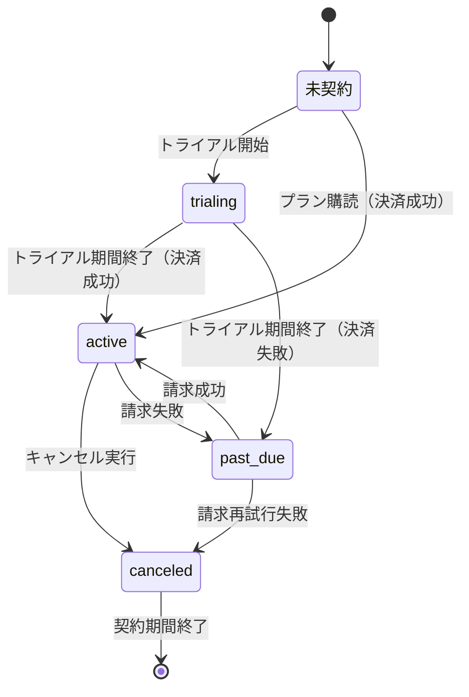
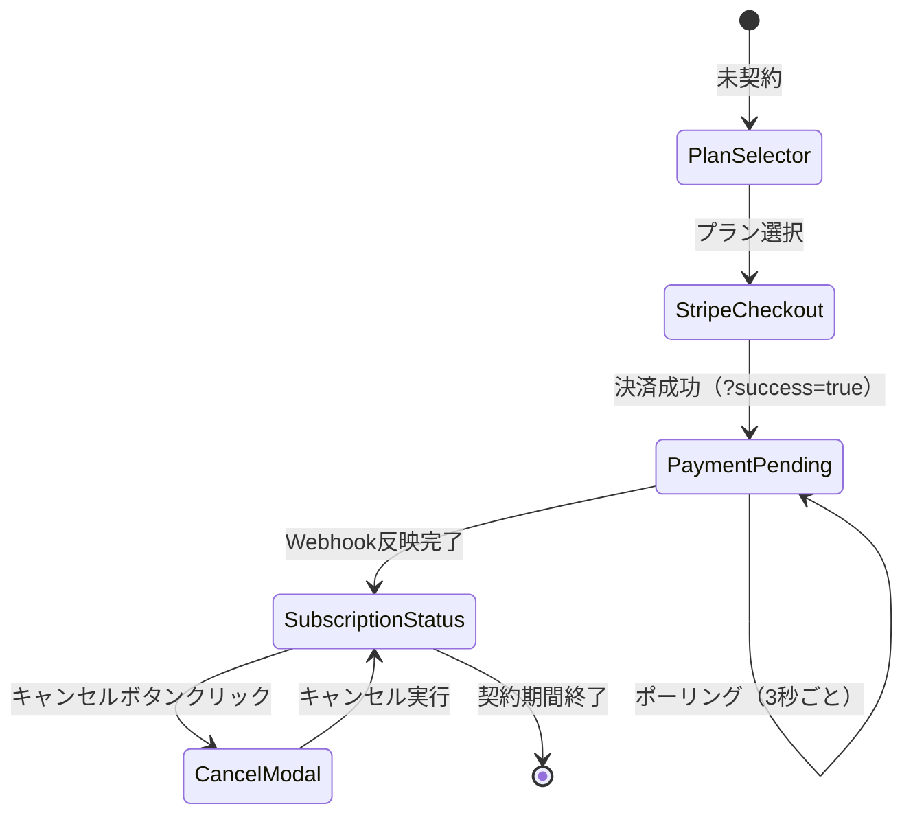

# uiux-spec.md - subscription Section

## 目的

このドキュメントは、`subscription`セクションのUI/UX設計を定義します。コンポーネント構造、状態遷移、インタラクションパターン、レスポンシブ対応、アクセシビリティ要件を包括的に記述します。

---

## 画面構成

### 1. サブスクリプション管理ページ (`/account/subscription`)

**URL**: `/account/subscription`

**ページタイトル**: サブスクリプション管理

**レイアウト**: AccountLayout（common）を使用

**主要コンポーネント構成**:

```
AccountLayout
  └─ Main Content Area
      ├─ SubscriptionStatus（契約中の場合）
      │   ├─ 契約プラン情報
      │   ├─ 契約状態バッジ
      │   ├─ 次回請求日
      │   └─ キャンセルボタン
      │
      └─ PlanSelector（未契約または別プランを表示）
          ├─ プランカード × 3
          │   ├─ プラン名
          │   ├─ 価格
          │   ├─ 期間
          │   ├─ 特典リスト
          │   └─ 「購読する」ボタン
          └─ 契約中プランには「契約中」バッジ
```

---

## コンポーネント詳細設計

### 1. PlanSelector

**ファイルパス**: `app/components/account/subscription/PlanSelector.tsx`

**責務**: 利用可能なプラン一覧を表示し、ユーザーがプランを選択できるUI

**Props定義**（抽象要件）:

- プラン一覧データ（プラン名、価格、期間、特典リスト、StripeプランID）
- 現在契約中のプラン情報（契約中プランの識別子）
- プラン選択時のアクション関数

**UI構造**:

```
<div data-testid="plan-selector">
  <h2>プランを選択</h2>

  <div class="plan-grid">  <!-- 3カラムグリッド、モバイルは1カラム -->

    <!-- 1ヶ月プラン -->
    <div class="plan-card" data-testid="plan-card-1month">
      <h3>1ヶ月プラン</h3>
      <div class="price">¥980 / 月</div>
      <ul class="features">
        <li>全記事閲覧</li>
        <li>広告非表示</li>
      </ul>
      <Button variant="primary" data-testid="subscribe-1month">
        購読する
      </Button>
    </div>

    <!-- 3ヶ月プラン -->
    <div class="plan-card plan-card-featured" data-testid="plan-card-3months">
      <div class="badge">おすすめ</div>
      <h3>3ヶ月プラン</h3>
      <div class="price">¥2,800 / 3ヶ月</div>
      <div class="price-per-month">（月あたり¥933）</div>
      <ul class="features">
        <li>全記事閲覧</li>
        <li>広告非表示</li>
        <li>5%割引</li>
      </ul>
      <Button variant="primary" data-testid="subscribe-3months">
        購読する
      </Button>
    </div>

    <!-- 6ヶ月プラン -->
    <div class="plan-card" data-testid="plan-card-6months">
      <h3>6ヶ月プラン</h3>
      <div class="price">¥5,400 / 6ヶ月</div>
      <div class="price-per-month">（月あたり¥900）</div>
      <ul class="features">
        <li>全記事閲覧</li>
        <li>広告非表示</li>
        <li>8%割引</li>
      </ul>
      <Button variant="primary" data-testid="subscribe-6months">
        購読する
      </Button>
    </div>

  </div>
</div>
```

**状態管理**:

- ローディング状態（Stripe Checkout Session作成中）
- エラー状態（Checkout作成失敗時）

**インタラクション**:

1. ユーザーが「購読する」ボタンをクリック
2. Formを送信（action: create-checkout, planId: 選択したプランID）
3. ローディング状態表示
4. Stripe Checkout Session URLを取得
5. Stripe Checkoutへリダイレクト

**レスポンシブ対応**:

- **Desktop**: 3カラムグリッド（横並び）
- **Tablet**: 3カラムグリッド（横並び、カード幅調整）
- **Mobile**: 1カラム（縦積み）

**アクセシビリティ**:

- プランカードに適切な見出しレベル（h3）
- 価格情報は読み上げ可能な形式
- ボタンにaria-labelで「〇〇プランを購読する」を設定
- 契約中プランには`aria-current="true"`を設定

---

### 2. SubscriptionStatus

**ファイルパス**: `app/components/account/subscription/SubscriptionStatus.tsx`

**責務**: 現在のサブスクリプション情報を表示し、管理アクションへのアクセスを提供

**Props定義**（抽象要件）:

- サブスクリプション情報（プラン名、契約状態、契約開始日、次回請求日、月額料金）
- キャンセルアクション関数

**UI構造**:

```
<div data-testid="subscription-status">
  <h2>契約状況</h2>

  <div class="status-card">
    <div class="status-header">
      <h3>3ヶ月プラン</h3>
      <Badge variant="success" data-testid="status-badge">
        アクティブ
      </Badge>
    </div>

    <dl class="status-details">
      <dt>契約開始日</dt>
      <dd>2025年12月1日</dd>

      <dt>次回請求日</dt>
      <dd>2026年3月1日</dd>

      <dt>月額料金</dt>
      <dd>¥933 / 月</dd>
    </dl>

    <div class="status-actions">
      <Button
        variant="danger"
        data-testid="cancel-subscription-button"
        onClick={handleCancelClick}
      >
        サブスクリプションをキャンセル
      </Button>
    </div>
  </div>
</div>
```

**状態別の表示バリエーション**:

| 契約状態 | バッジカラー | 表示内容 |
|:---|:---|:---|
| active | success（緑） | 次回請求日を表示、キャンセルボタンあり |
| pending（反映待ち） | info（青） | **「決済完了を確認中...」メッセージ、ローディングスピナー表示** |
| canceled | secondary（灰） | キャンセル日を表示、「期間終了まで利用可能」メッセージ |
| past_due | warning（黄） | 「支払いに問題があります」メッセージ、請求更新リンク |
| trialing | info（青） | トライアル終了日を表示 |

**注**: `pending`状態は、`?success=true`パラメータがある場合に表示され、Webhookによるステータス反映待ちを示します。

**インタラクション**:

1. ユーザーが「サブスクリプションをキャンセル」ボタンをクリック
2. 共通Modal（`app/components/account/common/Modal.tsx`）を使用してキャンセル確認UIを表示

**レスポンシブ対応**:

- **Desktop**: カード幅600px固定
- **Tablet**: カード幅100%（padding適用）
- **Mobile**: カード幅100%（padding適用）、フォントサイズ調整

**アクセシビリティ**:

- 契約状態バッジにaria-labelで状態を明示（「契約状態: アクティブ」）
- 契約情報は定義リスト（dl/dt/dd）で構造化
- キャンセルボタンにaria-describedbyで警告メッセージを関連付け

---

### 3. キャンセル確認UI（SubscriptionStatus内でModalを使用）

**実装方式**: SubscriptionStatusコンポーネント内で共通Modal（`app/components/account/common/Modal.tsx`）を使用

**責務**: サブスクリプションキャンセル確認UIの表示（共通Modalを使用）

**状態管理**（SubscriptionStatus内）:

- モーダル開閉状態
- サブスクリプション情報（次回請求日、プラン名）

**UI構造**:

```
<Modal
  isOpen={isOpen}
  onClose={onClose}
  data-testid="cancel-subscription-modal"
  aria-labelledby="cancel-modal-title"
  aria-describedby="cancel-modal-description"
>
  <div class="modal-header">
    <h2 id="cancel-modal-title">サブスクリプションをキャンセル</h2>
  </div>

  <div class="modal-body">
    <p id="cancel-modal-description" class="warning-message">
      本当にサブスクリプションをキャンセルしますか？
    </p>

    <div class="info-box">
      <p>キャンセル後も、次回請求日（2026年3月1日）まで引き続きご利用いただけます。</p>
    </div>

    <Form method="post">
      <input type="hidden" name="intent" value="cancel-subscription" />

      <div class="modal-actions">
        <Button
          type="button"
          variant="secondary"
          onClick={onClose}
          data-testid="cancel-modal-back-button"
        >
          戻る
        </Button>

        <Button
          type="submit"
          variant="danger"
          data-testid="cancel-modal-confirm-button"
        >
          キャンセルを実行
        </Button>
      </div>
    </Form>
  </div>
</Modal>
```

**状態管理**（SubscriptionStatus内で管理）:

- モーダル開閉状態（isOpen）
- フォーム送信中状態（isSubmitting）

**インタラクション**:

1. モーダルが開く
2. フォーカスが「戻る」ボタンに移動
3. ユーザーが「キャンセルを実行」をクリック
4. Formを送信（action: cancel-subscription）
5. ローディング状態表示
6. 成功時: モーダルを閉じて成功メッセージ表示
7. エラー時: エラーメッセージ表示

**モーダル動作**:

- オーバーレイクリックで閉じない（誤操作防止）
- Escapeキーで閉じる
- フォーカストラップ有効

**レスポンシブ対応**:

- **Desktop**: モーダル幅480px固定、中央配置
- **Mobile**: モーダル幅100%（padding適用）

**アクセシビリティ**:

- role="dialog"、aria-modal="true"
- モーダルタイトルとaria-labelledby関連付け
- 警告メッセージとaria-describedby関連付け
- フォーカストラップ有効
- Escapeキーでモーダルを閉じる

**注**: 共通化徹底型の設計により、セクション固有のモーダルコンポーネントは作成せず、SubscriptionStatus内で共通Modal（`app/components/account/common/Modal.tsx`）を直接使用します。また、ステータスバッジには共通Badge（`app/components/account/common/Badge.tsx`）を使用します。

---

## ページ遷移フロー

### プラン購読フロー

```
/account/subscription（プラン選択）
    ↓ 「購読する」クリック
action: create-checkout
    ↓ Stripe Checkout Session作成
Stripe Checkout（外部サイト）
    ↓ 決済完了
/account/subscription?success=true（成功メッセージ表示）
```

### キャンセルフロー

```
/account/subscription（契約中）
    ↓ 「キャンセル」クリック
Modal (common) 表示（キャンセル確認UI）
    ↓ 「キャンセルを実行」クリック
action: cancel-subscription
    ↓ Stripeでキャンセル、DB更新
/account/subscription（キャンセル完了メッセージ表示）
```

---

## 状態遷移図

### サブスクリプション状態遷移



### UI表示状態遷移



**注**: `PaymentPending`状態は、Stripe決済完了後からWebhookによるステータス反映までの過渡的な状態です。

---

## エラーハンドリング

### Stripe Checkout Session作成エラー

**発生条件**: Stripe API呼び出し失敗、ネットワークエラー

**表示内容**:

```
<ErrorMessage data-testid="checkout-error">
  Stripe決済画面の作成に失敗しました。もう一度お試しください。
</ErrorMessage>
```

**対処**:

- ユーザーに再試行を促す
- エラー詳細をログに記録

### サブスクリプションキャンセルエラー

**発生条件**: Stripe API呼び出し失敗、DB更新失敗

**表示内容**:

```
<ErrorMessage data-testid="cancel-error">
  サブスクリプションのキャンセルに失敗しました。もう一度お試しください。
</ErrorMessage>
```

**対処**:

- ユーザーに再試行を促す
- Webhook処理で最終的に同期される

### Webhook処理エラー

**発生条件**: 署名検証失敗、DB更新失敗

**表示内容**: ユーザーには表示しない（サーバーログに記録のみ）

**対処**:

- 400 Bad Requestを返却
- Stripeが自動的にリトライ

---

## 成功フィードバック

### プラン購読成功（決済完了直後の反映待ち状態）

**問題**: Stripe決済完了後、WebhookがサーバーへすべてのイベントPOSTし、DBが更新されるまで数秒〜数十秒のラグがあります。この間、ステータスが「未契約」のまま表示されると、ユーザーは「決済に失敗した」と誤解し、二重決済や問い合わせに繋がります。

**解決策**: `?success=true`パラメータがある場合、DBの状態に関わらず**楽観的UI（Optimistic UI）**を表示します。

**表示内容**:

```
<div data-testid="payment-pending-indicator" class="pending-status">
  <div class="spinner" aria-label="読み込み中"></div>
  <h3>決済完了を確認中...</h3>
  <p>Stripeでの決済が完了しました。サブスクリプション情報を反映しています。</p>
  <p class="info-text">通常、数秒から1分以内に完了します。このページは自動的に更新されます。</p>
</div>

<SuccessMessage data-testid="subscription-success">
  サブスクリプションの購読が完了しました。ご利用ありがとうございます。
</SuccessMessage>
```

**実装詳細**:

- **条件**: URLパラメータに`?success=true`が含まれる場合
- **表示方式**:
  - Option 1 (推奨): **ポーリング** - 3秒ごとにloaderを再実行し、ステータスが`active`になったら通常表示に切り替え
  - Option 2: **楽観的UI** - `pending`状態として「決済完了を確認中...」を表示し、ページリロードを促す
- **タイムアウト**: 60秒経過してもステータスが反映されない場合、「反映に時間がかかっています。ページを再読み込みしてください」というメッセージを表示

**表示タイミング**: `/account/subscription?success=true`にリダイレクトされた時

### キャンセル成功

**表示内容**:

```
<SuccessMessage data-testid="cancel-success">
  サブスクリプションをキャンセルしました。次回請求日まで引き続きご利用いただけます。
</SuccessMessage>
```

**表示タイミング**: action実行後のページリロード時

---

## レスポンシブデザイン詳細

### ブレークポイント

| デバイス | 幅 | レイアウト変更 |
|:---|:---|:---|
| Mobile | < 768px | 1カラム、フォントサイズ縮小、padding調整 |
| Tablet | 768px - 1024px | 3カラムグリッド、カード幅調整 |
| Desktop | > 1024px | 3カラムグリッド、カード幅固定 |

### PlanSelector レスポンシブ

**Desktop**:

```css
.plan-grid {
  display: grid;
  grid-template-columns: repeat(3, 1fr);
  gap: 24px;
}
```

**Mobile**:

```css
.plan-grid {
  display: grid;
  grid-template-columns: 1fr;
  gap: 16px;
}
```

### Modal レスポンシブ

**Desktop**:

```css
.modal-container {
  max-width: 480px;
  margin: 0 auto;
}
```

**Mobile**:

```css
.modal-container {
  width: 100%;
  padding: 16px;
}
```

---

## アクセシビリティ要件

### キーボード操作

| 操作 | 動作 |
|:---|:---|
| Tab | 次の操作可能要素へフォーカス移動 |
| Shift + Tab | 前の操作可能要素へフォーカス移動 |
| Enter / Space | ボタンやリンクを実行 |
| Escape | モーダルを閉じる |

### スクリーンリーダー対応

- すべてのフォーム要素にlabelを関連付け
- エラーメッセージはaria-live="assertive"で即座に読み上げ
- 成功メッセージはaria-live="polite"で読み上げ
- モーダルはaria-modal="true"で読み上げモードを制御

### フォーカス管理

- モーダルオープン時: モーダル内の最初のボタンにフォーカス
- モーダルクローズ時: モーダルを開いたボタンにフォーカス復帰
- フォーカストラップ: モーダル内でTabキーの循環

### カラーコントラスト

- WCAG 2.1 AA準拠（コントラスト比4.5:1以上）
- 契約状態バッジは色だけでなくテキストでも状態を表示

---

## パフォーマンス要件

### ページロード時間

- `/account/subscription`のFCP（First Contentful Paint）: 1.5秒以内
- Stripe Checkout Sessionの作成: 3秒以内

### Stripe Checkout リダイレクト

- Session作成からリダイレクトまで: 3秒以内
- ローディングインジケーターで進行状況を表示

### Webhook処理

- Webhookイベント受信から処理完了まで: 5秒以内
- タイムアウト時はStripeが自動リトライ

---

## テスト要件

### E2Eテスト（`tests/e2e/account/subscription.spec.ts`）

**テストケース**:

1. プラン選択画面の表示確認
2. Stripe Checkout Session作成の成功シナリオ
3. サブスクリプション状態の表示確認（active/canceled/past_due）
4. キャンセルモーダルの開閉動作確認
5. キャンセル実行の成功シナリオ
6. Webhook処理の確認（モック使用）

### 単体テスト

各コンポーネントに対応する`.test.tsx`ファイル:

- `PlanSelector.test.tsx`: プラン表示、ボタンクリック
- `SubscriptionStatus.test.tsx`: 状態別表示、キャンセルボタン、キャンセル確認UI（Modal使用）、フォーム送信

---

## セキュリティ要件

### Stripe Checkout

- Checkout Session作成時に`metadata`にユーザーIDを含める
- Webhook処理でmetadataからユーザーIDを取得し、DB更新

### Webhook署名検証

- すべてのWebhookリクエストでStripe署名を検証
- 検証失敗時は400 Bad Requestを返却

### APIキー管理

- Stripe Secret Keyは環境変数で管理（STRIPE_SECRET_KEY）
- クライアント側でPublishable Keyのみ使用（STRIPE_PUBLISHABLE_KEY）

---

## 将来実装（Phase 2）

- プラン変更機能（アップグレード/ダウングレード）
- 請求履歴表示（過去の請求書一覧）
- クーポン適用機能
- トライアル期間対応
- 複数支払い方法の管理

---

**最終更新**: 2025-12-23
