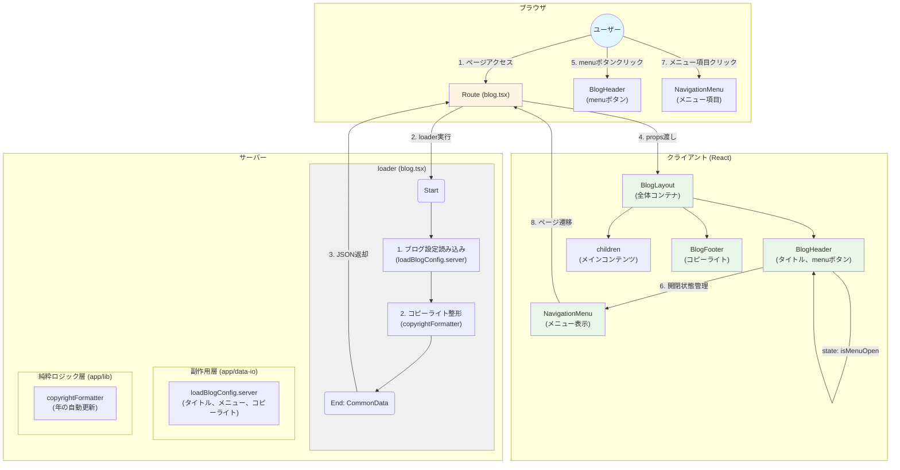

# data-flow-diagram.md - common Section

## 目的

`file-list.md`を基に、`common`セクションのコンポーネント間の依存関係とデータフローをMermaid図として可視化する。

---

## データフロー図



---

## フロー説明

### 初回ロード（1→4）

1. ユーザーがページにアクセス
2. Routeが`loader`を実行
   - `loadBlogConfig.server`: ブログ設定を読み込み
   - `copyrightFormatter`: コピーライト文字列を整形
3. `loader`がJSONを返却
4. Routeが`BlogLayout`にpropsを渡す
   - `BlogLayout` → `BlogHeader`, `BlogFooter`をレンダリング

### メニュー開閉（5→6）

5. ユーザーが`BlogHeader`のmenuボタンをクリック
6. `BlogHeader`内でstate管理（`isMenuOpen`をトグル）
   - `NavigationMenu`が表示/非表示切り替え

### ページ遷移（7→8）

7. ユーザーが`NavigationMenu`のメニュー項目をクリック
8. 対応するページへ遷移（例: `/blog/welcome`, `/blog`）

---

## コンポーネント責務

| コンポーネント | 責務 | 依存先 |
| :--- | :--- | :--- |
| **BlogLayout** | 全体レイアウト管理 | BlogHeader, BlogFooter |
| **BlogHeader** | タイトル表示、メニュー開閉制御 | NavigationMenu |
| **NavigationMenu** | メニュー項目表示、ページ遷移 | - |
| **BlogFooter** | コピーライト表示 | - |

---

## データ依存関係

### loaderからの入力

```typescript
interface CommonData {
  blogTitle: string        // "ClaudeMix Blog"
  menuItems: MenuItem[]    // メニュー項目リスト
  copyright: string        // "© 2025 ClaudeMix"
}
```

### 状態管理（Client Side）

- `BlogHeader`: `isMenuOpen: boolean` - メニューの開閉状態

---

## OGP画像生成のデータフロー

### フロー図

```mermaid
graph LR
    A[GET /ogp/$slug.png] --> B[Route: ogp.$slug.tsx]
    B --> C[Data-IO: loadPostMetadata]
    C --> D[MDXファイル読み込み]
    D --> E[Frontmatter抽出]
    E --> F[Logic: generateOgpImage]
    F --> G[HTML/CSS構築]
    G --> H[Satori: PNG生成]
    H --> I[Response: image/png]
    I --> J[Cache-Control設定]
```



### OGP画像生成のフロー説明

1. **リクエスト受信**: ユーザー（またはSNSクローラー）が `/ogp/:slug.png` にアクセス
2. **Route処理**: `ogp.$slug.tsx` がリクエストを受信し、slugパラメータを取得
3. **データ取得**: `loadPostMetadata.server.ts` がMDXファイルからFrontmatterを読み込む
   - タイトル、説明、著者などのメタデータを抽出
   - 記事が存在しない場合は404エラー
4. **画像生成**: `generateOgpImage.ts` がメタデータを基にOGP画像を生成
   - Satoriライブラリを使用してHTML/CSSからPNG画像を生成
   - デザイン仕様（1200x630px、フォント、色など）に従う
5. **レスポンス**: PNG形式で画像を返却
   - Content-Type: `image/png`
   - Cache-Control: `public, max-age=31536000, immutable`（1年間キャッシュ）

### OGP画像生成のデータ依存関係

#### 入力データ（MDX Frontmatter）

```typescript
interface PostMetadata {
  title: string        // 記事タイトル
  description: string  // 記事の説明
  author: string       // 著者名
}
```

#### 出力データ（PNG画像）

- **フォーマット**: PNG
- **サイズ**: 1200px × 630px
- **Content-Type**: `image/png`
- **Cache-Control**: `public, max-age=31536000, immutable`
