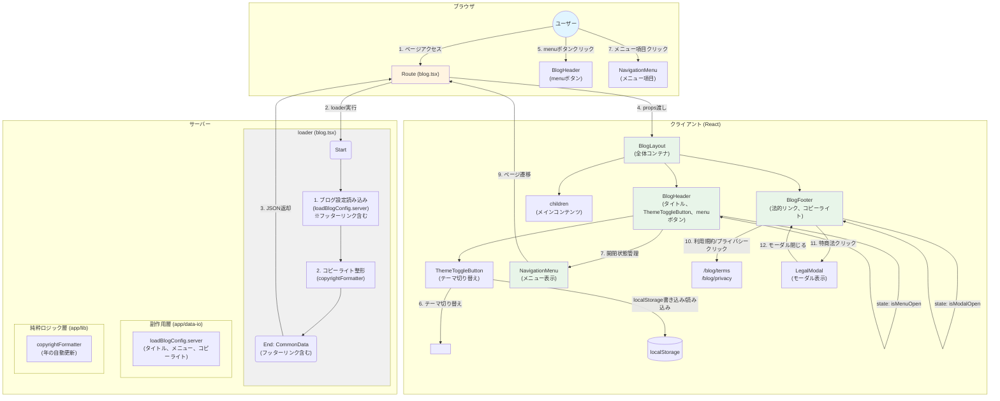

# data-flow-diagram.md - common Section

## 目的

`file-list.md`を基に、`common`セクションのコンポーネント間の依存関係とデータフローをMermaid図として可視化する。

---

## データフロー図



---

## フロー説明

### 初回ロード（1→4）

1. ユーザーがページにアクセス
2. Routeが`loader`を実行
   - `loadBlogConfig.server`: ブログ設定を読み込み
   - `copyrightFormatter`: コピーライト文字列を整形
3. `loader`がJSONを返却
4. Routeが`BlogLayout`にpropsを渡す
   - `BlogLayout` → `BlogHeader`, `BlogFooter`をレンダリング

### テーマ切り替え（5→6）

5. ユーザーが`ThemeToggleButton`をクリック
6. `ThemeToggleButton`が以下を実行:
   - `<html>`タグの`data-theme`属性を`light`/`dark`に切り替え
   - `localStorage`にテーマ設定を保存（キー: `theme`）
   - ページ全体の配色が即座に切り替わる

### メニュー開閉（7）

7. ユーザーが`BlogHeader`のmenuボタンをクリック
   - `BlogHeader`内でstate管理（`isMenuOpen`をトグル）
   - `NavigationMenu`が表示/非表示切り替え

### ページ遷移（9）

9. ユーザーが`NavigationMenu`のメニュー項目をクリック
   - 対応するページへ遷移（例: `/blog/welcome`, `/blog`）

### フッターリンククリック（10）

10. ユーザーが利用規約またはプライバシーポリシーのリンクをクリック
    - `/blog/terms` または `/blog/privacy` へ遷移
    - ブログ記事として実装されているため、既存の記事詳細ページで表示される

### 特商法モーダル表示（11→12）

11. ユーザーが特定商取引法のリンクをクリック
    - `BlogFooter`内でstate管理（`isModalOpen`をtrueに設定）
    - `LegalModal`が表示される
    - 背景のスクロールが無効化される
12. ユーザーがモーダルを閉じる（×ボタン、Escキー、外側クリック）
    - `isModalOpen`をfalseに設定
    - `LegalModal`が非表示になる
    - 背景のスクロールが復元される

---

## コンポーネント責務

| コンポーネント | 責務 | 依存先 |
| :--- | :--- | :--- |
| **BlogLayout** | 全体レイアウト管理 | BlogHeader, BlogFooter |
| **BlogHeader** | タイトル表示、メニュー開閉制御 | NavigationMenu |
| **NavigationMenu** | メニュー項目表示、ページ遷移 | - |
| **BlogFooter** | 法的リンク表示、コピーライト表示、モーダル開閉制御 | LegalModal |
| **LegalModal** | 特定商取引法の内容表示（個人情報保護のため検索エンジンから隠蔽） | - |

---

## データ依存関係

### loaderからの入力

```typescript
interface CommonData {
  blogTitle: string
  menuItems: MenuItem[]
  copyright: string
  footerLinks: FooterLink[]
  legalContent: string
}

interface FooterLink {
  label: string
  href?: string
  isModal: boolean
}
```

### 状態管理（Client Side）

- `BlogHeader`: `isMenuOpen: boolean` - メニューの開閉状態
- `BlogFooter`: `isModalOpen: boolean` - 特商法モーダルの開閉状態

---

## OGP画像生成のデータフロー

### フロー図


### OGP画像生成のフロー説明

1. **リクエスト受信**: ユーザー（またはSNSクローラー）が `/ogp/:slug.png` にアクセス
2. **Route処理**: `ogp.$slug.tsx` がリクエストを受信し、slugパラメータを取得
3. **データ取得**: `loadPostMetadata.server.ts` がMDXファイルからFrontmatterを読み込む
   - タイトル、説明、著者などのメタデータを抽出
   - 記事が存在しない場合は404エラー
4. **画像生成**: `generateOgpImage.ts` がメタデータを基にOGP画像を生成
   - Satoriライブラリを使用してHTML/CSSからPNG画像を生成
   - デザイン仕様（1200x630px、フォント、色など）に従う
5. **レスポンス**: PNG形式で画像を返却
   - Content-Type: `image/png`
   - Cache-Control: `public, max-age=31536000, immutable`（1年間キャッシュ）

### OGP画像生成のデータ依存関係

#### 入力データ（MDX Frontmatter）

```typescript
interface PostMetadata {
  title: string
  description: string
  author: string
}
```

#### 出力データ（PNG画像）

- **フォーマット**: PNG
- **サイズ**: 1200px × 630px
- **Content-Type**: `image/png`
- **Cache-Control**: `public, max-age=31536000, immutable`
