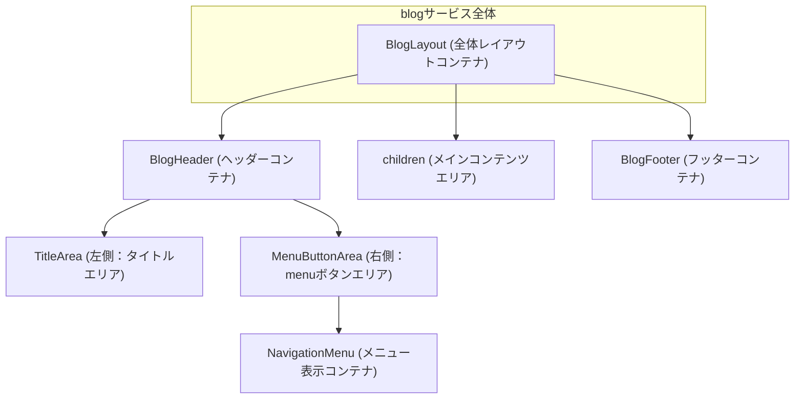
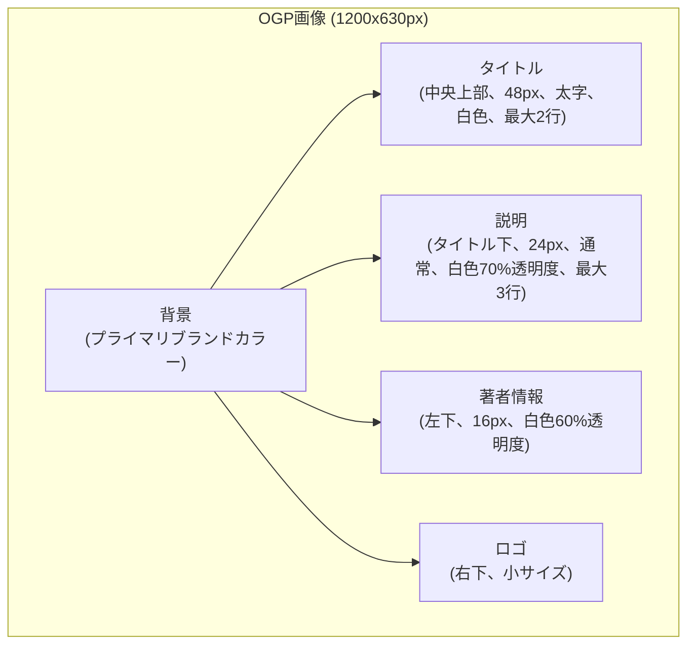

# common - UI/UX設計書

🛑 ドキュメント利用に関する注意書きとスコープ定義

> この設計書は、新規開発のための詳細な仕様書ではありません。AIエージェントによるコーディングと、人間による高効率な保守運用を目的とした**「アーキテクチャ・マップ」**です。

### I. 🎯 目指す方向とドキュメントの役割

| 項目 | 目的と役割 |
| :--- | :--- |
| **役割の焦点** | 新規開発よりも保守・修正に重点を置く。修正時のデバッグパスを最短化することが最大の目的です。 |
| **陳腐化の防止** | 頻繁に変わる具体的な情報（色、サイズ、影など）は一切記載しません。ドキュメントの役割を**構造（抽象）に限定することで、コード実装の詳細が変わっても陳腐化しない「構造的な真実の源泉」**を維持します。 |
| **一望性の確保** | UI/UX設計において、修正時に最も認知負荷が高い**「親子構造」「並列配置」「状態遷移ルール」**の3点に絞り、最小の目的を1つのドキュメントで迅速に確認できる状態を保証します。 |

### II. 🗺️ ドキュメントのスコープ（責務の境界線）

> この設計書は、サービスの**「セクション単位」**で、構造的な抽象レイヤーに特化しています。記載すべき情報と、コードに委ねる情報の境界線を明確にしてください。

#### 1. 📂 内部スコープ：このドキュメントで定義するもの（抽象）

| 項目 | 責務の対象 | 規律 |
| :--- | :--- | :--- |
| **サービススコープ** | セクション固有のコンポーネント、ロジック | Route/Componentの責務分離、セクション固有の構造（親子、並列）、セクション固有の状態遷移のルールを明確に定義します。 |
| **CSS抽象レイヤー** | 構造と配置の論理 | コンポーネント間の親子構造、並列配置（flex/grid）の論理、例外構造のルール（疑似要素など）といった、UIの骨格となる抽象的なルールのみを記載します。 |

#### 2. 🚫 外部スコープ：コードまたは別ドキュメントに委ねるもの（具体）

| 項目 | 委ねる場所 | 理由 |
| :--- | :--- | :--- |
| **アプリケーションスコープ** | App全体のUIXガイド、デザインシステム | 画面共通やセクションを横断して利用される共通コンポーネント（例: `.button-primary`、`.page-container`など）の定義は、このセクション設計書ではなく、アプリケーション全体のUIXガイドを参照してください。 |
| **CSS詳細** | Tailwind Config, Layer 1/2 の実装 | 具体的なスタイル値（色コード、スペーシング値、フォントサイズ、影、ボーダー定義など）は、**コード（Tailwindクラスまたはトークン）**を参照してください。この設計書に具体的なCSSプロパティを記載することは厳禁です。 |
| **セクション共通** | 共通コンポーネント設計書 | 複数セクションで再利用されるコンポーネントの設計は、該当の共通コンポーネント設計書を参照してください。 |

> 🔑 **原則**: 抽象は設計書に、具象はコードに。保守者はコードを見る前に、まずこの設計書を見て構造的な問題を切り分けてください。

## 📋 セクション概要

### セクション名

**Common Components (共通コンポーネント)**

### 所属サービス

**blog** の **common** セクションに配置

### セクションの目的

ブログサービス全体で一貫したレイアウトとナビゲーションを提供し、ユーザーがどのページにいても統一された操作感とブランディングを体験できるようにする。

---

## 🚗 データフロー設計 (Route責務)

このセクションの共通コンポーネントは、各Routeから利用されます。データの取得は各Routeの`loader`で行われます。

### Loader（親Routeレベル: app/routes/blog.tsx）

- **責務**: ブログサービス全体で使用される共通データ（ブログタイトル、メニュー項目、コピーライト情報）を読み込む
- **データソース**: `app/data-io/blog/common/loadBlogConfig.server.ts`

### Action

- **責務**: このセクションには`action`は不要（共通コンポーネントは表示のみを担当）
- **処理フロー**: なし

---

## 🧩 レイアウトのコンポーネント構造規範 (Layout Hierarchy Map)

このセクションは、ページ全体におけるレイアウトコンテナの階層構造を定義する**地図**です。

### 構造図

### 責務の説明

| コンテナ名 | 責務 |
| :--- | :--- |
| **BlogLayout** | ページ全体の構造を定義。ヘッダー、メインコンテンツ、フッターの縦配置を管理 |
| **BlogHeader** | ヘッダーエリア。タイトルとmenuボタンを左右に配置 |
| **TitleArea** | ブログタイトルの表示エリア。ホームへのリンク機能を持つ |
| **MenuButtonArea** | menuボタンを配置するエリア |
| **NavigationMenu** | メニュー項目を表示するコンテナ。開閉状態により表示/非表示が切り替わる |
| **children** | 各ページのメインコンテンツを表示するエリア（記事一覧、記事詳細など） |
| **BlogFooter** | フッターエリア。コピーライト表記を表示 |

---

## 📐 認定済み並列配置 (Authorized Flexbox/Grid Layouts)

このセクションは、**不要なレイアウト実装の乱立を防ぐ**ため、このUIセクション内で**許可された並列配置パターンのみ**を定義するホワイトリストです。

---

### BlogHeader内の左右配置

| 設計項目 | 定義 | 備考 |
| :--- | :--- | :--- |
| **対象コンテナ** | `BlogHeader` | ヘッダー全体のレイアウトコンテナ |
| **対象アイテム** | `TitleArea`, `MenuButtonArea` | 左側のタイトルエリアと右側のmenuボタンエリア |
| **想定アイテム数** | `固定: 2個` | タイトルとmenuボタンの2要素 |
| **レイアウトの意図** | `横並びで左右に配置（justify-between）` | タイトルを左端、menuボタンを右端に配置 |

---

### NavigationMenu内のメニュー項目配置

| 設計項目 | 定義 | 備考 |
| :--- | :--- | :--- |
| **対象コンテナ** | `NavigationMenu` | メニュー項目を表示するコンテナ |
| **対象アイテム** | `MenuItem` | 各メニュー項目（挨拶記事、Articlesなど） |
| **想定アイテム数** | `可変: 2～5個程度` | メニュー項目は将来的に追加される可能性がある |
| **レイアウトの意図** | `縦並びでスタック配置` | メニュー項目を縦方向に並べる |

---

## ⚡ インタラクションと状態遷移の設計 (Component責務)

### 1. BlogHeader

**責務**: ブログタイトルとmenuボタンを表示し、ユーザーのナビゲーションを支援する

#### 状態 (State)

- **通常 (default)**: ブログタイトルとmenuボタンが表示されている状態
- **メニュー開 (menu-open)**: NavigationMenuが表示されている状態

#### インタラクション (Interaction)

- **トリガー1**: ブログタイトルをクリック
  - **応答**: `/blog`へ遷移（ホーム画面へ戻る）
- **トリガー2**: menuボタンをクリック
  - **応答**: NavigationMenuの開閉状態をトグル
  - **アニメーション**: NavigationMenuがフェードイン/フェードアウト

---

### 2. NavigationMenu

**責務**: メニュー項目を表示し、ユーザーが各ページへ遷移できるようにする

#### 状態 (State)

- **閉じている (closed)**: メニューが非表示
- **開いている (open)**: メニューが表示されている状態
- **ホバー (hover)**: メニュー項目にマウスをホバーした時の強調表示

#### インタラクション (Interaction)

- **トリガー1**: メニュー項目をクリック
  - **応答**: 対応するページへ遷移（例: `/blog/welcome`, `/blog`）
  - **アニメーション**: クリック時に軽微な視覚フィードバック
- **トリガー2**: メニュー外の領域をクリック
  - **応答**: NavigationMenuを閉じる
  - **アニメーション**: フェードアウト
- **トリガー3**: Escキー押下
  - **応答**: NavigationMenuを閉じる
  - **アニメーション**: フェードアウト

---

### 3. BlogFooter

**責務**: コピーライト表記を表示する

#### 状態 (State)

- **通常 (default)**: コピーライト表記が表示されている状態（インタラクションなし）

#### インタラクション (Interaction)

- なし（静的な表示のみ）

---

## 🛠️ 例外構造と規律

このセクションでは、上記の規範で対応できない例外的な構造は現時点で存在しません。

将来的に例外が必要になった場合は、以下の形式で記載します：

### {例外構造の名前}

| 項目 | 内容 |
| :--- | :--- |
| **対象コンポーネント** | {コンポーネント名} |
| **例外の理由** | {なぜ通常の構造規範では対応できないのか} |
| **実装方法** | {疑似要素、子孫セレクタなどの具体的な実装方法の抽象的な説明} |

---

## 📱 レスポンシブ対応

### ブレークポイント戦略

| デバイス | 対応方針 |
| :--- | :--- |
| **モバイル (< 768px)** | NavigationMenuはモーダル形式で全画面表示 |
| **タブレット (768px ~ 1024px)** | NavigationMenuはドロップダウン形式で表示 |
| **デスクトップ (> 1024px)** | NavigationMenuはドロップダウン形式で表示 |

### レイアウト変更点

- **BlogHeader**: モバイルではタイトルを省略形で表示する可能性あり（デザイントークンで調整）
- **NavigationMenu**: モバイルでは画面全体をオーバーレイ表示

---

## 🖼️ OGP画像デザイン仕様

### 概要

記事ごとにSNSシェア用のOGP画像を動的に生成します。この画像はブラウザ上で表示されるものではなく、SNSプラットフォーム（Twitter、Facebook、Linkedinなど）でシェアされた際にプレビュー表示されます。

### 画像仕様

| 項目 | 仕様 |
| :--- | :--- |
| **画像サイズ** | 1200px × 630px（OGP標準サイズ） |
| **フォーマット** | PNG |
| **背景** | プライマリブランドカラー（デザイントークンから取得） |

### レイアウト構造

### テキスト仕様

| 要素 | 配置 | フォントサイズ | 太さ | 色 | 行数制限 | 備考 |
| :--- | :--- | :--- | :--- | :--- | :--- | :--- |
| **タイトル** | 中央上部 | 48px | 太字 | 白色 | 最大2行 | 長い場合は末尾を`...`で省略 |
| **説明** | タイトル下 | 24px | 通常 | 白色（70%透明度） | 最大3行 | 長い場合は末尾を`...`で省略 |
| **著者情報** | 左下 | 16px | 通常 | 白色（60%透明度） | 1行 | "By {著者名}" 形式 |
| **ロゴ** | 右下 | 小サイズ | - | - | - | ブランドロゴまたはサービス名 |

### フォント

- **フォントファミリー**: システムフォント（sans-serif）
- **日本語対応**: 必須
- **フォールバック**: `'Noto Sans JP', 'Hiragino Sans', 'ヒラギノ角ゴ ProN W3', 'メイリオ', Meiryo, sans-serif`

### 文字切り詰めルール

- **タイトル**: 最大60文字程度。2行を超える場合は末尾を`...`で省略
- **説明**: 最大120文字程度。3行を超える場合は末尾を`...`で省略

---

## 🎨 デザイントークン参照

具体的なスタイル値（色、サイズ、影など）は、以下のデザイントークンを参照してください：

- **Layer 1**: `app/styles/blog/layer1.css` - デザイントークンの定義
- **Layer 2**: `app/styles/blog/layer2.css` - カスタムクラスの定義
- **Tailwind設定**: `tailwind.config.ts` - プロジェクト全体のTailwind設定

**重要**: この設計書には具体的なCSS値を記載しません。実装時は必ずデザイントークンとTailwindクラスを使用してください。
