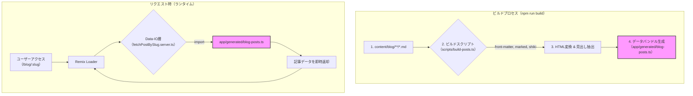

# 設計書: マークダウンHTML変換 プレビルドシステム

## 1. 目的と背景 (Why Pre-build?)

- **目的**: ユーザーリクエスト時のサーバー負荷をゼロにし、TTFB（Time To First Byte）を極限まで短縮することで、圧倒的な表示速度を実現する。
- **背景**: 従来の動的変換（リクエストごとに変換）では、記事アクセス時にCPU負荷が発生し、表示遅延の原因となる。本システムでは、ビルド時にすべての重い処理（ファイル読み込み、マークダウン解析、HTML変換、シンタックスハイライト）を完了させ、ランタイムは完成したデータを返すだけの状態にする。これはJamstackアーキテクチャのベストプラクティスに沿ったアプローチである。

### 1.1. 設計選択: なぜHTMLをGit管理しないのか？

- **Single Source of Truthの原則**: 本設計では、コンテンツの唯一の真実の源（Single Source of Truth）はマークダウンファイル（`.md`）であると定義する。生成物であるHTMLをGit管理に含めると、ソース（.md）と生成物（.html）の同期が取れなくなるリスクがあり、この原則が崩れるため採用しない。
- **自動化による品質担保**: 変換処理をビルドプロセスに組み込むことで、変換忘れといったヒューマンエラーを排除し、常に最新のコンテンツがデプロイされることを保証する。
- **トレードオフの受容**: この戦略は、記事数に応じてビルド時間が増加するというトレードオフを持つ。しかし、手動運用によるリスクやリポジトリの肥大化といった問題と比較し、ビルドプロセスの自動化と信頼性を優先する。

## 2. アーキテクチャ概要

プレビルド処理の全体像とデータフローを定義する。



## 3. 主要コンポーネントの責務

### 3.1. ビルドスクリプト (`scripts/prebuild/generate-blog-posts.js`)

- **トリガー**: `npm run build` 時、または開発モードでのファイル変更時。
- **責務**:
    1. **ファイル探索**: `content/blog/posts/` ディレクトリ配下の全 `.md` ファイルを探索・読み込み。
    2. **メタデータ抽出**: `gray-matter` を使用して、各ファイルからfrontmatter（メタデータ）とマークダウン本文を抽出。
    3. **外部ファイル参照解決**: frontmatterの `source` プロパティが存在する場合、スクリプト内で直接外部マークダウンファイルを読み込み、本文として使用する。
    4. **HTML変換と見出し抽出**: スクリプト内部のロジックで、マークダウン本文をHTMLコンテンツと見出し情報の配列に変換する（`marked`, `shiki`, `sanitize-html` を利用）。
    5. **データ検証と整形**: frontmatterの必須フィールド（`title`, `publishedAt`）を検証し、`BlogPost` 型のオブジェクト配列を生成する。
    6. **本番用データフィルタリング**: `NODE_ENV` が `production` の場合、`testOnly: true` の記事を除外する。
    7. **カテゴリ定義の読み込み**: `app/specs/blog/posts-spec.yaml` からカテゴリのマスタデータを読み込む。
    8. **データバンドル生成**: 記事データとカテゴリデータを結合し、`app/generated/blog-posts.ts` ファイルとして書き出す。この際、記事を検索するためのヘルパー関数（`getPostBySlug` など）も同時に生成する。

### 3.2. データバンドル (`app/generated/blog-posts.ts`)

- **役割**: ビルド時に生成された、すべての記事データを含むTypeScriptファイル。**Gitの管理対象外**とする。
- **責務**:
    1. 全記事データの配列 `allPosts: BlogPost[]` をエクスポート。
    2. `slug` をキーとして記事データを高速に取得するための `Map` と `getPostBySlug(slug)` 関数をエクスポート。

### 3.3. データIO層 (`app/data-io/blog/post-detail/fetchPostBySlug.server.ts`)

- **責務の変更**: ファイルシステムへのアクセスは一切行わない。
- **新しい責務**: データバンドルから `getPostBySlug(slug)` をインポートし、呼び出すだけ。これにより、ランタイムでの副作用が大幅に削減される。

## 4. 実行フローと開発体験

### 4.1. 本番ビルド (`npm run build`)

- **実行環境**: このコマンドは、主に**Cloudflare Pagesのビルド環境**で、Gitリポジトリへのプッシュをトリガーとして自動実行されることを想定しています。
- **処理内容**: `package.json` の `build` スクリプト (`npm run prebuild && remix vite:build`) が実行されます。
- **フロー**:
    1. `prebuild`スクリプト (`scripts/prebuild/generate-blog-posts.js`) が実行され、マークダウンファイルからデータバンドル (`app/generated/blog-posts.ts`) を生成します。
    2. `remix vite:build` が実行され、生成されたデータバンドルを含んだアプリケーション全体がビルドされます。
    3. このプロセスにより、ランタイム（リクエスト時）にはファイルシステムへのアクセスが一切不要になります。

### 4.2. 開発モード (`npm run dev`)

- `chokidar` などのファイル監視ライブラリを使用し、`content/blog/` 配下の `.md` ファイルの変更を監視する。
- ファイルの追加・変更・削除を検知したら、`scripts/build-posts.ts` を自動で再実行し、`app/generated/blog-posts.ts` を更新する。これにより、開発者は記事を保存するだけで即座に変更が画面に反映される。

## 5. 型定義

- ビルド済み記事データの型 `BlogPost` を `app/generated/blog-posts.ts` 内で定義・エクスポートする。

```typescript
// app/generated/blog-posts.ts
import type { Frontmatter, Heading } from '~/specs/blog/types';

export interface BlogPost {
  slug: string;
  frontmatter: Frontmatter;
  content: string; // HTML変換後のコンテンツ
  headings: Heading[];
}

// ... allPosts と getPostBySlug の実装
```

## 6. 設定変更箇所

1. **`.gitignore`**: `app/generated/` ディレクトリを追加し、自動生成ファイルがリポジトリに含まれないようにする。
2. **`package.json`**:
    - `scripts` の `build` コマンドを更新。
    - `scripts` に `dev` 用のファイル監視・ビルド実行コマンドを追加。
    - `devDependencies` に `chokidar` や `glob` などを追加。
