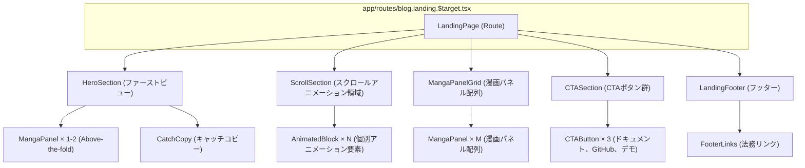

# landing - UI/UX設計書

## ドキュメント利用に関する注意書きとスコープ定義

この設計書は、新規開発のための詳細な仕様書ではありません。AIエージェントによるコーディングと、人間による高効率な保守運用を目的とした**アーキテクチャ・マップ**です。

## 目指す方向とドキュメントの役割

| 項目 | 目的と役割 |
| :--- | :--- |
| **役割の焦点** | 新規開発よりも保守・修正に重点を置く。修正時のデバッグパスを最短化することが最大の目的です。 |
| **陳腐化の防止** | 頻繁に変わる具体的な情報（色、サイズ、影など）は一切記載しません。ドキュメントの役割を**構造（抽象）に限定することで、コード実装の詳細が変わっても陳腐化しない「構造的な真実の源泉」**を維持します。 |
| **一望性の確保** | UI/UX設計において、修正時に最も認知負荷が高い**「親子構造」「並列配置」「状態遷移ルール」**の3点に絞り、最小の目的を1つのドキュメントで迅速に確認できる状態を保証します。 |

## ドキュメントのスコープ（責務の境界線）

この設計書は、サービスの**セクション単位**で、構造的な抽象レイヤーに特化しています。記載すべき情報と、コードに委ねる情報の境界線を明確にしてください。

## 内部スコープ：このドキュメントで定義するもの（抽象）

| 項目 | 責務の対象 | 規律 |
| :--- | :--- | :--- |
| **サービススコープ** | セクション固有のコンポーネント、ロジック | Route/Componentの責務分離、セクション固有の構造（親子、並列）、セクション固有の状態遷移のルールを明確に定義します。 |
| **CSS抽象レイヤー** | 構造と配置の論理 | コンポーネント間の親子構造、並列配置（flex/grid）の論理、例外構造のルール（疑似要素など）といった、UIの骨格となる抽象的なルールのみを記載します。 |

## 外部スコープ：コードまたは別ドキュメントに委ねるもの（具体）

| 項目 | 委ねる場所 | 理由 |
| :--- | :--- | :--- |
| **アプリケーションスコープ** | App全体のUIXガイド、デザインシステム | 画面共通やセクションを横断して利用される共通コンポーネント（例: `.button-primary`、`.page-container`など）の定義は、このセクション設計書ではなく、アプリケーション全体のUIXガイドを参照してください。 |
| **CSS詳細** | Tailwind Config, Layer 1/2 の実装 | 具体的なスタイル値（色コード、スペーシング値、フォントサイズ、影、ボーダー定義など）は、**コード（Tailwindクラスまたはトークン）**を参照してください。この設計書に具体的なCSSプロパティを記載することは厳禁です。 |
| **セクション共通** | 共通コンポーネント設計書 | 複数セクションで再利用されるコンポーネントの設計は、該当の共通コンポーネント設計書を参照してください。 |

> 🔑 **原則**: 抽象は設計書に、具象はコードに。保守者はコードを見る前に、まずこの設計書を見て構造的な問題を切り分けてください。

## セクション概要

### セクション名

Landing Page (ランディングページ)

### 所属サービス

**blog** の **landing** セクションに配置

### セクションの目的

ClaudeMixの技術力を視覚的にデモンストレーションし、ターゲット別の価値提案を行う。スクロール駆動型アニメーション、漫画コンテンツ、CTAボタンを組み合わせた差別化されたLP体験を提供する。

---

## 🚗 データフロー設計 (Route責務)

このセクションにおけるデータの流れと、Remixの`loader`および`action`の責務を定義します。

### Loader（app/routes/blog.landing.$target.tsx）

- **責務**: ターゲット別のコンテンツと漫画アセットを読み込み、UIコンポーネントに渡す
- **データソース**:
  - `app/data-io/blog/landing/getLandingContent.server.ts`
  - `app/data-io/blog/landing/getMangaAssets.server.ts`
- **処理フロー**:
  1. URLパラメータからターゲットを取得
  2. lib層でターゲット検証（不正値はデフォルトフォールバック）
  3. ファイルシステムからコンテンツYAMLを読み込み
  4. 漫画画像パスを取得
  5. LandingContent型に変換
  6. UIに返す
- **エラーハンドリング**: ErrorBoundaryでターゲット不正時のフォールバック表示

### Action

- **責務**: このセクションには`action`は不要（LPは閲覧のみ）
- **処理フロー**: なし

---

## 🧩 レイアウトのコンポーネント構造規範 (Layout Hierarchy Map)

このセクションは、ページ全体におけるレイアウトコンテナの階層構造を定義する**地図**です。後続の「並列配置規範」で定義されるコンテナが、ページ全体のどこに位置するのかを把握するために使用します。

**原則**:

- **レイアウトコンテナのみ**: ここでは、レイアウトを構成する主要なコンテナ（箱）の親子関係のみを記述します。
- **コンテンツは除外**: ラベル、テキスト、アイコンといった、レイアウト構造と本質的に関係のないコンテンツ要素は記載しません。

### 構造図



---

## 📐 並列配置規範 (Layout Distribution Map)

各コンテナがどのように並列配置されるかを定義します。レスポンシブ対応の戦略も含みます。

### HeroSection（ファーストビュー）

- **配置**: Flexbox縦積み
- **構成要素**:
  - MangaPanel × 1-2（Above-the-fold）
  - CatchCopy（キャッチコピー）
- **レスポンシブ**:
  - モバイル: 1列（縦積み）
  - デスクトップ: 1列（縦積み）
- **特記事項**: Critical CSS対象領域

### ScrollSection（スクロールアニメーション領域）

- **配置**: Flexbox縦積み
- **構成要素**:
  - AnimatedBlock × N（個別アニメーション要素）
- **レスポンシブ**:
  - モバイル: 1列（縦積み）
  - デスクトップ: 1列（縦積み）
- **特記事項**: Intersection Observer連携

### MangaPanelGrid（漫画パネル配列）

- **配置**: CSS Grid
- **構成要素**:
  - MangaPanel × M（漫画パネル）
- **レスポンシブ**:
  - モバイル: 1列（`grid-cols-1`）
  - デスクトップ: 2列（`grid-cols-2`）
- **特記事項**: 画像遅延ロード対応

### CTASection（CTAボタン群）

- **配置**: Flexbox横並び（中央揃え）
- **構成要素**:
  - CTAButton × 3（ドキュメント、GitHub、デモ）
- **レスポンシブ**:
  - モバイル: 縦積み（`flex-col`）
  - デスクトップ: 横並び（`flex-row`）
- **特記事項**: アクセシビリティ対応（`aria-label`）

### LandingFooter（フッター）

- **配置**: Flexbox横並び（中央揃え）
- **構成要素**:
  - FooterLinks（法務リンク）
- **レスポンシブ**:
  - モバイル: 縦積み
  - デスクトップ: 横並び
- **特記事項**: シンプルな構成

---

## 🔄 状態遷移ルール (State Transition Map)

このセクションで管理される状態と、その遷移ルールを定義します。

### スクロール位置に基づくアニメーション状態

**状態定義**:

- **非表示状態**: 要素がビューポート外にある
- **アニメーション発火**: 要素がビューポート70%に到達
- **表示完了状態**: アニメーションが完了し、要素が表示される

**遷移ルール**:

```
非表示状態 --[ビューポート70%到達]--> アニメーション発火 --[800ms経過]--> 表示完了状態
```

**実装方法**:

- Intersection Observer API使用
- 閾値: `threshold: 0.7`
- アニメーション時間: `800ms`
- イージング: `cubic-bezier(0.4, 0, 0.2, 1)`

### 画像遅延ロード状態

**状態定義**:

- **未ロード**: 画像がまだロードされていない
- **ロード中**: 画像がロード中
- **ロード完了**: 画像がロード完了

**遷移ルール**:

```
未ロード --[ビューポート接近]--> ロード中 --[ロード完了]--> ロード完了
```

**実装方法**:

- ``属性使用
- ブラウザネイティブの遅延ロード

---

## 🎨 CSS戦略とLayer構成

### Layer 1: Application Tokens（既存変数使用）

- **`--color-interactive-primary`**: シアン（#22d3ee）
- **`--color-surface-dark`**: 黒（#0a0a0a）
- **`--color-accent-gold`**: アクセント（#D4BC89）

### Layer 2: Component Styles（`app/styles/blog/layer2-landing.css`）

- **責務**: 漫画パネル、CTAボタン、フッターの見た目定義
- **対象要素**:
  - `.manga-panel`: 漫画パネルスタイル
  - `.cta-button`: CTAボタンスタイル
  - `.landing-footer`: フッタースタイル

### Layer 3: Layout Definitions（`app/styles/blog/layer3-landing.ts`）

- **責務**: Grid/Flexレイアウト定義
- **生成クラス**:
  - `mangaPanelGrid()`: CSS Grid（レスポンシブ、モバイル1列/デスクトップ2列）
  - `scrollSection()`: Flexbox縦積み
  - `ctaSection()`: Flexbox横並び（レスポンシブ）

### Layer 4: Animations（`app/styles/blog/layer4-landing.ts`）

- **責務**: スクロールアニメーション`@keyframes`定義
- **生成クラス**:
  - `animateFadeInUp()`: フェードイン＋上移動
  - `animateSlideIn()`: 横スライド
  - `animateScale()`: スケール変化

### 性能最適化の妥協点

**Critical CSSのインライン化**:

- **対象**: Above-the-fold領域（HeroSection）のみ
- **方法**: `<style>`タグでインライン
- **理由**: 初回ロード最適化（Lighthouse対策）
- **文書化**: `landing-spec.yaml`と`docs/thinking/landing-css-inline.md`に記録

---

## ♿ アクセシビリティ要件

### 必須対応項目

- **CTAButton**: `aria-label`属性でリンク先を明示
- **MangaPanel**: `alt`属性で画像説明
- **AnimatedBlock**: `data-testid`属性で要素識別
- **ScrollSection**: キーボードナビゲーション対応

### 推奨対応項目

- **色覚多様性**: 十分なコントラスト比（既存カラー変数を使用）
- **スクリーンリーダー**: セマンティックHTML使用
- **キーボード操作**: Tab順序の最適化

---

## 📏 レスポンシブ戦略

### ブレークポイント

Tailwind CSS標準を使用：

- **モバイル**: `< 640px`
- **タブレット**: `640px ～ 1024px`
- **デスクトップ**: `>= 1024px`

### デバイス別最適化

| デバイス | MangaPanelGrid | CTASection | ScrollSection |
|---------|---------------|-----------|---------------|
| モバイル | 1列 | 縦積み | 縦積み |
| タブレット | 1列 | 縦積み | 縦積み |
| デスクトップ | 2列 | 横並び | 縦積み |

---

## 🧪 UI/UXテスト観点

### E2Eテスト観点

- LP表示確認（全デバイス）
- スクロールアニメーション動作確認
- CTA導線確認（リンク遷移）
- レスポンシブ表示確認

### ユニットテスト観点

- コンポーネント構造テスト
- プロップス検証
- 遅延ロード動作確認
- アクセシビリティ属性検証
