# data-flow-diagram.md - post-detail Section

## 目的

post-detailセクションのコンポーネント間の依存関係とデータフローを可視化し、設計レビューを容易にする。

---

## データフロー図

```mermaid
graph TD
    User["ユーザー"] -->|"URL: /blog/:slug"| Route["blog.$slug.tsx<br/>(Route)"]

    subgraph "データ取得・変換フロー"
        Route -->|"1. slug を渡す"| DataIO["fetchPostBySlug.server.ts<br/>(Data-IO層)"]
        DataIO -->|"2. 記事データ返却<br/>(frontmatter含む: freeContentPercentage)"| Route

        Route -->|"3a. source無し"| Content1["記事ファイル本文"]
        Route -->|"3b. source有り<br/>(例: /README.md)"| ExternalIO["fetchExternalMarkdown.server.ts<br/>(Data-IO層)"]
        ExternalIO -->|"外部ファイル内容"| Content2["外部マークダウン"]

        Content1 --> Lib["markdownConverter.ts<br/>(Pure Logic層)"]
        Content2 --> Lib
        Lib -->|"4. HTML返却<br/>(画像・Mermaid・ID付き見出し処理済み)"| Route

        Content1 --> HeadingsLib["extractHeadings.ts<br/>(Pure Logic層)"]
        Content2 --> HeadingsLib
        HeadingsLib -->|"4b. 見出し情報配列"| Route
    end

    subgraph "サブスクリプション状態取得フロー"
        Route -->|"Session Cookie"| SessionCheck{"認証済み?"}
        SessionCheck -->|"Yes: userId"| SubIO["getSubscriptionStatus.server.ts<br/>(Data-IO層)"]
        SessionCheck -->|"No"| SubNull["hasActiveSubscription: false"]
        SubIO -->|"accountサービス<br/>data-io層呼び出し"| AccountIO["getSubscriptionByUserId.server.ts<br/>(account/subscription)"]
        AccountIO -->|"サブスクリプションデータ"| SubIO
        SubIO -->|"hasActiveSubscription: boolean"| Route
        SubNull --> Route
    end

    subgraph "アクセス制御判定フロー"
        Route -->|"hasActiveSubscription<br/>freeContentPercentage"| VisibilityLib["determineContentVisibility.ts<br/>(Pure Logic層)"]
        VisibilityLib -->|"showFullContent<br/>visiblePercentage"| Route
    end

    subgraph "UI表示フロー"
        Route -->|"5. 変換後データ<br/>+可視範囲判定結果"| Component["PostDetailSection.tsx<br/>(Component)"]
        Route -->|"5b. 見出し情報を渡す"| TOC["TableOfContents.tsx<br/>(Component)"]
        Component -->|"条件判定"| PaywallCheck{"showFullContent?"}
        PaywallCheck -->|"false"| Paywall["Paywall.tsx<br/>(Component)"]
        Paywall --> PromoBanner["SubscriptionPromotionBanner.tsx<br/>(Component)"]
        PromoBanner -->|"CTAクリック"| SubPage["/account/subscription"]
        PaywallCheck -->|"true"| FullContent["記事全文表示"]
        Component -->|"6. レンダリング"| Display["記事詳細画面表示"]
        TOC -->|"6b. 目次表示"| Display
    end

    subgraph "SEO・メタデータフロー"
        Route -->|"7. loaderデータ"| Meta["meta関数<br/>(Route層)"]
        Meta -->|"8. OGP/Twitter Card<br/>メタデータ"| Head["HTML Head"]
    end

    subgraph "共通コンポーネント"
        Route --> Header["Header<br/>(common)"]
        Route --> Footer["Footer<br/>(common)"]
    end

    DataIO -.->|"存在しない場合"| Error404["404 Error"]
    ExternalIO -.->|"ファイル不存在/不正パス"| Error500["500 Error"]
    Route -.->|"ErrorBoundary"| Error404
    Route -.->|"ErrorBoundary"| Error500

    style Route fill:#e1f5ff
    style Component fill:#e1f5ff
    style Lib fill:#fff3e0
    style DataIO fill:#f3e5f5
    style Header fill:#f1f8e9
    style Footer fill:#f1f8e9
```



---

## 層別の責務と依存関係

### 1. Route層（UI層）

**ファイル**: `app/routes/blog.$slug.tsx`

**責務**:

- URLパラメータ（slug）の取得
- Data-IO層への記事データ取得依頼
- **サブスクリプション状態取得**: Session Cookieからユーザー認証状態を確認し、認証済みの場合はData-IO層を介してサブスクリプション状態を取得
- **アクセス制御判定**: Pure Logic層で`determineContentVisibility`を呼び出し、記事の可視範囲を判定
- Pure Logic層でのマークダウン変換の実行
- 変換済みデータ+可視範囲判定結果をComponentに渡す
- **meta関数によるSEO対応**: loaderデータからOGP/Twitter Cardメタデータを生成
- エラーハンドリング（404）

**依存先**:

- `app/data-io/blog/post-detail/fetchPostBySlug.server.ts` （副作用層）
- `app/data-io/blog/post-detail/getSubscriptionStatus.server.ts` （副作用層）
- `app/lib/blog/post-detail/markdownConverter.ts` （純粋ロジック層）
- `app/lib/blog/post-detail/extractHeadings.ts` （純粋ロジック層）
- `app/lib/blog/post-detail/determineContentVisibility.ts` （純粋ロジック層）
- `app/components/blog/post-detail/PostDetailSection.tsx` （Component層）
- `app/components/blog/post-detail/TableOfContents.tsx` （Component層）
- `app/components/blog/common/Header.tsx` （共通Component）
- `app/components/blog/common/Footer.tsx` （共通Component）

---

### 2. Component層（UI層）

**ファイル1**: `app/components/blog/post-detail/PostDetailSection.tsx`

**責務**:

- 記事のメタデータ（タイトル、投稿日、著者）を表示
- **サブスクリプション状態に基づくコンテンツ制御**: `showFullContent`の値に基づいて、記事全文または部分表示を決定
- マークダウン変換後のHTML本文を表示（可視範囲に応じて部分表示）
- **ペイウォール表示**: `showFullContent: false`の場合、Paywallコンポーネントを表示
- **Mermaidクライアント側レンダリング**: useEffectでMermaid.jsを初期化し、`.mermaid` クラスを持つ要素をSVG図表に変換
- 適切なスタイリング（proseクラスなど）の適用

**依存先**:

- `mermaid` (npm パッケージ) - Mermaid図表レンダリング
- `app/components/blog/post-detail/Paywall.tsx` （Component層）

---

**ファイル2**: `app/components/blog/post-detail/Paywall.tsx`

**責務**:

- 未契約ユーザーに対して、制限を超えるコンテンツの前に表示される障壁
- SubscriptionPromotionBannerを内包し、会員登録を促す
- メッセージ表示（「続きを読むには会員登録が必要です」）

**依存先**:

- `app/components/blog/post-detail/SubscriptionPromotionBanner.tsx` （Component層）

---

**ファイル3**: `app/components/blog/post-detail/SubscriptionPromotionBanner.tsx`

**責務**:

- プラン情報（1ヶ月/3ヶ月/6ヶ月）と価格を表示
- CTAボタン（「プランを見る」）で`/account/subscription`へ遷移
- `app/specs/account/subscription-spec.yaml`からプラン情報を動的に読み込む

**依存先**:

- `app/specs/account/subscription-spec.yaml` （SSoT）

---

### 3. Pure Logic層

**ファイル1**: `app/lib/blog/post-detail/markdownConverter.ts`

**責務**:

- マークダウン形式の文字列をHTML形式に変換
- **シンタックスハイライト**: Shikiでコードブロック（` ```language ... ``` `）を変換し、インラインスタイル付きHTMLを生成
- **画像処理**: 画像記法（``）を処理し、遅延読み込み（`loading="lazy"`）とレスポンシブ対応（`max-width: 100%`）を付与
- **Mermaid処理**: Mermaidコードブロック（` ```mermaid ... ``` `）に `<pre class="mermaid">` タグを付与
- **見出しID付与**: h1-h6にスラグ化されたID属性を自動付与
- **XSSサニタイズ**: 安全なHTMLのみ生成（h1-h6のid属性を許可）

**依存先**:

- `shiki` (npm パッケージ) - シンタックスハイライト
- `marked` (npm パッケージ) - マークダウンパーサー
- `sanitize-html` (npm パッケージ) - XSS対策
- `slugify.ts` - 見出しテキストのスラグ化

---

**ファイル2**: `app/lib/blog/post-detail/extractHeadings.ts`

**責務**:

- マークダウンから見出しを抽出（階層定義は [`func-spec.md`](func-spec.md) の「目次階層の定義」参照）
- 見出しレベル、テキスト、スラグ化されたIDを配列で返す

**依存先**:

- `slugify.ts` - 見出しテキストのスラグ化

---

**ファイル3**: `app/lib/blog/post-detail/slugify.ts`

**責務**:

- 見出しテキストをURLセーフなスラグに変換
- 日本語テキスト対応（エンコードまたはそのまま使用）

**依存先**:

- なし（純粋関数）

---

**ファイル4**: `app/lib/blog/post-detail/determineContentVisibility.ts`

**責務**:

- サブスクリプション状態（`hasActiveSubscription: boolean`）と記事の公開割合（`freeContentPercentage: number`）を受け取る
- コンテンツの可視範囲を判定し、`{ showFullContent: boolean, visiblePercentage: number }` を返す
- ロジック:
  - `hasActiveSubscription === true`: `showFullContent: true, visiblePercentage: 100`
  - `hasActiveSubscription === false`: `showFullContent: false, visiblePercentage: freeContentPercentage`
- 副作用なし（テスト容易性を確保）

**依存先**:

- なし（純粋関数）

---

### 4. Data-IO層（副作用層）

**ファイル1**: `app/data-io/blog/post-detail/fetchPostBySlug.server.ts`

**責務**:

- slugを受け取り、ファイルシステムから記事データ（frontmatter含む: title, description, publishedAt, author, tags, category, source）を取得
- frontmatterパース時に `source` プロパティを取得（gray-matterを使用）
- sourceが存在する場合、fetchExternalMarkdown.server.tsを呼び出して外部ファイルを読み込む
- 読み込んだ内容を `content` として返す（記事ファイル本文は無視）
- **descriptionとtagsフィールドを含むPostDetailDataを返す**
- 記事が存在しない場合はnullを返す

**依存先**:

- ファイルシステム（外部リソース）
- `gray-matter` (npm パッケージ) - frontmatterパーサー
- `fetchExternalMarkdown.server.ts` (source指定時のみ)

---

**ファイル2**: `app/data-io/blog/post-detail/fetchExternalMarkdown.server.ts`

**責務**:

- frontmatterのsourceプロパティで指定されたパスのファイルを読み込む
- パスバリデーション（ディレクトリトラバーサル対策）を実施
  - 許可する拡張子: `.md` のみ
  - 禁止パターン: `../`, `..\\`, `/etc/`, `C:\\` を含むパスは拒否
  - パスはプロジェクトルート（`process.cwd()`）配下に制限
- ファイルが存在しない場合、または不正なパスの場合はエラーをthrow

**依存先**:

- ファイルシステム（外部リソース）
- Node.js標準モジュール（`fs/promises`, `path`）

---

**ファイル3**: `app/data-io/blog/post-detail/getSubscriptionStatus.server.ts`

**責務**:

- ユーザーIDを受け取り、サブスクリプション状態を取得
- **サービス間連携**: accountサービスのdata-io層（`app/data-io/account/subscription/getSubscriptionByUserId.server.ts`）を直接呼び出し
- 取得したサブスクリプションデータから、有効なサブスクリプションが存在するかを判定
- `{ hasActiveSubscription: boolean }` を返す
- 判定ロジック:
  - サブスクリプションが存在し、`status === 'active'` かつ `current_period_end` が未来日: `true`
  - 上記以外: `false`
- エラーハンドリング: accountサービスdata-io層でエラーが発生した場合は、`hasActiveSubscription: false`として安全側に倒す（記事を制限する方向）

**依存先**:

- `app/data-io/account/subscription/getSubscriptionByUserId.server.ts` （accountサービスdata-io層）
- **重要**: blogサービスからaccountサービスのdata-io層への直接依存が発生します

---

## データフローの説明

### 正常系フロー

1. **ユーザーアクセス**: ユーザーが `/blog/:slug` にアクセス
2. **記事データ取得**: Route が `fetchPostBySlug.server.ts` を呼び出してslugに対応する記事データ（frontmatter含む: title, description, publishedAt, author, tags, category, source, freeContentPercentage）を取得
3. **本文取得の分岐**:
   - **sourceなし**: 記事ファイル本文をそのまま使用
   - **sourceあり** (例: `source: "/README.md"`): `fetchExternalMarkdown.server.ts` で外部ファイルを読み込み
     - パスバリデーションを実施（不正パスは拒否）
     - ファイル内容を取得
4. **サブスクリプション状態取得**:
   - Session Cookieからユーザーの認証状態を確認
   - **認証済みの場合**: `getSubscriptionStatus.server.ts` を呼び出し、accountサービスのdata-io層を介してサブスクリプション状態を取得
   - **未認証の場合**: `hasActiveSubscription: false` として扱う
5. **アクセス制御判定**: Route が `determineContentVisibility.ts` を呼び出し、サブスクリプション状態と`freeContentPercentage`から可視範囲を判定
6. **マークダウン変換**: Route が取得した本文（マークダウン形式）を `markdownConverter.ts` に渡してHTML形式に変換
7. **見出し抽出**: Route が `extractHeadings.ts` を呼び出して見出し情報を抽出
8. **SEO対応**: `meta` 関数が loader データから OGP/Twitter Card メタデータを生成し、HTML Headに挿入
9. **データ受け渡し**: Route が変換済みデータ（HTML本文、見出し情報、メタデータ、可視範囲判定結果）を `PostDetailSection.tsx` と `TableOfContents.tsx` に渡す
10. **UI表示とアクセス制御**:
    - **契約ユーザー（`showFullContent: true`）**: 記事全文を表示
    - **未契約ユーザー（`showFullContent: false`）**:
      - `visiblePercentage`で指定された割合までのコンテンツを表示
      - 制限を超えるコンテンツの前にPaywallを表示
      - Paywall内にSubscriptionPromotionBannerを表示し、`/account/subscription`へのCTAボタンを配置

### 異常系フロー

#### パターン1: 記事が存在しない

1. `fetchPostBySlug.server.ts` が null を返す
2. Route が ErrorBoundary を通じて404エラーを表示

#### パターン2: 参照元ファイルが存在しない / 不正なパス

1. `fetchExternalMarkdown.server.ts` がエラーをthrow
2. Route が ErrorBoundary を通じて500エラーを表示

---

## アーキテクチャ原則の遵守確認

### ✅ 3大層分離の遵守

- **UI層**: Route と Component は副作用層・純粋ロジック層に適切に依存
- **Pure Logic層**: `markdownConverter.ts` は副作用なしの純粋関数として実装
- **Data-IO層**: `fetchPostBySlug.server.ts` は外部リソースへのアクセスを担当

### ✅ 依存方向の適切性

- UI層 → Pure Logic層 ✅
- UI層 → Data-IO層 ✅
- Pure Logic層 → UI層 ❌ （依存なし）
- Data-IO層 → UI層 ❌ （依存なし）

すべての依存方向が適切であり、逆方向の依存は存在しない。
