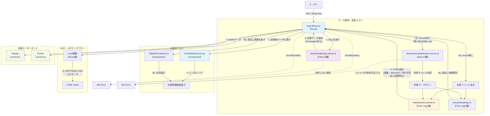

# data-flow-diagram.md - post-detail Section

## 目的
post-detailセクションのコンポーネント間の依存関係とデータフローを可視化し、設計レビューを容易にする。

---

## データフロー図



---

## 層別の責務と依存関係

### 1. Route層（UI層）
**ファイル**: `app/routes/blog.$slug.tsx`

**責務**:
- URLパラメータ（slug）の取得
- Data-IO層への記事データ取得依頼
- Pure Logic層でのマークダウン変換の実行
- 変換済みデータをComponentに渡す
- **meta関数によるSEO対応**: loaderデータからOGP/Twitter Cardメタデータを生成
- エラーハンドリング（404）

**依存先**:
- `app/data-io/blog/post-detail/fetchPostBySlug.server.ts` （副作用層）
- `app/lib/blog/post-detail/markdownConverter.ts` （純粋ロジック層）
- `app/lib/blog/post-detail/extractHeadings.ts` （純粋ロジック層）
- `app/components/blog/post-detail/PostDetailSection.tsx` （Component層）
- `app/components/blog/post-detail/TableOfContents.tsx` （Component層）
- `app/components/blog/common/Header.tsx` （共通Component）
- `app/components/blog/common/Footer.tsx` （共通Component）

---

### 2. Component層（UI層）
**ファイル**: `app/components/blog/post-detail/PostDetailSection.tsx`

**責務**:
- 記事のメタデータ（タイトル、投稿日、著者）を表示
- マークダウン変換後のHTML本文を表示
- **Mermaidクライアント側レンダリング**: useEffectでMermaid.jsを初期化し、`.mermaid` クラスを持つ要素をSVG図表に変換
- 適切なスタイリング（proseクラスなど）の適用

**依存先**:
- `mermaid` (npm パッケージ) - Mermaid図表レンダリング

---

### 3. Pure Logic層

**ファイル1**: `app/lib/blog/post-detail/markdownConverter.ts`

**責務**:
- マークダウン形式の文字列をHTML形式に変換
- **シンタックスハイライト**: Shikiでコードブロック（` ```language ... ``` `）を変換し、インラインスタイル付きHTMLを生成
- **画像処理**: 画像記法（``）を処理し、遅延読み込み（`loading="lazy"`）とレスポンシブ対応（`max-width: 100%`）を付与
- **Mermaid処理**: Mermaidコードブロック（` ```mermaid ... ``` `）に `<pre class="mermaid">` タグを付与
- **見出しID付与**: h1-h6にスラグ化されたID属性を自動付与
- **XSSサニタイズ**: 安全なHTMLのみ生成（h1-h6のid属性を許可）

**依存先**:
- `shiki` (npm パッケージ) - シンタックスハイライト
- `marked` (npm パッケージ) - マークダウンパーサー
- `sanitize-html` (npm パッケージ) - XSS対策
- `slugify.ts` - 見出しテキストのスラグ化

---

**ファイル2**: `app/lib/blog/post-detail/extractHeadings.ts`

**責務**:
- マークダウンから見出しを抽出（階層定義は [`func-spec.md`](func-spec.md) の「目次階層の定義」参照）
- 見出しレベル、テキスト、スラグ化されたIDを配列で返す

**依存先**:
- `slugify.ts` - 見出しテキストのスラグ化

---

**ファイル3**: `app/lib/blog/post-detail/slugify.ts`

**責務**:
- 見出しテキストをURLセーフなスラグに変換
- 日本語テキスト対応（エンコードまたはそのまま使用）

**依存先**:
- なし（純粋関数）

---

### 4. Data-IO層（副作用層）

**ファイル1**: `app/data-io/blog/post-detail/fetchPostBySlug.server.ts`

**責務**:
- slugを受け取り、ファイルシステムから記事データ（frontmatter含む: title, description, publishedAt, author, tags, category, source）を取得
- frontmatterパース時に `source` プロパティを取得（gray-matterを使用）
- sourceが存在する場合、fetchExternalMarkdown.server.tsを呼び出して外部ファイルを読み込む
- 読み込んだ内容を `content` として返す（記事ファイル本文は無視）
- **descriptionとtagsフィールドを含むPostDetailDataを返す**
- 記事が存在しない場合はnullを返す

**依存先**:
- ファイルシステム（外部リソース）
- `gray-matter` (npm パッケージ) - frontmatterパーサー
- `fetchExternalMarkdown.server.ts` (source指定時のみ)

---

**ファイル2**: `app/data-io/blog/post-detail/fetchExternalMarkdown.server.ts`

**責務**:
- frontmatterのsourceプロパティで指定されたパスのファイルを読み込む
- パスバリデーション（ディレクトリトラバーサル対策）を実施
  - 許可する拡張子: `.md` のみ
  - 禁止パターン: `../`, `..\\`, `/etc/`, `C:\\` を含むパスは拒否
  - パスはプロジェクトルート（`process.cwd()`）配下に制限
- ファイルが存在しない場合、または不正なパスの場合はエラーをthrow

**依存先**:
- ファイルシステム（外部リソース）
- Node.js標準モジュール（`fs/promises`, `path`）

---

## データフローの説明

### 正常系フロー

1. **ユーザーアクセス**: ユーザーが `/blog/:slug` にアクセス
2. **記事データ取得**: Route が `fetchPostBySlug.server.ts` を呼び出してslugに対応する記事データ（frontmatter含む: title, description, publishedAt, author, tags, category, source）を取得
3. **本文取得の分岐**:
   - **sourceなし**: 記事ファイル本文をそのまま使用
   - **sourceあり** (例: `source: "/README.md"`): `fetchExternalMarkdown.server.ts` で外部ファイルを読み込み
     - パスバリデーションを実施（不正パスは拒否）
     - ファイル内容を取得
4. **マークダウン変換**: Route が取得した本文（マークダウン形式）を `markdownConverter.ts` に渡してHTML形式に変換
5. **見出し抽出**: Route が `extractHeadings.ts` を呼び出して見出し情報を抽出
6. **SEO対応**: `meta` 関数が loader データから OGP/Twitter Card メタデータを生成し、HTML Headに挿入
7. **データ受け渡し**: Route が変換済みデータ（HTML本文、見出し情報、メタデータ含む）を `PostDetailSection.tsx` と `TableOfContents.tsx` に渡す
8. **UI表示**: Component が記事詳細（タイトル、投稿日、著者、本文）を画面に表示

### 異常系フロー

**パターン1: 記事が存在しない**
1. `fetchPostBySlug.server.ts` が null を返す
2. Route が ErrorBoundary を通じて404エラーを表示

**パターン2: 参照元ファイルが存在しない / 不正なパス**
1. `fetchExternalMarkdown.server.ts` がエラーをthrow
2. Route が ErrorBoundary を通じて500エラーを表示

---

## アーキテクチャ原則の遵守確認

### ✅ 3大層分離の遵守

- **UI層**: Route と Component は副作用層・純粋ロジック層に適切に依存
- **Pure Logic層**: `markdownConverter.ts` は副作用なしの純粋関数として実装
- **Data-IO層**: `fetchPostBySlug.server.ts` は外部リソースへのアクセスを担当

### ✅ 依存方向の適切性

- UI層 → Pure Logic層 ✅
- UI層 → Data-IO層 ✅
- Pure Logic層 → UI層 ❌ （依存なし）
- Data-IO層 → UI層 ❌ （依存なし）

すべての依存方向が適切であり、逆方向の依存は存在しない。
