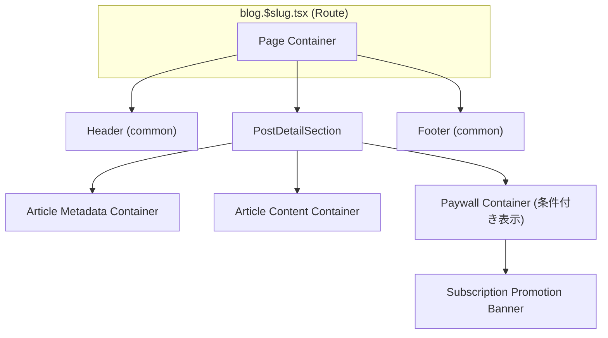

# post-detail - UI/UX設計書

## ドキュメント利用に関する注意書きとスコープ定義

この設計書は、新規開発のための詳細な仕様書ではありません。AIエージェントによるコーディングと、人間による高効率な保守運用を目的とした**アーキテクチャ・マップ**です。

## 目指す方向とドキュメントの役割

| 項目 | 目的と役割 |
| :--- | :--- |
| **役割の焦点** | 新規開発よりも保守・修正に重点を置く。修正時のデバッグパスを最短化することが最大の目的です。 |
| **陳腐化の防止** | 頻繁に変わる具体的な情報（色、サイズ、影など）は一切記載しません。ドキュメントの役割を**構造（抽象）に限定することで、コード実装の詳細が変わっても陳腐化しない「構造的な真実の源泉」**を維持します。 |
| **一望性の確保** | UI/UX設計において、修正時に最も認知負荷が高い**「親子構造」「並列配置」「状態遷移ルール」**の3点に絞り、最小の目的を1つのドキュメントで迅速に確認できる状態を保証します。 |

## ドキュメントのスコープ（責務の境界線）

この設計書は、サービスの**セクション単位**で、構造的な抽象レイヤーに特化しています。記載すべき情報と、コードに委ねる情報の境界線を明確にしてください。

## 内部スコープ：このドキュメントで定義するもの（抽象）

| 項目 | 責務の対象 | 規律 |
| :--- | :--- | :--- |
| **サービススコープ** | セクション固有のコンポーネント、ロジック | Route/Componentの責務分離、セクション固有の構造（親子、並列）、セクション固有の状態遷移のルールを明確に定義します。 |
| **CSS抽象レイヤー** | 構造と配置の論理 | コンポーネント間の親子構造、並列配置（flex/grid）の論理、例外構造のルール（疑似要素など）といった、UIの骨格となる抽象的なルールのみを記載します。 |

## 外部スコープ：コードまたは別ドキュメントに委ねるもの（具体）

| 項目 | 委ねる場所 | 理由 |
| :--- | :--- | :--- |
| **アプリケーションスコープ** | App全体のUIXガイド、デザインシステム | 画面共通やセクションを横断して利用される共通コンポーネント（例: `.button-primary`、`.page-container`など）の定義は、このセクション設計書ではなく、アプリケーション全体のUIXガイドを参照してください。 |
| **CSS詳細** | Tailwind Config, Layer 1/2 の実装 | 具体的なスタイル値（色コード、スペーシング値、フォントサイズ、影、ボーダー定義など）は、**コード（Tailwindクラスまたはトークン）**を参照してください。この設計書に具体的なCSSプロパティを記載することは厳禁です。 |
| **セクション共通** | 共通コンポーネント設計書 | 複数セクションで再利用されるコンポーネントの設計は、該当の共通コンポーネント設計書を参照してください。 |

> 🔑 **原則**: 抽象は設計書に、具象はコードに。保守者はコードを見る前に、まずこの設計書を見て構造的な問題を切り分けてください。

## セクション概要

### セクション名

記事詳細セクション (post-detail)

### 所属サービス

**blog** の **post-detail** セクションに配置

### セクションの目的

個別の記事の詳細内容を閲覧できるUIを提供し、マークダウン形式で記述された技術記事を読みやすく整形されたHTML形式で表示する。記事のタイトル、投稿日、著者などのメタデータとともに、本文（画像やMermaid図を含む）を適切にレンダリングし、ユーザーに快適な読書体験を提供する。

---

## 🚗 データフロー設計 (Route責務)

このセクションにおけるデータの流れと、Remixの`loader`および`action`の責務を定義します。

### Loader

- **責務**: URLパラメータ（slug）から記事を特定し、記事データとユーザーのサブスクリプション状態を取得する
- **データソース**:
  - `app/data-io/blog/post-detail/fetchPostBySlug.server.ts` - 記事データの取得
  - `app/lib/blog/post-detail/markdownConverter.ts` - マークダウンからHTMLへの変換（画像・Mermaid対応）
  - `app/data-io/blog/post-detail/getSubscriptionStatus.server.ts` - サブスクリプション状態の取得（accountサービスと連携）
- **処理フロー**:
  1. URLパラメータ（slug）から記事を特定
  2. リクエストからセッションCookieを読み取り、ユーザーの認証状態を確認
  3. 認証済みの場合、サブスクリプション状態を取得（未認証の場合は`null`）
  4. 記事データとサブスクリプション状態をコンポーネントに渡す
- **エラーハンドリング**: 記事が存在しない場合（slugが無効）、404エラーをスロー

### Action

- **責務**: このセクションではユーザーによるデータ変更アクションは存在しない（閲覧のみ）
- **処理フロー**: N/A

---

## 🧩 レイアウトのコンポーネント構造規範 (Layout Hierarchy Map)

このセクションは、ページ全体におけるレイアウトコンテナの階層構造を定義する**地図**です。後続の「並列配置規範」で定義されるコンテナが、ページ全体のどこに位置するのかを把握するために使用します。

**原則**:

- **レイアウトコンテナのみ**: ここでは、レイアウトを構成する主要なコンテナ（箱）の親子関係のみを記述します。
- **コンテンツは除外**: ラベル、テキスト、アイコンといった、レイアウト構造と本質的に関係のないコンテンツ要素は記載しません。

### 構造図



**説明**:

- **Header/Footer**: commonセクションで定義された共通コンポーネント
- **PostDetailSection**: 記事詳細セクションのメインコンテナ
- **Article Metadata Container**: 記事のタイトル、投稿日、著者を表示するエリア
- **Article Content Container**: マークダウンから変換されたHTML本文を表示するエリア（サブスクリプション状態に応じて部分表示）
- **Paywall Container**: 未契約ユーザーに対して、制限を超えるコンテンツの前に表示される障壁（条件付き表示）
- **Subscription Promotion Banner**: ペイウォール内に配置される会員登録・サブスクリプション購入促進バナー

---

## 📐 認定済み並列配置 (Authorized Flexbox/Grid Layouts)

このセクションは、**不要なレイアウト実装の乱立を防ぐ**ため、このUIセクション内で**許可された並列配置パターンのみ**を定義するホワイトリストです。ここに記載されていない`flex`や`grid`の利用は原則として禁止されます。

**重要**: このセクションには、**アイテム数が可変（動的に増減する）**レイアウトパターンのみを記載します。アイテム数が固定（静的）のレイアウトは、コンポーネント構造規範で定義されているため、ここでは記載不要です。

---

*このセクションには現在、可変レイアウトパターンはありません。*

---

## ⚡ インタラクションと状態遷移の設計 (Component責務)

### 1. PostDetailSection

**責務**: 記事の詳細情報（メタデータと本文）を表示する

#### PostDetailSection の状態

- **通常 (default)**: 記事のタイトル、投稿日、著者、マークダウン変換された本文を表示
- **ローディング (loading)**: Routeのloaderがデータを取得中の状態（Remixのデフォルト挙動）
- **エラー (error)**: 記事が存在しない場合、ErrorBoundaryによる404エラー表示

#### 表示内容

- **Article Metadata Container**:
  - タイトル: 記事のタイトル
  - 投稿日: YYYY-MM-DD形式の投稿日
  - 著者: 記事の著者名

#### PostDetailSection のインタラクション

- **トリガー**: ページの初回読み込み時
- **応答**: loaderから受け取った記事データを表示。マークダウン本文はHTMLに変換され、画像とMermaid図を含めて適切にレンダリングされる
- **アニメーション**: 特になし（静的な表示）

---

### 2. マークダウン本文内のリンク

**責務**: 記事本文内に含まれるハイパーリンクの表示と遷移

#### マークダウンリンク の状態

- **通常 (default)**: 下線付きのテキストリンクとして表示
- **ホバー (hover)**: 色の変化やアンダーラインの強調（デザイントークンで定義）

#### マークダウンリンク のインタラクション

- **トリガー**: リンクをクリック
- **応答**: 外部リンクの場合は新しいタブで開く、内部リンクの場合は同一タブで遷移
- **アニメーション**: ホバー時のトランジション効果（デザイントークンで定義）

---

### 3. Paywall (ペイウォール)

**責務**: 未契約ユーザーに対して、制限を超えるコンテンツの前に表示される障壁

#### Paywall の状態

- **表示 (visible)**: サブスクリプションが非アクティブ（`hasActiveSubscription: false`）かつ記事に`freeContentHeading`が設定されている場合に表示
- **非表示 (hidden)**: サブスクリプションがアクティブ（`hasActiveSubscription: true`）の場合、またはfreeContentHeadingが未設定の場合は非表示

#### 表示条件の判定ロジック

- **lib層での判定**: `app/lib/blog/post-detail/determineContentVisibility.ts` で可視範囲を計算（見出しベース）
- **lib層での分割**: `app/lib/blog/post-detail/splitContentByHeading.ts` で指定見出しの終わりまでを抽出
- **UI層での適用**: PostDetailSectionで判定結果を受け取り、条件に応じてPaywallコンポーネントを表示

#### Paywall の表示内容

- **メッセージ**: 「続きを読むには会員登録が必要です」などのテキスト
- **SubscriptionPromotionBanner**: 会員登録・サブスクリプション購入を促すバナー

#### Paywall のインタラクション

- **トリガー**: Paywall内のCTAボタン（「プランを見る」など）をクリック
- **応答**: `/account/subscription`（サブスクリプション管理ページ）へ遷移
- **アニメーション**: 特になし（静的な表示）

---

### 4. SubscriptionPromotionBanner (購読促進バナー)

**責務**: ペイウォール内に配置され、会員登録・サブスクリプション購入を促す

#### SubscriptionPromotionBanner の状態

- **通常 (default)**: プラン情報（1ヶ月/3ヶ月/6ヶ月）と価格を表示
- **ホバー (hover)**: CTAボタンがホバー状態になり、視覚的なフィードバックを提供

#### SubscriptionPromotionBanner の表示内容

- **見出し**: 「すべての記事を読むには」などのキャッチコピー
- **プラン情報**: 各プランの期間と価格（`app/specs/account/subscription-spec.yaml`から取得）
- **CTAボタン**: 「プランを見る」「今すぐ登録」などのアクション誘導ボタン

#### SubscriptionPromotionBanner のインタラクション

- **トリガー**: CTAボタンをクリック
- **応答**: `/account/subscription`（サブスクリプション管理ページ）へ遷移
- **アニメーション**: ボタンホバー時のトランジション効果（デザイントークンで定義）

---

## 🛠️ 例外構造と規律

このセクションは、上記2つの規範や状態遷移で対応できない、やむを得ない構造的な例外（疑似要素、子孫セレクタなど）を管理します。

---

### 1. マークダウン変換HTMLのスタイリング

**対象**: Article Content Container内のマークダウン変換後のHTML要素

**例外の理由**:
マークダウンから変換されたHTMLは、見出し、段落、リスト、コードブロック、引用など多様な要素で構成される。これらの要素に対して一貫したスタイルを適用するため、prose系のユーティリティクラスまたは子孫セレクタを使用する必要がある。

**適用方法**:

- **必須依存パッケージ**: `@tailwindcss/typography` をインストール

  ```bash
  npm install -D @tailwindcss/typography
  ```

- **Tailwind設定**: `tailwind.config.ts`のpluginsにtypographyを追加

  ```typescript
  import typography from '@tailwindcss/typography'

  export default {
    plugins: [typography, /* other plugins */],
  } satisfies Config
  ```

- **実装**: Article Content Containerに対してTailwind CSSの`prose`クラスを適用
- マークダウン内の見出し（h1～h6）、段落（p）、リスト（ul, ol）、コードブロック（pre, code）などに対して、typographyプラグインによる自動スタイリングが適用される

---

### 2. Mermaid図のレンダリング

**対象**: マークダウン内のMermaidコードブロック（` ```mermaid ... ``` `）

**例外の理由**:
Mermaid図は、クライアントサイドでSVGとしてレンダリングされるため、特定のクラスやデータ属性を付与して処理を制御する必要がある。

**技術選定**:

- **Mermaid.js** (npm: `mermaid` または CDN)
- バージョン: 10.x以降推奨

**適用方法**:

1. **サーバー側処理**（markdownConverter.ts）:
   - Mermaidコードブロックを `<pre class="mermaid">` タグでラップ
   - Mermaidコードはそのまま保持（例: `graph TD A-->B`）
   - sanitizeHtmlで `mermaid` クラスを許可リストに追加

2. **クライアント側処理**（PostDetailSection.tsx）:
   - useEffectでMermaid.jsを初期化: `mermaid.initialize({ startOnLoad: false })`
   - `mermaid.run()` で `.mermaid` クラスを持つ要素をSVG図表に変換
   - 初期化タイミング: コンポーネントマウント時およびcontent変更時

3. **エラーハンドリング**:
   - 不正なMermaid構文の場合、try-catchでエラーをキャッチ
   - フォールバック: 元のコードブロックをそのまま表示

4. **スタイリング**:
   - Mermaid SVGは自動生成されるため、カスタムCSSは最小限
   - テーマは `mermaid.initialize()` で指定（例: `theme: 'default'`）

---

## 🌓 テーマ対応（ライトモード/ダークモード）

このセクションのすべてのコンポーネントは、commonセクションで管理されるテーマ状態に応じて配色が自動的に切り替わります。

### テーマ切り替えの仕組み

- **テーマの管理**: `<html>`タグの`data-theme`属性（`light`または`dark`）で管理
- **配色の定義**: Layer 1（`app/styles/globals.css`）のCSSカスタムプロパティで一元管理
- **コンポーネントの実装**: 具体的な色コードではなく、意味的なCSS変数（例: `--color-bg-primary`, `--color-text-primary`）を参照

### 記事詳細ページの対応

- **PostDetailSection**: 記事の背景色、テキスト色がテーマに応じて自動的に切り替わります
- **マークダウンコンテンツ**: 見出し、段落、リスト、引用のスタイルがテーマに応じて変化します
- **コードブロック**: Shikiのテーマをライトモード/ダークモードに応じて動的に選択します

---

### 3. コードブロックのシンタックスハイライト

**対象**: マークダウン内のコードブロック（` ```language ... ``` `）

**例外の理由**:
コードブロックに対してプログラミング言語に応じたシンタックスハイライトを適用するため、サーバー側でHTMLとインラインスタイルを生成する必要がある。

**技術選定**:

- **Shiki** (npm: `shiki`)
- 理由: VS Codeと同じシンタックスハイライトエンジン、高品質、インラインスタイル出力
- 代替案: Highlight.js（クライアント側）、Prism.js（クライアント側）

**サポート言語**:

- TypeScript, JavaScript, Python, Bash, CSS, JSON, Markdown, HTML, SQL など
- 100以上の言語をサポート

**適用方法**:

1. **サーバー側処理**（markdownConverter.ts）:
   - Shikiの `codeToHtml()` 関数でコードブロックを変換
   - 出力: インラインスタイル付きHTMLとして生成
   - テーマ選択:
     - 推奨: `github-light`（ライトモード）、`github-dark`（ダークモード）
     - または: `vs-code-dark-plus`、`material-theme-palenight`

2. **HTMLサンプル出力**:

   ```html
   <pre class="shiki" style="background-color: #fff">
     <code>
       <span style="color: #d73a49">const</span>
       <span style="color: #24292e"> greeting </span>
       <span style="color: #d73a49">=</span>
       <span style="color: #032f62"> "Hello"</span>
     </code>
   </pre>
   ```

3. **スタイリング**:
   - Shikiが生成するインラインスタイルをそのまま使用
   - Layer 2のカスタムCSSは不要（Shikiが完全にスタイリング）
   - `@tailwindcss/typography` のproseクラスと併用可能

4. **パフォーマンス最適化**:
   - Shikiはサーバー側で実行されるため、クライアント側の負荷なし
   - 初回起動時にShiki highlighterを初期化してキャッシュ
