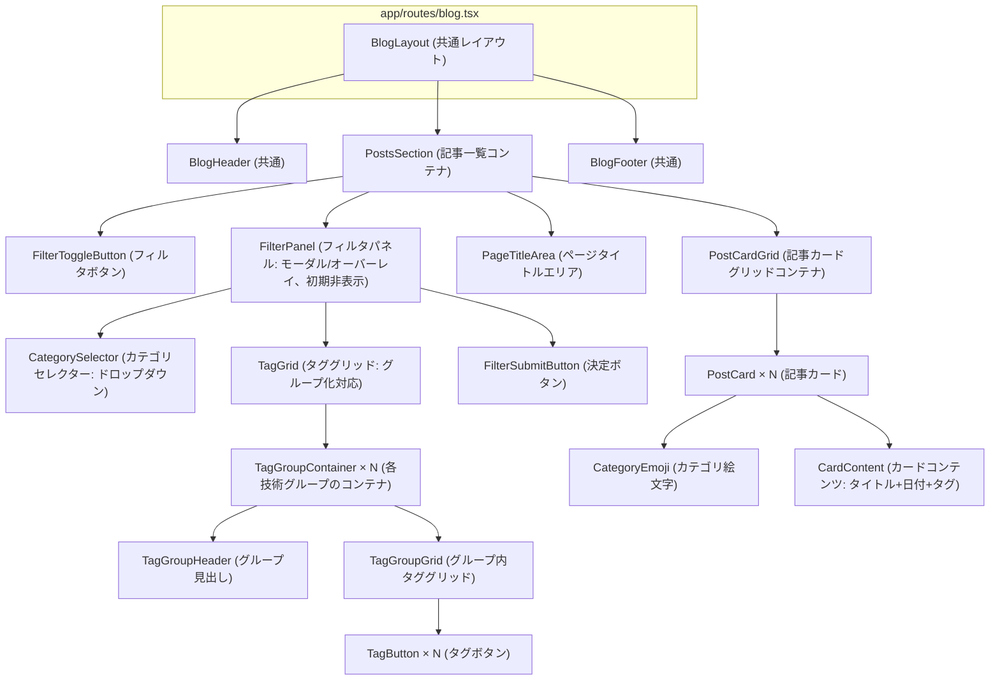

# posts - UI/UX設計書

🛑 ドキュメント利用に関する注意書きとスコープ定義

> この設計書は、新規開発のための詳細な仕様書ではありません。AIエージェントによるコーディングと、人間による高効率な保守運用を目的とした**「アーキテクチャ・マップ」**です。

### I. 🎯 目指す方向とドキュメントの役割

| 項目 | 目的と役割 |
| :--- | :--- |
| **役割の焦点** | 新規開発よりも保守・修正に重点を置く。修正時のデバッグパスを最短化することが最大の目的です。 |
| **陳腐化の防止** | 頻繁に変わる具体的な情報（色、サイズ、影など）は一切記載しません。ドキュメントの役割を**構造（抽象）に限定することで、コード実装の詳細が変わっても陳腐化しない「構造的な真実の源泉」**を維持します。 |
| **一望性の確保** | UI/UX設計において、修正時に最も認知負荷が高い**「親子構造」「並列配置」「状態遷移ルール」**の3点に絞り、最小の目的を1つのドキュメントで迅速に確認できる状態を保証します。 |

### II. 🗺️ ドキュメントのスコープ（責務の境界線）

> この設計書は、サービスの**「セクション単位」**で、構造的な抽象レイヤーに特化しています。記載すべき情報と、コードに委ねる情報の境界線を明確にしてください。

#### 1. 📂 内部スコープ：このドキュメントで定義するもの（抽象）

| 項目 | 責務の対象 | 規律 |
| :--- | :--- | :--- |
| **サービススコープ** | セクション固有のコンポーネント、ロジック | Route/Componentの責務分離、セクション固有の構造（親子、並列）、セクション固有の状態遷移のルールを明確に定義します。 |
| **CSS抽象レイヤー** | 構造と配置の論理 | コンポーネント間の親子構造、並列配置（flex/grid）の論理、例外構造のルール（疑似要素など）といった、UIの骨格となる抽象的なルールのみを記載します。 |

#### 2. 🚫 外部スコープ：コードまたは別ドキュメントに委ねるもの（具体）

| 項目 | 委ねる場所 | 理由 |
| :--- | :--- | :--- |
| **アプリケーションスコープ** | App全体のUIXガイド、デザインシステム | 画面共通やセクションを横断して利用される共通コンポーネント（例: `.button-primary`、`.page-container`など）の定義は、このセクション設計書ではなく、アプリケーション全体のUIXガイドを参照してください。 |
| **CSS詳細** | Tailwind Config, Layer 1/2 の実装 | 具体的なスタイル値（色コード、スペーシング値、フォントサイズ、影、ボーダー定義など）は、**コード（Tailwindクラスまたはトークン）**を参照してください。この設計書に具体的なCSSプロパティを記載することは厳禁です。 |
| **セクション共通** | 共通コンポーネント設計書 | 複数セクションで再利用されるコンポーネントの設計は、該当の共通コンポーネント設計書を参照してください。 |

> 🔑 **原則**: 抽象は設計書に、具象はコードに。保守者はコードを見る前に、まずこの設計書を見て構造的な問題を切り分けてください。

## 📋 セクション概要

### セクション名

**Posts List (記事一覧)**

### 所属サービス

**blog** の **posts** セクションに配置

### セクションの目的

ユーザーが投稿されたブログ記事を一目で把握し、読みたい記事を探せるようにする。時系列で整理された記事カードを提供し、各記事へのスムーズなアクセスを実現する。

---

## 🚗 データフロー設計 (Route責務)

このセクションにおけるデータの流れと、Remixの`loader`および`action`の責務を定義します。

### Loader（app/routes/blog.tsx）

- **責務**: 記事一覧データを読み込み、UIコンポーネントに渡す
- **データソース**: `app/data-io/blog/posts/fetchPosts.server.ts`
- **処理フロー**:
  1. ファイルシステムから記事メタデータを取得
  2. frontmatterから`slug`, `title`, `publishedAt`, `category`フィールドを読み取る
  3. PostSummary[]の形式に変換（categoryフィールドを含む）
  4. UIに返す
- **エラーハンドリング**: ErrorBoundaryで記事取得失敗時のフォールバック表示

### Action

- **責務**: このセクションには`action`は不要（記事一覧は閲覧のみ）
- **処理フロー**: なし

---

## 🧩 レイアウトのコンポーネント構造規範 (Layout Hierarchy Map)

このセクションは、ページ全体におけるレイアウトコンテナの階層構造を定義する**地図**です。後続の「並列配置規範」で定義されるコンテナが、ページ全体のどこに位置するのかを把握するために使用します。

**原則**:

- **レイアウトコンテナのみ**: ここでは、レイアウトを構成する主要なコンテナ（箱）の親子関係のみを記述します。
- **コンテンツは除外**: ラベル、テキスト、アイコンといった、レイアウト構造と本質的に関係のないコンテンツ要素は記載しません。

### 構造図

### 責務の説明

| コンテナ名 | 責務 |
| :--- | :--- |
| **BlogLayout** | ページ全体の構造（commonセクション）。ヘッダー、メインコンテンツ、フッターの縦配置を管理 |
| **PostsSection** | 記事一覧のメインコンテナ。FilterToggleButton、FilterPanel、ページタイトル、記事カードグリッドを配置。FilterPanelの開閉状態を管理 |
| **FilterToggleButton** | フィルタパネルを表示/非表示するトグルボタン。記事一覧の一番上に配置 |
| **FilterPanel** | フィルタUIコンポーネント（モーダル/オーバーレイ形式）。初期状態は非表示。カテゴリセレクターとタググリッドを提供 |
| **CategorySelector** | カテゴリフィルタ（ドロップダウンセレクター、単一選択）。デフォルト値は全カテゴリ表示 |
| **TagGrid** | タグフィルタの全体コンテナ。技術グループごとにタグを整理して表示し、UXとコンテンツの発見性を向上させる。グループ情報はspec.yamlで管理 |
| **TagGroupContainer** | 各技術グループのコンテナ。グループヘッダーとグループ内タググリッドを縦配置 |
| **TagGroupHeader** | 技術グループの見出しを表示。グループ名はspec.yamlから動的に取得 |
| **TagGroupGrid** | グループ内のタグをグリッド配置（列数調整可能、複数選択可能）。列数の具体値はspec.yamlで管理 |
| **FilterSubmitButton** | 選択されたフィルタ条件を適用するための決定ボタン |
| **PageTitleArea** | ページタイトル（"Articles"）を表示するエリア |
| **PostCardGrid** | 記事カードを格納するグリッドレイアウトコンテナ。レスポンシブ対応 |
| **PostCard** | 個別記事の表示カード。カテゴリ絵文字、タイトル、投稿日、タグを表示 |
| **CategoryEmoji** | 記事のカテゴリを示す絵文字を表示 |
| **CardContent** | 記事のタイトル、投稿日、タグバッジを表示するコンテンツエリア |

---

## 📐 認定済み並列配置 (Authorized Flexbox/Grid Layouts)

このセクションは、**不要なレイアウト実装の乱立を防ぐ**ため、このUIセクション内で**許可された並列配置パターンのみ**を定義するホワイトリストです。ここに記載されていない`flex`や`grid`の利用は原則として禁止されます。

**重要**: このセクションには、**アイテム数が可変（動的に増減する）**レイアウトパターンのみを記載します。アイテム数が固定（静的）のレイアウトは、コンポーネント構造規範で定義されているため、ここでは記載不要です。

---

### 1. PostCardGrid内の記事カード配置

| 設計項目 | 定義 | 備考 |
| :--- | :--- | :--- |
| **対象コンテナ** | `PostCardGrid` | 記事カードを格納するグリッドレイアウトコンテナ |
| **対象アイテム** | `PostCard` | 個別記事の表示カード |
| **想定アイテム数** | `可変: 上限なし` | 記事数に応じて動的に増減 |
| **レイアウトの意図** | `レスポンシブグリッド配置（モバイル: 1列、タブレット: 2列、デスクトップ: 3列）` | デバイス幅に応じて自動的に列数が変更される |

---

### 2. PostCard内のカテゴリ絵文字とコンテンツの配置

| 設計項目 | 定義 | 備考 |
| :--- | :--- | :--- |
| **対象コンテナ** | `PostCard` | 個別記事の表示カード |
| **対象アイテム** | `CategoryEmoji`（左）、`CardContent`（右） | カテゴリ絵文字と記事情報（タイトル+日付） |
| **想定アイテム数** | `固定: 2個` | カテゴリ絵文字1つとコンテンツエリア1つ |
| **レイアウトの意図** | `水平方向のflexbox配置（左: 絵文字、右: タイトル+日付）` | カテゴリを視覚的に識別しやすくする |

---

### 3. PostCard内のタグバッジ配置

| 設計項目 | 定義 | 備考 |
| :--- | :--- | :--- |
| **対象コンテナ** | `CardContent` | 記事のコンテンツエリア（タイトル、投稿日、タグ） |
| **対象アイテム** | タグバッジ（`TagBadge × N`） | 記事に設定された複数のタグ |
| **想定アイテム数** | `可変: 通常2～5個` | 記事によってタグの数は異なる |
| **レイアウトの意図** | `水平方向のflexbox配置、左揃え、折り返し許可` | タグを横並びで表示し、幅が足りない場合は次の行へ折り返す |

---

### 4. FilterPanel内のフィルタコンポーネント配置

| 設計項目 | 定義 | 備考 |
| :--- | :--- | :--- |
| **対象コンテナ** | `FilterPanel` | フィルタUIコンポーネント（モーダル/オーバーレイ形式） |
| **対象アイテム** | `CategorySelector`、`TagGrid`、`FilterSubmitButton` | カテゴリセレクター、タググリッド、決定ボタン |
| **想定アイテム数** | `固定: 3個` | カテゴリセレクター、タググリッド、決定ボタン |
| **レイアウトの意図** | `縦方向のflexbox配置` | フィルタコンポーネントを上から下へ配置 |

---

### 5-1. TagGrid内のグループコンテナ配置

| 設計項目 | 定義 | 備考 |
| :--- | :--- | :--- |
| **対象コンテナ** | `TagGrid` | タググリッド全体のコンテナ |
| **対象アイテム** | `TagGroupContainer × N` | 各技術グループのコンテナ |
| **想定アイテム数** | `可変` | グループ数はspec.yamlで管理 |
| **レイアウトの意図** | `縦方向のFlexbox配置、グループ間にマージンを設ける` | グループを上から下へ順番に配置。グループ間の視覚的な分離を明確にする |
| **Layer 3 CSS指定** | `display: flex; flex-direction: column; gap: var(--spacing-4);` | 既存のgrid指定を削除し、flex指定に変更。gapはLayer 1トークンを参照 |

---

### 5-2. TagGroupContainer内の構造

| 設計項目 | 定義 | 備考 |
| :--- | :--- | :--- |
| **対象コンテナ** | `TagGroupContainer` | 各技術グループのコンテナ |
| **対象アイテム** | `TagGroupHeader`（見出し）+ `TagGroupGrid`（タググリッド） | 固定2要素 |
| **想定アイテム数** | `固定: 2個` | ヘッダー1つ + グリッド1つ |
| **レイアウトの意図** | `縦方向のFlexbox配置、ヘッダーとグリッドを縦に並べる` | グループ名を表示した後、そのグループのタグを表示 |
| **Layer 3 CSS指定** | `display: flex; flex-direction: column; gap: var(--spacing-2);` | gapはLayer 1トークンを参照 |

---

### 5-3. TagGroupGrid内のタグボタン配置

| 設計項目 | 定義 | 備考 |
| :--- | :--- | :--- |
| **対象コンテナ** | `TagGroupGrid` | 各グループ内のタググリッド |
| **対象アイテム** | タグボタン（`button × N`） | 各グループに属するタグ |
| **想定アイテム数** | `可変: グループごとに異なる` | タグ数はspec.yamlで管理 |
| **レイアウトの意図** | `グリッドレイアウト、列数は調整可能、行は自動生成` | 既存のTagGridのグリッド指定を継承。タグをグリッドで表示。選択時は視覚的にハイライト。列数はCSS変数（`--tag-grid-columns`）で柔軟に調整可能。具体的な列数はspec.yamlで管理 |
| **Layer 3 CSS指定** | `display: grid; grid-template-columns: repeat(var(--tag-grid-columns), 1fr); gap: var(--spacing-2);` | 既存のTagGridから移動。gapはLayer 1トークンを参照 |

---

### 6. Pagination内のページ番号リンク配置

| 設計項目 | 定義 | 備考 |
| :--- | :--- | :--- |
| **対象コンテナ** | `Pagination` | ページネーションコンポーネント |
| **対象アイテム** | ページ番号リンク（「前へ」、数字、「次へ」） | ページ遷移のためのリンク要素 |
| **想定アイテム数** | `可変: 通常5～7個` | 現在ページの前後2ページ + 「前へ」「次へ」 |
| **レイアウトの意図** | `水平方向のflexbox配置、中央揃え` | ページ番号リンクを横並びに中央配置 |

---

## ⚡ インタラクションと状態遷移の設計 (Component責務)

### 1. FilterToggleButton

**責務**: フィルタパネルの表示/非表示を切り替えるトグルボタン

#### 状態 (State)

- **通常 (default)**: パネルが閉じている状態（初期状態）
- **パネル開 (panel open)**: パネルが表示されている状態

#### インタラクション (Interaction)

1. **ボタンクリック**:
   - **トリガー**: FilterToggleButtonをクリック
   - **応答**: FilterPanelの表示/非表示を切り替え（クライアントサイドの状態管理）
   - **アニメーション**: フェードイン/フェードアウト

---

### 2. FilterPanel

**責務**: カテゴリとタグのフィルタUIを提供し、ユーザーが記事を絞り込めるようにする（モーダル/オーバーレイ形式）

#### 状態 (State)

- **非表示 (hidden)**: パネルが非表示の状態（初期状態）
- **表示 (visible)**: パネルが表示されている状態
- **フィルタ選択中 (selecting)**: カテゴリまたはタグが選択されている状態

#### インタラクション (Interaction)

1. **カテゴリセレクター選択**:
   - **トリガー**: CategorySelectorでカテゴリを選択
   - **応答**: 選択されたカテゴリをフォーム内部で保持（まだ適用されない）
   - **デフォルト値**: 全カテゴリ表示（空文字列）

2. **タグボタンクリック**:
   - **トリガー**: TagGrid内のタグボタンをクリック
   - **応答**: タグの選択/解除を切り替え（複数選択可能）。視覚的にハイライト表示
   - **ロジック**: AND条件（複数タグを選択した場合、すべてのタグを含む記事のみ表示）

3. **決定ボタン（submit）クリック**:
   - **トリガー**: FilterSubmitButtonをクリック
   - **応答**: Formをsubmitし、選択されたフィルタ条件でページを再読み込み
   - **URL**: `/blog?category=Tutorials&tags=Remix,AI`
   - **パネル動作**: フィルタ適用後、パネルを閉じる

4. **オーバーレイクリック（オプション）**:
   - **トリガー**: パネル外の背景（オーバーレイ）をクリック
   - **応答**: パネルを閉じる（選択内容は破棄）

#### 表示位置

- **モバイル/デスクトップ共通**: 全画面モーダル/オーバーレイ形式
- **z-index**: 他の要素より前面に表示

---

### 3. PostsSection

**責務**: 記事一覧のメインコンテナとして、FilterToggleButton、ページタイトル、記事カードグリッドを表示し、FilterPanelの開閉状態を管理する

#### 状態 (State)

- **通常 (default)**: ページタイトルと記事カードが表示されている状態
- **FilterPanel表示中 (panel visible)**: FilterPanelが表示されている状態（クライアントサイドのuseStateで管理）
- **ローディング (loading)**: 記事データ取得中の状態（スケルトンスクリーンまたはローディングインジケーターを表示）
- **エラー (error)**: 記事取得失敗時の状態（ErrorBoundaryによるエラーメッセージ表示）

#### 状態管理 (State Management)

- **FilterPanelの開閉**: `const [isPanelOpen, setIsPanelOpen] = useState(false);`
- **FilterToggleButton**: `onClick={() => setIsPanelOpen(!isPanelOpen)}`
- **FilterPanel**: `isOpen={isPanelOpen}` props で表示/非表示を制御

#### インタラクション (Interaction)

- なし（コンテナコンポーネントのため、インタラクションは子コンポーネントに委譲）

---

### 4. PostCard

**責務**: 個別記事の情報（カテゴリ絵文字、タイトル、投稿日、タグ）を表示し、クリックで記事詳細ページへ遷移する

#### 状態 (State)

- **通常 (default)**: 記事タイトル、投稿日、タグバッジが表示されている状態
- **ホバー (hover)**: マウスホバー時に視覚的なフィードバックを表示（シャドウやボーダーの変化など）

#### 表示内容

- **カテゴリ絵文字**: 記事のカテゴリを示す絵文字（左側）
- **タイトル**: 記事のタイトル
- **投稿日**: YYYY-MM-DD形式の投稿日
- **タグバッジ**: 記事に設定されたタグを小さめのピル型バッジで横並び表示
  - スタイル: 薄いグレー背景、クリック不可（リンクなし）
  - 配置: 投稿日の下
  - 折り返し: タグが多い場合は次の行へ折り返す

#### インタラクション (Interaction)

- **トリガー**: PostCardをクリック
- **応答**: 記事詳細ページ（`/blog/${slug}`）へ遷移
- **アニメーション**: ホバー時にスムーズなスタイル変化

---

### 5. Pagination

**責務**: ページネーションUIを表示し、ユーザーがページ間を移動できるようにする

#### 状態 (State)

- **通常 (default)**: 「前へ」「次へ」ボタンとページ番号リンクが表示されている状態
- **最初のページ (first page)**: 「前へ」ボタンが非表示、現在ページが1
- **最後のページ (last page)**: 「次へ」ボタンが非表示、現在ページが最終ページ
- **ホバー (hover)**: ボタンやページ番号リンクにマウスホバー時の視覚的フィードバック

#### インタラクション (Interaction)

1. **ページ番号リンククリック**:
   - **トリガー**: ページ番号リンク（例: "3"）をクリック
   - **応答**: 該当ページへ遷移（`/blog?page=3&category=...&tags=...`）
   - **重要**: フィルタパラメータを保持すること
   - **アニメーション**: なし（即座に遷移）

2. **「前へ」ボタンクリック**:
   - **トリガー**: 「前へ」ボタンをクリック
   - **応答**: 現在ページ - 1のページへ遷移（フィルタパラメータ保持）
   - **条件**: 現在ページが2以上の場合のみ表示

3. **「次へ」ボタンクリック**:
   - **トリガー**: 「次へ」ボタンをクリック
   - **応答**: 現在ページ + 1のページへ遷移（フィルタパラメータ保持）
   - **条件**: 現在ページが最終ページ未満の場合のみ表示

#### アクセシビリティ対応

- **aria-label**: 各ボタン・リンクに適切なラベルを付与（例: "ページ3へ移動"、"前のページ"、"次のページ"）
- **aria-current**: 現在のページに `aria-current="page"` を付与
- **キーボードナビゲーション**: Tab キーでフォーカス移動、Enter/Space でリンククリック

---

## 🛠️ 例外構造と規律

このセクションでは、上記の規範で対応できない例外的な構造は現時点で存在しません。

将来的に例外が必要になった場合は、以下の形式で記載します：

### {例外構造の名前}

| 項目 | 内容 |
| :--- | :--- |
| **対象コンポーネント** | {コンポーネント名} |
| **例外の理由** | {なぜ通常の構造規範では対応できないのか} |
| **実装方法** | {疑似要素、子孫セレクタなどの具体的な実装方法の抽象的な説明} |

---

## 📱 レスポンシブ対応

### ブレークポイント戦略

| デバイス | 対応方針 |
| :--- | :--- |
| **モバイル (< 768px)** | PostCardGridは1列表示 |
| **タブレット (768px ~ 1024px)** | PostCardGridは2列表示 |
| **デスクトップ (> 1024px)** | PostCardGridは3列表示 |

### レイアウト変更点

- **PostCardGrid**: デバイス幅に応じて自動的に列数が変更される（グリッドレイアウト）
- **PostCard**: カードサイズはコンテナ幅に応じて可変（レスポンシブ対応）

---

## 🎨 デザイントークン参照

具体的なスタイル値（色、サイズ、影など）は、以下のデザイントークンを参照してください：

- **Layer 1**: `app/styles/blog/layer1.css` - デザイントークンの定義
- **Layer 2**: `app/styles/blog/layer2.css` - カスタムクラスの定義
- **Tailwind設定**: `tailwind.config.ts` - プロジェクト全体のTailwind設定

**重要**: この設計書には具体的なCSS値を記載しません。実装時は必ずデザイントークンとTailwindクラスを使用してください。
