# data-flow-diagram.md - Operation Section

## 目的
`file-list.md`を基に、`operation`セクションのコンポーネント間の依存関係とデータフローをMermaid図として可視化し、オペレーターによる設計レビューを容易にする。

---

```mermaid
graph TD
    subgraph Browser["ブラウザ"]
        direction LR
        User(ユーザー) -- "1. / にアクセス" --> Route["Route (_index.tsx)"]
    end

    subgraph Server["サーバーサイド"]
        direction TB
        subgraph Loader["loader関数"]
            Loader_Start("Start") --> P1["Promise.all"]
            P1 --> LS["loadServices.server"]
            P1 --> CAC["checkAllCheckpoints.server"]
            
            subgraph DataIO_Loader["🔌 data-io層 (Loader)"]
                LS["loadServices.server<br/>(project.toml読込)"]
                CAC["checkAllCheckpoints.server<br/>(全ファイル存在確認)"]
            end

            CAC --> Loader_End("End: { services, checkpoints, lastUpdated }")
            LS --> Loader_End
        end

        subgraph Action["action関数 (リトライ時)"]
            Action_Start("Start: { checkpointId }") --> RTC["retryTargetCalculator"]
            RTC --> AF["archiveFiles.server"]
            AF --> TG["timestampGenerator"]
        end
        
        Route -- "2. loader実行" --> Loader_Start
        Loader_End -- "3. JSONデータを渡す" --> Route
        Route -- "5. action実行" --> Action_Start
    end

    subgraph Client["クライアントサイド (React)"]
        direction TB
        OS["OperationSection"] --> SS["ServiceSelector"] & RB["RefreshButton"] & RTB["RetryButton"] & LUL["LastUpdatedLabel"] & RM["RetryModal"]
        
        subgraph Lib_Client["🧠 lib層 (クライアント)"]
            RTC_Client["retryTargetCalculator<br/>(影響ファイル計算)"]
        end

        Route -- "4. propsとしてデータ供給" --> OS
        RM -- "影響ファイル表示のため呼び出し" --> RTC_Client
    end
```

