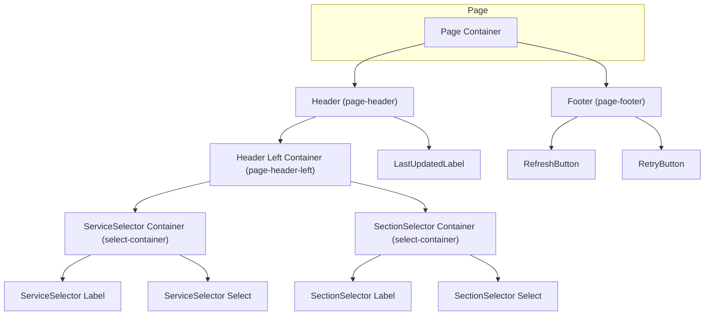

# common - UI/UX設計書

<details>
<summary>🛑 ドキュメント利用に関する注意書きとスコープ定義</summary>

> この設計書は、新規開発のための詳細な仕様書ではありません。AIエージェントによるコーディングと、人間による高効率な保守運用を目的とした**「アーキテクチャ・マップ」**です。

### I. 🎯 目指す方向とドキュメントの役割

| 項目 | 目的と役割 |
| :--- | :--- |
| **役割の焦点** | 新規開発よりも保守・修正に重点を置く。修正時のデバッグパスを最短化することが最大の目的です。 |
| **陳腐化の防止** | 頻繁に変わる具体的な情報（色、サイズ、影など）は一切記載しません。ドキュメントの役割を**構造（抽象）に限定することで、コード実装の詳細が変わっても陳腐化しない「構造的な真実の源泉」**を維持します。 |
| **一望性の確保** | UI/UX設計において、修正時に最も認知負荷が高い**「親子構造」「並列配置」「状態遷移ルール」**の3点に絞り、最小の目的を1つのドキュメントで迅速に確認できる状態を保証します。 |

### II. 🗺️ ドキュメントのスコープ（責務の境界線）

> この設計書は、サービスの**「セクション単位」**で、構造的な抽象レイヤーに特化しています。記載すべき情報と、コードに委ねる情報の境界線を明確にしてください。

#### 1. 📂 内部スコープ：このドキュメントで定義するもの（抽象）

| 項目 | 責務の対象 | 規律 |
| :--- | :--- | :--- |
| **サービススコープ** | セクション固有のコンポーネント、ロジック | Route/Componentの責務分離、セクション固有の構造（親子、並列）、セクション固有の状態遷移のルールを明確に定義します。 |
| **CSS抽象レイヤー** | 構造と配置の論理 | コンポーネント間の親子構造、並列配置（flex/grid）の論理、例外構造のルール（疑似要素など）といった、UIの骨格となる抽象的なルールのみを記載します。 |

#### 2. 🚫 外部スコープ：コードまたは別ドキュメントに委ねるもの（具体）

| 項目 | 委ねる場所 | 理由 |
| :--- | :--- | :--- |
| **アプリケーションスコープ** | App全体のUIXガイド、デザインシステム | 画面共通やセクションを横断して利用される共通コンポーネント（例: `.button-primary`、`.page-container`など）の定義は、このセクション設計書ではなく、アプリケーション全体のUIXガイドを参照してください。 |
| **CSS詳細** | Tailwind Config, Layer 1/2 の実装 | 具体的なスタイル値（色コード、スペーシング値、フォントサイズ、影、ボーダー定義など）は、**コード（Tailwindクラスまたはトークン）**を参照してください。この設計書に具体的なCSSプロパティを記載することは厳禁です。 |
| **セクション共通** | 共通コンポーネント設計書 | 複数セクションで再利用されるコンポーネントの設計は、該当の共通コンポーネント設計書を参照してください。 |

> 🔑 **原則**: 抽象は設計書に、具象はコードに。保守者はコードを見る前に、まずこの設計書を見て構造的な問題を切り分けてください。

</details>

## 📋 セクション概要

### セクション名
**Common Components (共通コンポーネント)**

### 所属サービス
**flow-auditor** の **common** セクションに配置

### セクションの目的
- **再利用性の確保**: design-flowとimplementation-flowの両セクションで使用されるHeader/Footerコンポーネントを提供し、UIの一貫性とDRY原則を実現する。
- **操作部の統一**: サービス選択、セクション切り替え、リフレッシュ、リトライといった共通操作を一元化し、保守性を向上させる。
- **データフロー管理**: URL SearchParamsを介したselectedCheckpointIdの共有により、セクション間の状態連携を実現する。

---

## 🚗 データフロー設計 (Route責務)

このセクションにおけるデータの流れと、Remixの`loader`および`action`の責務を定義します。

### Loader
- **責務**: Header/Footerコンポーネントに必要なデータをすべて準備する。
- **データソース**:
  - `loadServiceList.server.ts`: project.tomlから全サービス一覧を取得
  - `loadSectionList.server.ts`: project.tomlから選択中サービスのセクション一覧を取得
  - URL SearchParams: selectedCheckpointIdを抽出
  - 現在のタイムスタンプ: 最終更新時刻を生成
  - `retryStepBuilder.ts`: RetryModalに表示するdesign/implementationステップリストを構築
- **返却データ**: `{ services, sections, selectedService, selectedSection, selectedCheckpointId, lastUpdated, designSteps, implementationSteps }`

### Action
- **責務**: Footer内の操作（Refresh/Retry）によって実行される処理を担当
- **処理フロー**:
  - **refresh**: loaderを再実行し、`return json({}, { status: 200 })`でデータを更新
  - **retry**:
    1. `{ target, stepIndex }`をリクエストボディから取得
    2. `retryTargetCalculator`（GUIDING_PRINCIPLES.md参照）でリトライ対象を計算
    3. `executeRetry.server.ts`でリトライ処理を実行
    4. 成功時: `redirect(/flow-auditor)`でURL SearchParamsをクリアし再読み込み
    5. 失敗時: loaderDataにエラー情報を含めて返却

---

## 🧩 レイアウトのコンポーネント構造規範 (Layout Hierarchy Map)

このセクションは、ページ全体におけるレイアウトコンテナの階層構造を定義する**地図**です。後続の「並列配置規範」で定義されるコンテナが、ページ全体のどこに位置するのかを把握するために使用します。

**原則**:
- **レイアウトコンテナのみ**: ここでは、レイアウトを構成する主要なコンテナ（箱）の親子関係のみを記述します。
- **コンテンツは除外**: ラベル、テキスト、アイコンといった、レイアウト構造と本質的に関係のないコンテンツ要素は記載しません。

### 構造図



---

## 📐 認定済み並列配置 (Authorized Flexbox/Grid Layouts)

このセクションは、**不要なレイアウト実装の乱立を防ぐ**ため、このUIセクション内で**許可された並列配置パターンのみ**を定義するホワイトリストです。ここに記載されていない`flex`や`grid`の利用は原則として禁止されます。

**重要**: このセクションには、**アイテム数が可変（動的に増減する）**レイアウトパターンのみを記載します。アイテム数が固定（静的）のレイアウトは、コンポーネント構造規範で定義されているため、ここでは記載不要です。

---

> **注記**: commonセクションでは、現時点で可変レイアウトパターンは定義されていません。すべてのレイアウトはコンポーネント構造規範で定義された固定レイアウトです。

---

## ⚡ インタラクションと状態遷移の設計 (Component責務)

### 1. Header (Container Component)

**責務**: ServiceSelector、SectionSelector、LastUpdatedLabelを包含し、Header全体のレイアウトを管理する。

#### 状態 (State)
- **通常 (default)**: 3つの子コンポーネントを横並びで表示（左側に2つのセレクタ、右側にタイムスタンプ）
- **レスポンシブ**: 現時点では未対応（将来的に縦並びへの変更を検討）

#### インタラクション (Interaction)
- **トリガー**: 子コンポーネント（ServiceSelector/SectionSelector）からのonChange呼び出し
- **応答**: propsで受け取った`onServiceChange` / `onSectionChange`を子に渡し、親コンポーネント（Route）へ委譲
- **アニメーション**: なし

---

### 2. ServiceSelector (Dropdown Component)

**責務**: project.tomlから取得したサービス一覧をドロップダウンで表示し、選択を受け付ける。

#### 状態 (State)
- **通常 (default)**: 選択中のサービスをハイライト表示
- **ホバー (hover)**: セレクトボックスにフォーカス時、ブラウザデフォルトのスタイルを適用（Layer 2で`:hover`を定義可能）
- **無効 (disabled)**: サービス一覧が空の場合（現実的には発生しない想定）

#### インタラクション (Interaction)
- **トリガー**: ユーザーがドロップダウンから別のサービスを選択
- **応答**: `onChange`コールバックを呼び出し、選択されたサービス名を親に通知
- **アニメーション**: なし

---

### 3. SectionSelector (Dropdown Component)

**責務**: 選択中のサービスに紐づくセクション一覧をドロップダウンで表示し、選択を受け付ける。

#### 状態 (State)
- **通常 (default)**: 選択中のセクションをハイライト表示
- **ホバー (hover)**: セレクトボックスにフォーカス時、ブラウザデフォルトのスタイルを適用
- **無効 (disabled)**: サービス未選択時、またはセクション一覧が空の場合

#### インタラクション (Interaction)
- **トリガー**: ユーザーがドロップダウンから別のセクションを選択
- **応答**: `onChange`コールバックを呼び出し、選択されたセクション名を親に通知
- **副作用**: 親コンポーネント（Route）が`navigate(/flow-auditor/{sectionName})`でURL遷移を実行
- **アニメーション**: なし

---

### 4. LastUpdatedLabel (Label Component)

**責務**: 最終更新時刻を「HH:MM」形式で表示し、1分以内の場合は「たった今」と表示する。

#### 状態 (State)
- **通常 (default)**: `last update: HH:MM` 形式で表示
- **1分以内 (just now)**: `last update: たった今` 形式で表示

#### インタラクション (Interaction)
- **トリガー**: なし（読み取り専用ラベル）
- **応答**: なし
- **アニメーション**: なし

---

### 5. Footer (Container Component)

**責務**: RefreshButtonとRetryButtonを包含し、Footer全体のレイアウトを管理する。

#### 状態 (State)
- **通常 (default)**: 2つのボタンを横並びで中央配置

#### インタラクション (Interaction)
- **トリガー**: 子コンポーネント（RefreshButton/RetryButton）からのonClick呼び出し
- **応答**: propsで受け取った`onRefresh` / `onRetry`を子に渡し、親コンポーネント（Route）へ委譲
- **アニメーション**: なし

---

### 6. RefreshButton (Button Component)

**責務**: 進捗データを再読み込みするためのボタンを提供する。

#### 状態 (State)
- **通常 (default)**: 「Refresh」というラベルを表示
- **ローディング (loading)**: 「Loading...」というラベルを表示し、`disabled`状態
- **ホバー (hover)**: `.button-primary:hover`で定義されたスタイルを適用（Layer 2で定義）

#### インタラクション (Interaction)
- **トリガー**: ユーザーがボタンをクリック
- **応答**: `onRefresh`コールバックを呼び出し、親コンポーネント（Route）がloaderを再実行
- **アニメーション**: なし（将来的にローディングスピナーを追加する余地あり）

---

### 7. RetryButton (Button Component)

**責務**: 選択されたチェックポイントからのリトライ処理を開始するボタンを提供する。

#### 状態 (State)
- **通常 (default)**: 「Retry」というラベルを表示
- **無効 (disabled)**: `selectedCheckpointId`が`null`の場合、`disabled`状態
- **ホバー (hover)**: `.button-secondary:hover`で定義されたスタイルを適用（Layer 2で定義）

#### インタラクション (Interaction)
- **トリガー**: ユーザーがボタンをクリック
- **応答**: `onClick`コールバックを呼び出し、親コンポーネント（Route）がRetryModalを表示
- **アニメーション**: なし

---

### 8. CardItem (Interactive Card Component)

**責務**: design-flowとimplementation-flowの両方で使用される汎用カード型コンポーネント。ファイルパスの表示、選択状態の管理、クリップボードコピー機能を提供する。

#### 状態 (State)
- **completed (緑色)**: ファイルが存在する状態
- **pending (赤色)**: ファイルが存在しない状態
- **selected (青色)**: ユーザーが選択中の状態
- **error (赤色)**: エラー状態
- **disabled**: クリック不可状態（`clickable={false}`）

#### インタラクション (Interaction)

##### 左クリック（Primary Action）
- **トリガー**: ユーザーがカードを左クリック、またはEnter/Spaceキーを押下
- **応答**:
  - `onClick`コールバックを呼び出し、親コンポーネント（LayerGroup、Branch等）に選択/選択解除を通知
  - 親コンポーネント側で`selectedFilePaths`状態を更新
  - design-flow: 単一選択（他のカードの選択を解除）
  - implementation-flow: 複数選択（トグル動作、ペアファイルも同時選択）
- **視覚フィードバック**:
  - 選択時: `status="selected"`（青色）
  - 選択解除時: 元のステータス（completed/pending）に戻る
- **アニメーション**: なし

##### 右クリック（Secondary Action）
- **トリガー**: ユーザーがカードを右クリック
- **応答**:
  1. `event.preventDefault()`でブラウザの右クリックメニューを無効化
  2. `navigator.clipboard.writeText(path)`でパスをクリップボードにコピー
  3. コピー成功時:
     - トースト通知「Copied: {path}」を画面右上に2秒間表示
     - 緑色背景、白文字
  4. コピー失敗時:
     - トースト通知「Failed to copy path」を画面右上に2秒間表示
     - 赤色背景、白文字
- **視覚フィードバック**: トースト通知のみ（カード自体の状態は変更しない）
- **アニメーション**: トースト通知のフェードイン/アウト（0.3秒）
- **エラーハンドリング**:
  - Clipboard API非対応ブラウザ: `document.execCommand('copy')`フォールバック
  - セキュリティエラー（HTTPS必須）: エラートーストを表示

##### ツールチップ（Hover）
- **トリガー**: ユーザーがカードにマウスホバー
- **応答**: `title`属性でファイルパス全体を表示（ブラウザデフォルトのツールチップ）
- **表示遅延**: ブラウザデフォルト（通常1秒程度）
- **表示内容**: `path` propの値（例: `develop/flow-auditor/design-flow/func-spec.md`）

---

## 📝 データフロー補足：selectedCheckpointIdの共有メカニズム

### 概要

`selectedCheckpointId`は、design-flowセクションでユーザーが選択したチェックポイントのIDを、commonセクションのRetryButtonに伝達するための状態です。この状態は**URL SearchParams**を介して共有されます。

### フロー図

```
design-flow: ユーザーがチェックポイントを選択
  ↓
URL SearchParams `/flow-auditor?selectedCheckpoint={checkpointId}` に書き込み
  ↓
common/Footer: URL SearchParamsから `selectedCheckpointId` を読み取り
  ↓
RetryButton: `selectedCheckpointId !== null` でボタンを有効化
  ↓
RetryModal: ユーザーがリトライ対象を選択
  ↓
action: リトライ処理を実行
  ↓
redirect('/flow-auditor'): URL SearchParamsをクリアして再読み込み
```

### 実装ポイント

1. **design-flow側の実装**:
   - チェックポイント選択時に`navigate(/flow-auditor?selectedCheckpoint=${checkpointId})`を実行
   - URL SearchParamsに`selectedCheckpoint`パラメータを追加

2. **common/Footer側の実装**:
   - loaderで`new URLSearchParams(request.url).get('selectedCheckpoint')`を実行し、`selectedCheckpointId`を取得
   - `selectedCheckpointId`をFooterコンポーネントにpropsとして渡す
   - RetryButtonの`isDisabled`を`selectedCheckpointId === null`で制御

3. **retry action後の処理**:
   - リトライ処理完了後、`redirect('/flow-auditor')`でURL SearchParamsをクリアし、`selectedCheckpointId`を`null`にリセット
   - これにより、RetryButtonが再び無効状態に戻る

---

## 🎯 重要な設計原則

### 1. DRY原則の徹底
- **目的**: design-flowとimplementation-flowで同一のHeader/Footerを使用し、コードの重複を排除する。
- **実装**: `app/components/flow-auditor/common/`にHeader/Footerを配置し、各セクションから`import`して使用する。

### 2. Progressive Enhancement
- **Phase 1 (UI実装)**: UIコンポーネントをPropsのみで動作させる（`loader`/`action`なしでもStorybook等でテスト可能）
- **Phase 2 (データ統合)**: Routeの`loader`/`action`を実装し、実際のデータと接続する

### 3. URL SearchParamsによる状態共有
- **目的**: セクション間で状態を共有する際、グローバルステートやContextを避け、URLを唯一の真実の源泉とする。
- **利点**: リロード時に状態が保持される、URLを共有することで同じ状態を再現できる。

---

## 📊 パフォーマンス目標 (KPI)

### 再利用率
- **目標**: 100% ← design-flowとimplementation-flowの両方でHeader/Footerを共有
- **測定方法**: `import { Header } from '~/components/flow-auditor/common/Header'`が2箇所以上で使用されていることを確認

### レイアウト一貫性
- **目標**: 90% ← セレクタコンポーネントのレイアウトパターンが`.select-container`で統一されている
- **測定方法**: ServiceSelector/SectionSelectorの両方が`.select-container`を使用していることを確認

### 応答速度
- **loader実行時間**: 100ms以内（project.toml読み込み + タイムスタンプ生成）
- **action実行時間**: 300ms以内（リトライ処理 + リダイレクト）
- **RetryModal表示時間**: 50ms以内（モーダルのレンダリング）
- **クリップボードコピー**: 50ms以内（ユーザーが遅延を感じない閾値）

### クリップボード機能の信頼性
- **コピー成功率**: 99%以上（最新ブラウザ環境下）
- **フォールバック対応**: Clipboard API非対応ブラウザでは`document.execCommand('copy')`を使用
- **トースト通知表示率**: 100%（コピー成功/失敗に関わらず必ず表示）
