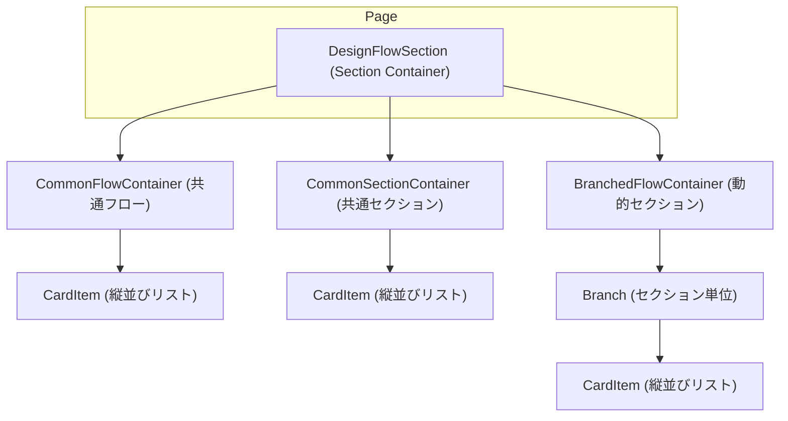

# design-flow - UI/UX設計書

🛑 ドキュメント利用に関する注意書きとスコープ定義

> この設計書は、新規開発のための詳細な仕様書ではありません。AIエージェントによるコーディングと、人間による高効率な保守運用を目的とした**「アーキテクチャ・マップ」**です。

### I. 🎯 目指す方向とドキュメントの役割

| 項目 | 目的と役割 |
| :--- | :--- |
| **役割の焦点** | 新規開発よりも保守・修正に重点を置く。修正時のデバッグパスを最短化することが最大の目的です。 |
| **陳腐化の防止** | 頻繁に変わる具体的な情報（色、サイズ、影など）は一切記載しません。ドキュメントの役割を**構造（抽象）に限定することで、コード実装の詳細が変わっても陳腐化しない「構造的な真実の源泉」**を維持します。 |
| **一望性の確保** | UI/UX設計において、修正時に最も認知負荷が高い**「親子構造」「並列配置」「状態遷移ルール」**の3点に絞り、最小の目的を1つのドキュメントで迅速に確認できる状態を保証します。 |

### II. 🗺️ ドキュメントのスコープ（責務の境界線）

> この設計書は、サービスの**「セクション単位」**で、構造的な抽象レイヤーに特化しています。記載すべき情報と、コードに委ねる情報の境界線を明確にしてください。

#### 1. 📂 内部スコープ：このドキュメントで定義するもの（抽象）

| 項目 | 責務の対象 | 規律 |
| :--- | :--- | :--- |
| **サービススコープ** | セクション固有のコンポーネント、ロジック | Route/Componentの責務分離、セクション固有の構造（親子、並列）、セクション固有の状態遷移のルールを明確に定義します。 |
| **CSS抽象レイヤー** | 構造と配置の論理 | コンポーネント間の親子構造、並列配置（flex/grid）の論理、例外構造のルール（疑似要素など）といった、UIの骨格となる抽象的なルールのみを記載します。 |

#### 2. 🚫 外部スコープ：コードまたは別ドキュメントに委ねるもの（具体）

| 項目 | 委ねる場所 | 理由 |
| :--- | :--- | :--- |
| **アプリケーションスコープ** | App全体のUIXガイド、デザインシステム | 画面共通やセクションを横断して利用される共通コンポーネント（例: `.button-primary`、`.page-container`など）の定義は、このセクション設計書ではなく、アプリケーション全体のUIXガイドを参照してください。 |
| **CSS詳細** | Tailwind Config, Layer 1/2 の実装 | 具体的なスタイル値（色コード、スペーシング値、フォントサイズ、影、ボーダー定義など）は、**コード（Tailwindクラスまたはトークン）**を参照してください。この設計書に具体的なCSSプロパティを記載することは厳禁です。 |
| **セクション共通** | 共通コンポーネント設計書 | 複数セクションで再利用されるコンポーネントの設計は、該当の共通コンポーネント設計書を参照してください。 |

> 🔑 **原則**: 抽象は設計書に、具象はコードに。保守者はコードを見る前に、まずこの設計書を見て構造的な問題を切り分けてください。

## 📋 セクション概要

### セクション名
**Design Flow**

### 所属サービス
**flow-auditor** の **design-flow** セクションに配置

### セクションの目的
Flow Auditorサービスにおける設計フロー（Design Flow）のチェックポイントを可視化し、ユーザーが開発プロセスの進捗を確認できるUIを提供します。各チェックポイントのファイル存在状態（completed/pending）を視覚的に表示し、選択されたチェックポイントを通じてリトライ機能などのアクションを実行できるようにします。

---

## 🚗 データフロー設計 (Route責務)

このセクションにおけるデータの流れと、Remixの`loader`および`action`の責務を定義します。

### Loader
- **責務**: flow-auditorサービスの全体設計フローに関わるチェックポイント情報を取得し、UI表示用にグループ化されたデータを返す
- **データソース**: `loadProjectSections`, `checkDesignFiles`, `getCommonCheckpointDefinitions`, `getSectionCheckpointDefinitions`
- **処理フロー**:
  1. URL SearchParamsから`selectedCheckpoint`を取得
  2. セクション一覧とチェックポイント定義を取得
  3. ファイル存在確認を一括実行し、各チェックポイントの`exists`状態を判定
  4. `buildFlowGroups`関数でチェックポイントをグループ化（common, commonSection, branched）
  5. グループ化されたデータをJSONで返す

### Action
- **責務**: ユーザーのリトライアクションを受け取り、選択されたチェックポイント以降のファイルをアーカイブする処理を実行
- **処理フロー**:
  1. FormDataから`intent`を取得（"retry" または "refresh"）
  2. `intent === "retry"`: FormDataから`checkpointId`または`checkpointIds`を取得し、`executeRetry`関数を実行。成功時は`selectedCheckpoint`パラメータをクリアしてリダイレクト
  3. `intent === "refresh"`: 現在のURL状態を保持してリダイレクト（loaderを再実行）

---

## 🧩 レイアウトのコンポーネント構造規範 (Layout Hierarchy Map)
このセクションは、ページ全体におけるレイアウトコンテナの階層構造を定義する**地図**です。後続の「並列配置規範」で定義されるコンテナが、ページ全体のどこに位置するのかを把握するために使用します。

**原則**:
- **レイアウトコンテナのみ**: ここでは、レイアウトを構成する主要なコンテナ（箱）の親子関係のみを記述します。
- **コンテンツは除外**: ラベル、テキスト、アイコンといった、レイアウト構造と本質的に関係のないコンテンツ要素は記載しません。

### 構造図

**構造の説明**:
- `DesignFlowSection`: セクション全体のルートコンテナ。3つの主要なコンテナを縦並びで保持
- `CommonFlowContainer`: 全体設計方針（project.toml, start-dev.jsなど）のチェックポイントを縦1列で表示
- `CommonSectionContainer`: commonセクション専用のチェックポイントを縦1列で表示（存在しない場合は非表示）
- `BranchedFlowContainer`: 機能セクション（operation, design-flowなど）を動的に横並びで表示。セクション数は1～6で可変
- `Branch`: 単一セクション（例: operation）のチェックポイント群を縦並びで表示するコンテナ
- `CardItem`: 個別チェックポイントを表示する最小単位のコンポーネント（共有コンポーネント）

---

## 📐 認定済み並列配置 (Authorized Flexbox/Grid Layouts)

このセクションは、**不要なレイアウト実装の乱立を防ぐ**ため、このUIセクション内で**許可された並列配置パターンのみ**を定義するホワイトリストです。ここに記載されていない`flex`や`grid`の利用は原則として禁止されます。

**重要**: このセクションには、**アイテム数が可変（動的に増減する）**レイアウトパターンのみを記載します。アイテム数が固定（静的）のレイアウトは、コンポーネント構造規範で定義されているため、ここでは記載不要です。

---

### 1. Branched Flow Container（横並び自動折り返し）

| 設計項目 | 定義 | 備考 |
| :--- | :--- | :--- |
| **対象コンテナ** | `.branched-flow-container` | BranchedFlowContainerのルートコンテナ |
| **対象アイテム** | `.flow-branch` | 各セクションのBranchコンポーネント |
| **想定アイテム数** | `可変: 0～6個` | セクション数は動的（最大6セクション） |
| **レイアウトの意図** | 横並びで自動折り返し、中央揃え | セクション数に応じた自動折り返し |

---

### 2. Card Item List Vertical（縦並びリスト）

| 設計項目 | 定義 | 備考 |
| :--- | :--- | :--- |
| **対象コンテナ** | `.card-item-list-vertical` | カードアイテムを縦並びで配置 |
| **対象アイテム** | `.card-item-wrapper` > `CardItem` | 個別カードアイテム（ラッパーで囲まれている） |
| **想定アイテム数** | `可変: 上限なし` | カードアイテム数は動的（共通フローは4個、セクション別は4個など） |
| **レイアウトの意図** | 縦並びで中央揃え | カードアイテムを縦一列に配置 |

---

## ⚡ インタラクションと状態遷移の設計 (Component責務)

### 1. CardItem

**責務**: 個別カードアイテムの表示と選択状態の管理

#### 状態 (State)
- **pending**: ファイルが存在しない状態（赤色、実装はLayer 2のトークンに委ねる）
- **completed**: ファイルが存在する状態（緑色、実装はLayer 2のトークンに委ねる）
- **selected**: ユーザーが選択した状態（青色、実装はLayer 2のトークンに委ねる）
- **disabled**: ファイルが存在しない場合、クリック不可能

#### インタラクション (Interaction)
- **トリガー**: カードアイテムをクリック（`clickable === true`の場合のみ）
- **応答**: `onClick`コールバックが実行され、`checkpointId`がURL SearchParamsに設定。トグル動作により、既に選択済みのカードアイテムをクリックすると選択を解除

#### 特殊処理
- **名前の短縮表示**: 特定のファイル名（`REQUIREMENTS_ANALYSIS_PIPE.md` → `REQUIREMENTS_ANA...`）を呼び出し元コンポーネント（CommonFlowContainer, Branch, CommonSectionContainer）で短縮処理してから表示

---

### 2. DesignFlowSection

**責務**: セクション全体のコンテナとして、選択されたチェックポイントIDの管理とナビゲーション処理を担当

#### 状態 (State)
- **通常**: `selectedCheckpointId === null`。すべてのチェックポイントは`pending`または`completed`状態
- **選択済み**: `selectedCheckpointId !== null`。該当するチェックポイントは`selected`状態
- **エラー**: `error`プロパティが存在する場合、エラーメッセージを表示

#### インタラクション (Interaction)
- **トリガー**: `CardItem`のクリックイベントが`handleSelect`コールバックを呼び出す
- **応答**: URL SearchParamsを更新（`selectedCheckpoint`パラメータを設定または削除）し、`/flow-auditor?selectedCheckpoint={checkpointId}`にナビゲーション

---

### 3. BranchedFlowContainer / CommonFlowContainer / CommonSectionContainer

**責務**: チェックポイント群を表示するコンテナ（表示のみ、インタラクションなし）

#### 状態 (State)
- **通常**: `checkpoints`または`branches`配列に基づいて表示
- **空**: `CommonSectionContainer`は`null`を返して非表示（他は常に表示）

---

## 🛠️ 例外構造と規律
このセクションは、上記2つの規範や状態遷移で対応できない、やむを得ない構造的な例外（疑似要素、子孫セレクタなど）を管理します。

### 例外1: カードアイテム名の短縮処理

**背景**: 一部のカードアイテム名（`REQUIREMENTS_ANALYSIS_PIPE.md`など）は長すぎてUIに収まらないため、短縮表示する必要がある。

**実装箇所**: 呼び出し元コンポーネント（`CommonFlowContainer.tsx`, `Branch.tsx`, `CommonSectionContainer.tsx`）内の`truncateCheckpointName`関数

**規律**:
- 短縮ルールはハードコードされており、個別のファイル名に対してのみ適用される
- 今後、短縮ルールが増える場合は、ロジック層（`app/lib`）に移動することを検討すること

---

> 🔑 **保守時の参照順序**:
> 1. この設計書で構造的な問題を切り分ける
> 2. `app/styles/flow-auditor/layer3.ts`でレイアウト実装を確認
> 3. `app/components/flow-auditor/design-flow/`でコンポーネント実装を確認
> 4. `app/routes/flow-auditor/index.tsx`でデータフローを確認
