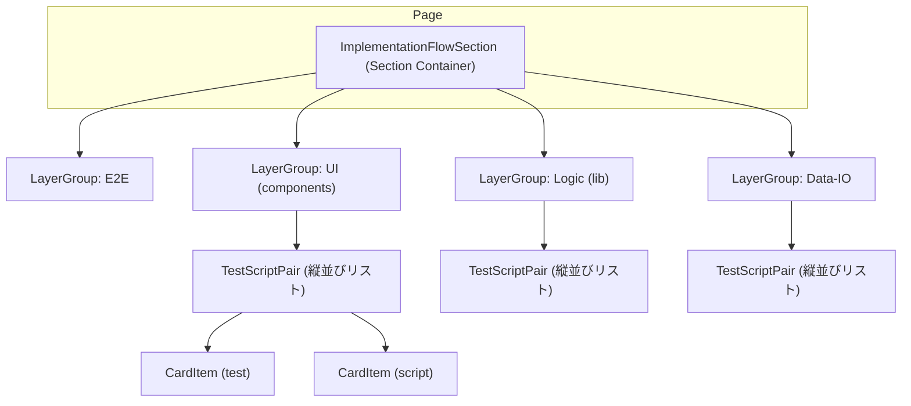

# implementation-flow - UI/UX設計書

🛑 ドキュメント利用に関する注意書きとスコープ定義

> この設計書は、新規開発のための詳細な仕様書ではありません。AIエージェントによるコーディングと、人間による高効率な保守運用を目的とした**「アーキテクチャ・マップ」**です。

### I. 🎯 目指す方向とドキュメントの役割

| 項目 | 目的と役割 |
| :--- | :--- |
| **役割の焦点** | 新規開発よりも保守・修正に重点を置く。修正時のデバッグパスを最短化することが最大の目的です。 |
| **陳腐化の防止** | 頻繁に変わる具体的な情報（色、サイズ、影など）は一切記載しません。ドキュメントの役割を**構造（抽象）に限定することで、コード実装の詳細が変わっても陳腐化しない「構造的な真実の源泉」**を維持します。 |
| **一望性の確保** | UI/UX設計において、修正時に最も認知負荷が高い**「親子構造」「並列配置」「状態遷移ルール」**の3点に絞り、最小の目的を1つのドキュメントで迅速に確認できる状態を保証します。 |

### II. 🗺️ ドキュメントのスコープ（責務の境界線）

> この設計書は、サービスの**「セクション単位」**で、構造的な抽象レイヤーに特化しています。記載すべき情報と、コードに委ねる情報の境界線を明確にしてください。

#### 1. 📂 内部スコープ：このドキュメントで定義するもの（抽象）

| 項目 | 責務の対象 | 規律 |
| :--- | :--- | :--- |
| **サービススコープ** | セクション固有のコンポーネント、ロジック | Route/Componentの責務分離、セクション固有の構造（親子、並列）、セクション固有の状態遷移のルールを明確に定義します。 |
| **CSS抽象レイヤー** | 構造と配置の論理 | コンポーネント間の親子構造、並列配置（flex/grid）の論理、例外構造のルール（疑似要素など）といった、UIの骨格となる抽象的なルールのみを記載します。 |

#### 2. 🚫 外部スコープ：コードまたは別ドキュメントに委ねるもの（具体）

| 項目 | 委ねる場所 | 理由 |
| :--- | :--- | :--- |
| **アプリケーションスコープ** | App全体のUIXガイド、デザインシステム | 画面共通やセクションを横断して利用される共通コンポーネント（例: `.button-primary`、`.page-container`など）の定義は、このセクション設計書ではなく、アプリケーション全体のUIXガイドを参照してください。 |
| **CSS詳細** | Tailwind Config, Layer 1/2 の実装 | 具体的なスタイル値（色コード、スペーシング値、フォントサイズ、影、ボーダー定義など）は、**コード（Tailwindクラスまたはトークン）**を参照してください。この設計書に具体的なCSSプロパティを記載することは厳禁です。 |
| **セクション共通** | 共通コンポーネント設計書 | 複数セクションで再利用されるコンポーネントの設計は、該当の共通コンポーネント設計書を参照してください。 |

> 🔑 **原則**: 抽象は設計書に、具象はコードに。保守者はコードを見る前に、まずこの設計書を見て構造的な問題を切り分けてください。

## 📋 セクション概要

### セクション名
**実装フロービュー**

### 所属サービス
**flow-auditor** の **implementation-flow** セクションに配置

### セクションの目的
実装フェーズの成果物がTDDフローに従って作成されているかを監査する。TDD_WORK_FLOW.mdや各層（ui, lib, data-io）のソースファイルとテストファイルが所定の場所に存在するかをチェックし、実装プロセスの完了度を可視化する。

---

## 🚗 データフロー設計 (Route責務)

このセクションにおけるデータの流れと、Remixの`loader`および`action`の責務を定義します。

### Loader
- **責務**: file-list.mdからファイル定義を読み込み、各ファイルの存在状態をチェックし、層別にグループ化したデータを返す
- **データソース**:
  - `implementationFlowDefinition.ts`: file-list.mdをパースしてFileDefinition配列を生成
  - `checkImplementationFiles.server.ts`: 各ファイルの存在確認（fs.existsSync）
  - `implementationFlowBuilder.ts`: test-scriptペアのマッチングと層別グループ化

### Action
- **責務**: Footer内のRetryボタンから受け取った複数ファイルパスに対するリトライ処理を実行
- **処理フロー**:
  1. FormDataから`selectedCheckpoint`（カンマ区切りのファイルパス文字列）を取得
  2. カンマ区切りをパースして配列化
  3. `executeRetry.server.ts`でリトライ処理を実行（対象ファイルをアーカイブ）
  4. 成功時: `redirect('/flow-auditor')`でURL SearchParamsをクリアして再読み込み
  5. 失敗時: エラー情報を含めて返却

---

## 🧩 レイアウトのコンポーネント構造規範 (Layout Hierarchy Map)
このセクションは、ページ全体におけるレイアウトコンテナの階層構造を定義する**地図**です。後続の「並列配置規範」で定義されるコンテナが、ページ全体のどこに位置するのかを把握するために使用します。

**原則**:
- **レイアウトコンテナのみ**: ここでは、レイアウトを構成する主要なコンテナ（箱）の親子関係のみを記述します。
- **コンテンツは除外**: ラベル、テキスト、アイコンといった、レイアウト構造と本質的に関係のないコンテンツ要素は記載しません。

### 構造図

**構造の説明**:
- `ImplementationFlowSection`: セクション全体のルートコンテナ。4つの層グループを縦並びで保持
- `LayerGroup`: 層別（e2e, ui, lib, data-io）のコンテナ。各層のtest-scriptペアを縦並びで表示
- `TestScriptPair`: testファイルとscriptファイルを横並びで表示するコンテナ（ペア数は可変）
- `CardItem`: 個別ファイルを表示する最小単位のコンポーネント（共有コンポーネント）。ペアロジックはImplementationFlowSectionのhandleFileClickで処理

---

## 📐 認定済み並列配置 (Authorized Flexbox/Grid Layouts)

このセクションは、**不要なレイアウト実装の乱立を防ぐ**ため、このUIセクション内で**許可された並列配置パターンのみ**を定義するホワイトリストです。ここに記載されていない`flex`や`grid`の利用は原則として禁止されます。

**重要**: このセクションには、**アイテム数が可変（動的に増減する）**レイアウトパターンのみを記載します。アイテム数が固定（静的）のレイアウトは、コンポーネント構造規範で定義されているため、ここでは記載不要です。

---

### 1. Test-Script Pair List（縦並びリスト）

| 設計項目 | 定義 | 備考 |
| :--- | :--- | :--- |
| **対象コンテナ** | `.pair-list-vertical` | LayerGroup内でTestScriptPairを縦並びで配置 |
| **対象アイテム** | `.test-script-pair` | testファイルとscriptファイルのペアコンテナ |
| **想定アイテム数** | `可変: 上限なし` | ペア数はfile-list.mdの定義に依存（層ごとに異なる） |
| **レイアウトの意図** | 縦並びで中央揃え | test-scriptペアを縦一列に配置

---

## ⚡ インタラクションと状態遷移の設計 (Component責務)

### 1. ImplementationFlowSection (Container Component)

**責務**: セクション全体のコンテナとして、選択されたファイルパスの管理とナビゲーション処理を担当

#### 状態 (State)
- **通常**: `selectedFilePaths === []`。すべてのファイルは`pending`または`completed`状態
- **選択済み**: `selectedFilePaths.length > 0`。該当するファイル（とそのペア）は`selected`状態
- **エラー**: `data`が未定義またはlayerGroupsが空の場合、エラーメッセージを表示

#### インタラクション (Interaction)
- **トリガー**: `PairItem`のクリックイベントが`handleFileClick`コールバックを呼び出す
- **応答**:
  1. クリックされたファイルのペアを`findPairFilePath`で検索
  2. クリックされたファイルとペアの両方を選択状態に追加（トグル動作）
  3. URL SearchParamsを更新（`selectedCheckpoint`にカンマ区切りで複数パスを設定）
  4. `/flow-auditor?selectedCheckpoint={path1},{path2},...`にナビゲーション

---

### 2. LayerGroup (Container Component)

**責務**: 層別（e2e, ui, lib, data-io）のコンテナとして、test-scriptペアを縦並びで表示

#### 状態 (State)
- **通常**: `pairs`配列に基づいてTestScriptPairを表示
- **空**: `pairs.length === 0`の場合、「No files found」メッセージを表示

#### インタラクション (Interaction)
- **トリガー**: なし（表示のみ）
- **応答**: 子コンポーネント（TestScriptPair）にpropsを渡す

---

### 3. CardItem (Interactive Component)

**責務**: 個別ファイルの表示と選択状態の管理

#### 状態 (State)
- **pending**: ファイルが存在しない状態（赤色、Layer 2のトークンに委ねる）
- **completed**: ファイルが存在する状態（緑色、Layer 2のトークンに委ねる）
- **selected**: ユーザーが選択した状態（青色、Layer 2のトークンに委ねる）
- **disabled**: ファイルが存在しない場合、クリック不可能

#### インタラクション (Interaction)
- **トリガー**: カードアイテムをクリック（`clickable === true`の場合のみ）
- **応答**:
  1. `onClick`コールバックが実行され、ファイルパスが親（ImplementationFlowSection）に通知
  2. ペアファイルも一緒に選択される（Surgical Retry機能 - handleFileClick内で処理）
  3. トグル動作により、既に選択済みのファイルをクリックすると選択を解除

#### 特殊処理
- **名前の短縮表示**: 長いファイル名（20文字超）を省略表示（`filename_longlong.test.tsx` → `filename_longlong.tes...`）。LayerGroup内で短縮処理してから表示

---

## 🛠️ 例外構造と規律
このセクションは、上記2つの規範や状態遷移で対応できない、やむを得ない構造的な例外（疑似要素、子孫セレクタなど）を管理します。

### 例外1: TestScriptPair内の横並び配置

**背景**: testファイルとscriptファイルを横並びで表示する必要があるが、これは固定レイアウト（2個）なので「認定済み並列配置」には記載しない。

**実装箇所**: `.test-script-pair`コンテナ内でtestとscriptを横並び配置

**規律**:
- 固定2個の横並びレイアウトなので、コンポーネント構造規範で定義されている
- 可変レイアウトではないため、このドキュメントの「認定済み並列配置」には記載不要

### 例外2: カードアイテム名の短縮処理

**背景**: 一部のファイル名は長すぎてUIに収まらないため、短縮表示する必要がある。

**実装箇所**: `LayerGroup.tsx`内の`truncateText`関数

**規律**:
- 20文字を超えるファイル名は省略表示（末尾3文字を`…`に置換）
- 今後、短縮ルールが複雑化する場合は、ロジック層（`app/lib`）に移動することを検討すること

---

> 🔑 **保守時の参照順序**:
> 1. この設計書で構造的な問題を切り分ける
> 2. `app/lib/flow-auditor/implementation-flow/implementationFlowTypes.ts`で型定義を確認
> 3. `app/components/flow-auditor/implementation-flow/`でコンポーネント実装を確認
> 4. `app/routes/flow-auditor/index.tsx`でデータフローを確認
