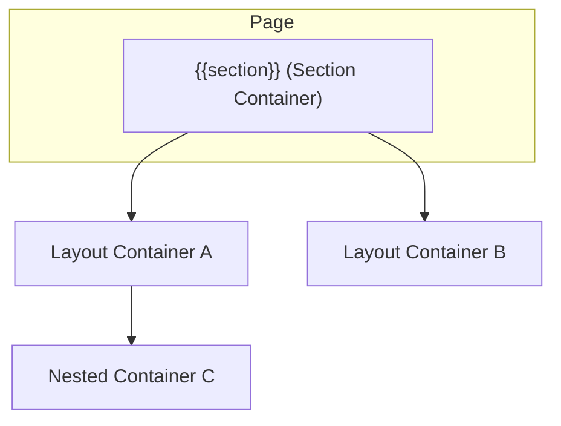

# {{section}} - UI/UX設計書

## ドキュメント利用に関する注意書きとスコープ定義

> この設計書は、新規開発のための詳細な仕様書ではありません。AIエージェントによるコーディングと、人間による高効率な保守運用を目的とした**「アーキテクチャ・マップ」**です。

### I. 🎯 目指す方向とドキュメントの役割

| 項目 | 目的と役割 |
| :--- | :--- |
| **役割の焦点** | 新規開発よりも保守・修正に重点を置く。修正時のデバッグパスを最短化することが最大の目的です。 |
| **陳腐化の防止** | 頻繁に変わる具体的な情報（色、サイズ、影など）は一切記載しません。ドキュメントの役割を**構造（抽象）に限定することで、コード実装の詳細が変わっても陳腐化しない「構造的な真実の源泉」**を維持します。 |
| **一望性の確保** | UI/UX設計において、修正時に最も認知負荷が高い**「親子構造」「並列配置」「状態遷移ルール」**の3点に絞り、最小の目的を1つのドキュメントで迅速に確認できる状態を保証します。 |

### II. 🗺️ ドキュメントのスコープ（責務の境界線）

> この設計書は、サービスの**「セクション単位」**で、構造的な抽象レイヤーに特化しています。記載すべき情報と、コードに委ねる情報の境界線を明確にしてください。

#### 1. 📂 内部スコープ：このドキュメントで定義するもの（抽象）

| 項目 | 責務の対象 | 規律 |
| :--- | :--- | :--- |
| **サービススコープ** | セクション固有のコンポーネント、ロジック | Route/Componentの責務分離、セクション固有の構造（親子、並列）、セクション固有の状態遷移のルールを明確に定義します。 |
| **CSS抽象レイヤー** | 構造と配置の論理 | コンポーネント間の親子構造、並列配置（flex/grid）の論理、例外構造のルール（疑似要素など）といった、UIの骨格となる抽象的なルールのみを記載します。 |

#### 2. 🚫 外部スコープ：コードまたは別ドキュメントに委ねるもの（具体）

| 項目 | 委ねる場所 | 理由 |
| :--- | :--- | :--- |
| **アプリケーションスコープ** | App全体のUIXガイド、デザインシステム | 画面共通やセクションを横断して利用される共通コンポーネント（例: `.button-primary`、`.page-container`など）の定義は、このセクション設計書ではなく、アプリケーション全体のUIXガイドを参照してください。 |
| **CSS詳細** | Tailwind Config, Layer 1/2 の実装 | 具体的なスタイル値（色コード、スペーシング値、フォントサイズ、影、ボーダー定義など）は、**コード（Tailwindクラスまたはトークン）**を参照してください。この設計書に具体的なCSSプロパティを記載することは厳禁です。 |
| **セクション共通** | 共通コンポーネント設計書 | 複数セクションで再利用されるコンポーネントの設計は、該当の共通コンポーネント設計書を参照してください。 |

> 🔑 **原則**: 抽象は設計書に、具象はコードに。保守者はコードを見る前に、まずこの設計書を見て構造的な問題を切り分けてください。

## 📋 セクション概要

### セクション名

{{name}}

### 所属サービス

**{{service}}** の **{{section}}** セクションに配置

### セクションの目的

{このUIセクションが達成すべき目的を記述}

---

## 🚗 データフロー設計 (Route責務)

このセクションにおけるデータの流れと、Remixの`loader`および`action`の責務を定義します。

### Loader

- **責務**: {このRouteが読み込むべきデータとその取得方法の概要を記述}
- **データソース**: {どの`data-io`関数を呼び出すか}

### Action

- **責務**: {ユーザーのアクション（フォーム送信など）によって実行される処理の概要を記述}
- **処理フロー**: {バリデーション、`data-io`関数の呼び出し、リダイレクトなどの流れ}

---

## 🧩 レイアウトのコンポーネント構造規範 (Layout Hierarchy Map)

このセクションは、ページ全体におけるレイアウトコンテナの階層構造を定義する**地図**です。後続の「並列配置規範」で定義されるコンテナが、ページ全体のどこに位置するのかを把握するために使用します。

**原則**:

- **レイアウトコンテナのみ**: ここでは、レイアウトを構成する主要なコンテナ（箱）の親子関係のみを記述します。
- **コンテンツは除外**: ラベル、テキスト、アイコンといった、レイアウト構造と本質的に関係のないコンテンツ要素は記載しません。

### 構造図

---

## 📐 認定済み並列配置 (Authorized Flexbox/Grid Layouts)

このセクションは、**不要なレイアウト実装の乱立を防ぐ**ため、このUIセクション内で**許可された並列配置パターンのみ**を定義するホワイトリストです。ここに記載されていない`flex`や`grid`の利用は原則として禁止されます。

**重要**: このセクションには、**アイテム数が可変（動的に増減する）**レイアウトパターンのみを記載します。アイテム数が固定（静的）のレイアウトは、コンポーネント構造規範で定義されているため、ここでは記載不要です。

---

### {レイアウトパターン名 例: チェックポイントリスト}

| 設計項目 | 定義 | 備考 |
| :--- | :--- | :--- |
| **対象コンテナ** | `{レイアウトのコンポーネント構造規範で定義したコンテナ名}` | このレイアウトを適用する親コンテナ |
| **対象アイテム** | `{並列配置される子要素のコンポーネント名}` | レイアウトされる子要素 |
| **想定アイテム数** | `可変: {最小}～{最大}個` または `可変: 上限なし` | アイテム数に応じた折り返しやスクロールの要否を判断する材料 |
| **レイアウトの意図** | `{横並びで均等配置}` / `{縦並びで中央揃え}` | 配置の目的を抽象的に記述（具体的なCSSプロパティは記載しない） |

---

### {次のレイアウトパターン名}

{上記と同様のフォーマットで記述}

---

## ⚡ インタラクションと状態遷移の設計 (Component責務)

### 1. {コンポーネント名}

**責務**: {コンポーネントの責務を記述}

#### 状態 (State)

- **通常 (default)**: {通常時の表示内容を記述}
- **ホバー (hover)**: {マウスホバー時の見た目の変化を記述。Figmaの`hover`バリアントを参照}
- **無効 (disabled)**: {ボタンが非活性になる条件を記述。例: フォームの必須項目が未入力の場合}

#### インタラクション (Interaction)

- **トリガー**: {ユーザーのアクションを記述。例: ボタンをクリック}
- **応答**: {トリガーに対するシステムの応答を記述。例: `action`が呼び出され、成功すると`/success`にリダイレクトする}
- **アニメーション**: {UIが変化する際のアニメーションを記述。例: `0.3s`かけて`shadow-lg`トークンの影を表示する}

---

## 🛠️ 例外構造と規律

このセクションは、上記2つの規範や状態遷移で対応できない、やむを得ない構造的な例外（疑似要素、子孫セレクタなど）を管理します。
