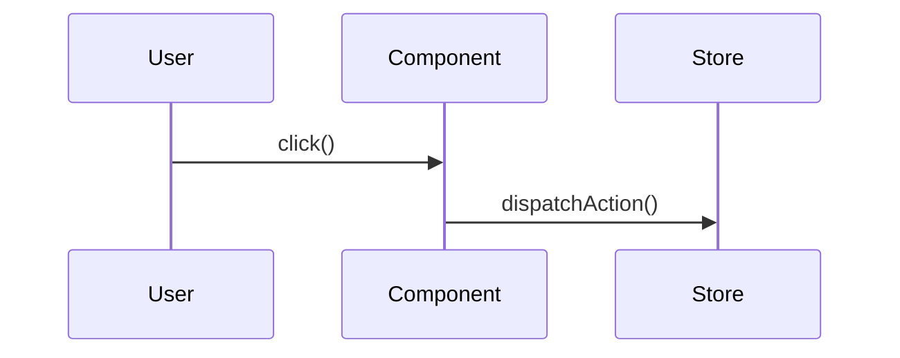

# 不具合調査・解消テンプレート (with Debugger Methodology)

このテンプレートは `.claude/skills/debugger.md` のデバッグ手法を統合したものです。

---

## 1. 不具合の概要

### 発生事象

* （例：〇〇画面でボタンをクリックしても反応がない）

### エラータイプ

- [ ] runtime-error (実行時エラー)
- [ ] test-failure (テスト失敗)
- [ ] type-error (TypeScriptエラー)
- [ ] build-error (ビルドエラー)
- [ ] logic-error (ロジックエラー)
- [ ] integration-error (統合エラー)
- [ ] performance-issue (パフォーマンス問題)

### 優先度判定

- [ ] **P0 (Critical)**: 本番エラー、ビルド失敗、Critical E2E失敗 → 即座対応
- [ ] **P1 (Error)**: 実行時エラー、ユニットテスト失敗 → 1時間以内に対応開始
- [ ] **P2 (Warning)**: パフォーマンス、警告、Lint → 1日以内に対応開始

### 再現手順

1.
2.
3.

### 期待される動作

* （例：ボタンをクリックすると、△△のダイアログが表示される）

### 実際の動作

* （例：ボタンをクリックしても何も起こらない。コンソールにエラーも表示されない）

### 環境

* **OS**: Windows 11
* **ブラウザ**: Chromium
* **Node.js**:
* **その他**:

---

## 2. 階層別エラー確認

* ステータス： `[ ]` 未着手, `[x]` 確認済, `[!]` 問題あり

### 影響レイヤー

<<<<<<< HEAD
- [ ] **UI層** (`routes/`, `components/`)
- [ ] **純粋ロジック層** (`lib/`)
- [ ] **副作用層** (`data-io/`)
- [ ] **テスト層** (`tests/`)
- [ ] **設定層** (`config`, `scripts`)
- [ ] **インフラ層** (サーバー、DB、ネットワーク)
=======
* [ ] **UI層** (`routes/`, `components/`)
* [ ] **純粋ロジック層** (`lib/`)
* [ ] **副作用層** (`data-io/`)
* [ ] **テスト層** (`tests/`)
* [ ] **設定層** (`config`, `scripts`)
* [ ] **インフラ層** (サーバー、DB、ネットワーク)
>>>>>>> main

### テスト・ビルド確認

* `[ ]` **E2Eテスト** (`npm run test:e2e`)
  * 結果：
* `[ ]` **ビルド** (`npm run build`)
  * 結果：
* `[ ]` **ユニット/インテグレーションテスト** (`npm run test`)
  * 結果：
* `[ ]` **Lint/フォーマット** (`npm run lint`)
  * 結果：
* `[ ]` **ローカル開発環境での動作確認** (`npm run dev`)
  * 結果：

---

## 3. 根本原因分析 (5 Whys法)

### 仮説

* （例：〇〇の状態管理に問題があるのではないか？）
* （例：△△APIからのレスポンス形式が変更されたのではないか？）

### Why1: なぜこのエラーが発生したか？

→

### Why2: なぜ〇〇が起きたか？

→

### Why3: なぜ△△が発生したか？

→

### Why4: なぜ□□だったか？

→

### Why5: なぜ最終的にこの状況になったか？

→ **根本原因**:

---

## 4. 調査ログ

### 調査1: {調査対象}

* **方法**: {試したこと、確認したコマンドなど}
* **結果**: {わかったこと、エラーログなど}
* **判断**: {この調査から得られた結論}

### 調査2: {調査対象}

* **方法**:
* **結果**:
* **判断**:

---

## 5. 特定された原因

### 抽象レイヤー

* （例：コンポーネントの責務分担が曖昧だったため、意図しない副作用が発生していた）

### 具体レイヤー

* （例：`src/components/MyButton.vue` の `onClick` ハンドラで、stateの更新処理が漏れていた）

### 影響範囲

<<<<<<< HEAD
- ✅ 影響あり: {ファイル名、コンポーネント名}
- ⚠️ 影響の可能性: {ファイル名、コンポーネント名}
=======
* ✅ 影響あり: {ファイル名、コンポーネント名}
* ⚠️ 影響の可能性: {ファイル名、コンポーネント名}
>>>>>>> main

### シーケンス図など



---

## 6. 解消方針

### 方針1（第一優先）

* **概要**:
* **メリット**:
* **デメリット/懸念点**:
* **推定作業時間**:
* **Breaking Change**: Yes / No

### 方針2（第二優先）

* **概要**:
* **メリット**:
* **デメリット/懸念点**:
* **推定作業時間**:
* **Breaking Change**: Yes / No

### 最終的な対応 (採用した方針)

* **採用方針**: 方針1 / 方針2
* **実装内容**:
  1. {具体的な変更内容}
  2. {具体的な変更内容}

---

## 7. テスト戦略

### 追加すべきテストケース

#### エッジケーステスト

```typescript
describe('エッジケーステスト', () => {
  it('境界値のテスト', () => {
    // テストコード
  });

  it('null/undefined のテスト', () => {
    // テストコード
  });

  it('異常系のテスト', () => {
    // テストコード
  });
});
```

### 回帰テスト

<<<<<<< HEAD
- [ ] 既存機能が正常動作することを確認
- [ ] 関連機能に影響がないことを確認
=======
* [ ] 既存機能が正常動作することを確認
* [ ] 関連機能に影響がないことを確認
>>>>>>> main

---

## 8. 修正実施記録

### 修正1: {修正内容の概要}

**ファイル**: {ファイルパス}:{行番号}

**変更内容**:
<<<<<<< HEAD
=======

>>>>>>> main
```typescript
// Before
{変更前のコード}

// After
{変更後のコード}
```

**理由**: {なぜこの変更が必要だったか}

**影響**: {この変更による影響範囲}

### 修正2: {修正内容の概要}

（同様の形式で記録）

---

## 9. 検証結果

### 修正前

* **症状**: {修正前の状態}
* **再現性**: 毎回 / 時々 / 稀

### 修正後

* **症状**: 解消 / 改善 / 変化なし
* **確認方法**:
<<<<<<< HEAD
  ```bash
  # 実行したコマンド
  ```
=======

  ```bash
  # 実行したコマンド
  ```

>>>>>>> main
* **結果**: {検証結果}

### パフォーマンス比較 (該当する場合)

| 項目 | 修正前 | 修正後 | 改善率 |
<<<<<<< HEAD
|:---|:---|:---|:---|
=======
| :--- | :--- | :--- | :--- |
>>>>>>> main
| {指標名} | {値} | {値} | {%} |

---

## 10. 再発防止策

### プロセス改善

1. {今後このエラーを防ぐための手順}
2. {チェックリストやガイドラインの追加}

### ツール・自動化

1. {自動チェックの追加}
2. {Lintルールの追加}

### ドキュメント整備

1. {追加すべきドキュメント}
2. {更新すべきドキュメント}

---

## 11. タイムライン

| 時刻 | イベント | 担当 |
<<<<<<< HEAD
|:---|:---|:---|
=======
| :--- | :--- | :--- |
>>>>>>> main
| 00:00 | 初期報告 | {担当者} |
| 00:05 | 調査開始 | {担当者} |
| 00:30 | 根本原因特定 | {担当者} |
| 01:00 | 修正完了 | {担当者} |
| 01:30 | 検証完了 | {担当者} |

---

## 12. 関連リソース

### 関連ファイル

* [修正したファイル1](パス)
* [修正したファイル2](パス)

### 参照ドキュメント

* [ARCHITECTURE_MANIFESTO2.md](docs/boilerplate_architecture/ARCHITECTURE_MANIFESTO2.md) - レイヤー判定
* [TDD_WORK_FLOW.md](docs/develop/*/TDD_WORK_FLOW.md) - テスト戦略
* [.claude/skills/debugger.md](.claude/skills/debugger.md) - デバッグ手法

### 参考になった外部リソース

* {URL}
* {ドキュメント名}

---

## 13. 学んだ教訓

### この問題から得られた知見

1. {教訓1}
2. {教訓2}

### 今後の開発に活かすポイント

1. {ポイント1}
2. {ポイント2}

---

## Appendix: Debugger スキルの活用

このテンプレートは `.claude/skills/debugger.md` のデバッグ手法を統合しています。

### レイヤー別デバッグアプローチ

#### lib層のデバッグ

* **Focus**: 純粋関数のロジック
* **Tools**: ユニットテストの詳細化、入力値のバリデーション確認、戻り値の型チェック
* **Common Issues**: 境界値の処理ミス、型の暗黙的変換、数値計算の精度問題

#### data-io層のデバッグ

* **Focus**: 副作用と外部連携
* **Tools**: ネットワークリクエストのログ、エラーハンドリングの検証、モックの正確性確認
* **Common Issues**: 非同期処理のタイミング問題、エラーハンドリング不足、タイムアウト処理の欠如

#### ui層のデバッグ

* **Focus**: レンダリングとデータフロー
* **Tools**: React DevTools、loader/action のログ確認、再レンダリングの追跡
* **Common Issues**: 状態管理の不整合、loader/action の実行順序、コンポーネントのライフサイクル

---

**テンプレートバージョン**: 2.0 (Debugger統合版)
**最終更新**: 2025-12-26
**策定者**: Claude Code
<<<<<<< HEAD
=======

ここにエラーを追記
>>>>>>> main
